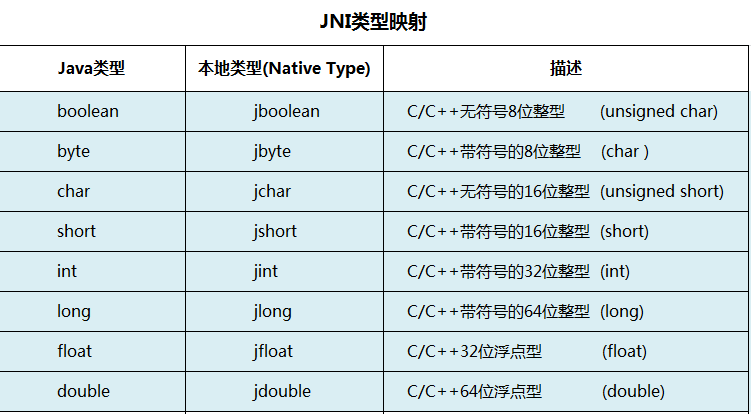
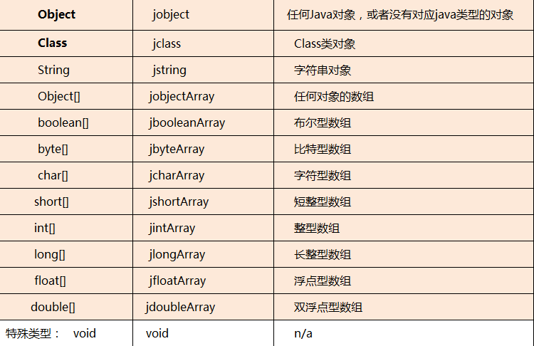
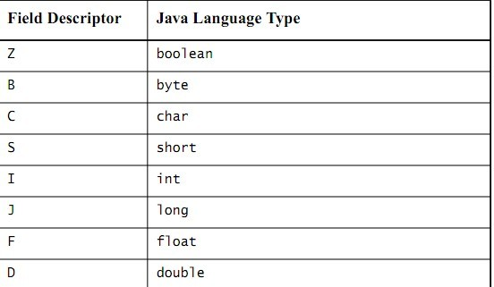

#JNI里的数据类型

在C++里，编译器会很据所处的平台来为一些基本的数据类型来分配长度，因此也就造成了平台不一致性，而这个问题在Java中则不存在，因为有JVM的缘故，所以Java中的基本数据类型在所有平台下得到的都是相同的长度，比如int的宽度永远都是32位。基于这方面的原因，java和c++的基本数据类型就需要实现一些mapping，保持一致性。下面的表可以概括：

##1、primitive types (基本数据类型)映射参见下表：

##2、reference types (引用数据类型)映射参见下表

注意：   

1. 引用数据类型则不能直接使用，需要根据JNI函数进行相应的转换后，才能使用
2. 多维数组(包括二维数组)都是引用类型，需要使用 jobjectArray 类型存取其值 ；

例如：二维整型数组就是指向一位数组的数组，其声明使用方式如下：

        //获得一维数组 的类引用，即jintArray类型  
        jclass intArrayClass = env->FindClass("[I");   
        //构造一个指向jintArray类一维数组的对象数组，该对象数组初始大小为dimion  
        jobjectArray obejctIntArray  =  env->NewObjectArray(dimion ,intArrayClass , NULL);  
        ...//具体操作  

##类描述符

类描述符是类的完整名称（包名+类名）,将原来的 . 分隔符换成 / 分隔符。

>例如：在java代码中的java.lang.String类的类描述符就是java/lang/String

其实，在实践中，我发现可以直接用该类型的域描述符取代，也是可以成功的。

>例如：        jclass intArrCls = env->FindClass("java/lang/String")
>等同于      jclass intArrCls = env->FindClass("Ljava/lang/String;")

数组类型的描述符则为，则为：  [ + 其类型的域描述符        (后文说明)

例如：

      int [ ]     其描述符为[I
      float [ ]   其描述符为[F
      String [ ]  其描述符为[Ljava/lang/String;

##域描述符

###1、基本类型的描述符已经被定义好了，如下表所示：

    boolean  Z
    byte     B
    char     C
    short    S
    int      I
    long     J
    float    F
    double   D

###2、引用类型的描述符

  一般引用类型则为 L + 该类型类描述符 + ;   (注意，这儿的分号“；”只得是JNI的一部分，而不是我们汉语中的分段，下同)

    例如：String类型的域描述符为 Ljava/lang/String;  

          对于数组，其为 :  [ + 其类型的域描述符 + ;

                  int[ ]     其描述符为[I
                  float[ ]   其描述符为[F
                  String[ ]  其描述符为[Ljava/lang/String;
                  Object[ ]类型的域描述符为[Ljava/lang/Object;

    多维数组则是 n个[ +该类型的域描述符 , N代表的是几维数组。例如：

           int  [ ][ ] 其描述符为[[I
           float[ ][ ] 其描述符为[[F

##方法描述符

将参数类型的域描述符按照申明顺序放入一对括号中后跟返回值类型的域描述符，规则如下： (参数的域描述符的叠加)返回类型描述符。对于，没有返回值的，用V(表示void型)表示。举例如下：

                 Java层方法                                               JNI函数签名

                String test ( )                                              Ljava/lang/String;

                int f (int i, Object object)                            (ILjava/lang/Object;)I

                void set (byte[ ] bytes)                                ([B)V

在编程时，如果是利用javah工具的话，这些都不需要我们手动编写对应的类型转换，如果不能用javah工具，就只能手动的进行类型转换了。
