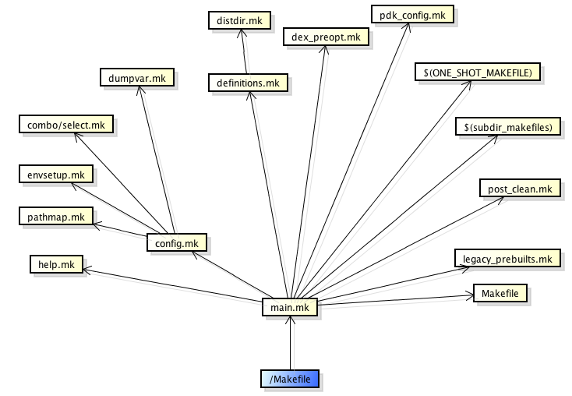

##概述

https://www.ibm.com/developerworks/cn/opensource/os-cn-android-build/

##命令

    croot	切换到源码树的根目录
    m	在源码树的根目录执行 make
    mm	Build 当前目录下的模块
    mmm	Build 指定目录下的模块
    cgrep	在所有 C/C++ 文件上执行 grep
    jgrep	在所有 Java 文件上执行 grep
    resgrep	在所有 res/*.xml 文件上执行 grep
    godir	转到包含某个文件的目录路径
    printconfig	显示当前 Build 的配置信息
    add_lunch_combo	在 lunch 函数的菜单中添加一个条目

Android编译系统集中于build/core下，几个很重要的*.mk文件如下：

+ main.mk	最主要的 Make 文件，该文件中首先将对编译环境进行检查，同时引入其他的 Make 文件。另外，该文件中还定义了几个最主要的 Make 目标，例如 droid，sdk，等（参见后文“Make 目标说明”）。
+ help.mk	包含了名称为 help 的 Make 目标的定义，该目标将列出主要的 Make 目标及其说明。
+ pathmap.mk	将许多头文件的路径通过名值对的方式定义为映射表，并提供 include-path-for 函数来获取。例如，通过 $(call include-path-for, frameworks-native)便可以获取到 framework 本地代码需要的头文件路径。
+ envsetup.mk	配置 Build 系统需要的环境变量，例如：TARGET_PRODUCT，TARGET_BUILD_VARIANT，HOST_OS，HOST_ARCH 等。
当前编译的主机平台信息（例如操作系统，CPU 类型等信息）就是在这个文件中确定的。
另外，该文件中还指定了各种编译结果的输出路径。
+ combo/select.mk	根据当前编译器的平台选择平台相关的 Make 文件。
+ dumpvar.mk	在 Build 开始之前，显示此次 Build 的配置信息。
+ config.mk	整个 Build 系统的配置文件，最重要的 Make 文件之一。该文件中主要包含以下内容：

    定义了许多的常量来负责不同类型模块的编译。
    定义编译器参数以及常见文件后缀，例如 .zip,.jar.apk。
    根据 BoardConfig.mk 文件，配置产品相关的参数。
    设置一些常用工具的路径，例如 flex，e2fsck，dx。

+ definitions.mk	最重要的 Make 文件之一，在其中定义了大量的函数。这些函数都是 Build 系统的其他文件将用到的。例如：my-dir，all-subdir-makefiles，find-subdir-files，sign-package 等，关于这些函数的说明请参见每个函数的代码注释。
+ distdir.mk	针对 dist 目标的定义。dist 目标用来拷贝文件到指定路径。
+ dex_preopt.mk	针对启动 jar 包的预先优化。
+ pdk_config.mk	顾名思义，针对 pdk（Platform Developement Kit）的配置文件。
${ONE_SHOT_MAKEFILE}	ONE_SHOT_MAKEFILE 是一个变量，当使用“mm”编译某个目录下的模块时，此变量的值即为当前指定路径下的 Make 文件的路径。
${subdir_makefiles}	各个模块的 Android.mk 文件的集合，这个集合是通过 Python 脚本扫描得到的。
+ post_clean.mk	在前一次 Build 的基础上检查当前 Build 的配置，并执行必要清理工作。
+ legacy_prebuilts.mk	该文件中只定义了 GRANDFATHERED_ALL_PREBUILT 变量。
+ Makefile	被 main.mk 包含，该文件中的内容是辅助 main.mk 的一些额外内容。

##Makefile包含关系

Makefile->main.mk->config.mk->pathmap.mk
                            ->envsetup.mk
                            ->combo/select.mk
                            ->dumpvar.mk
                  ->definitions.mk->distdir.mk
                  ->dex_preopt.mk
                  ->$(subdir_makefiles) // find leaves all the Android.mk
                  ->Makefile
                  ->legacy_prebuilts.mk

##定义文件包含关系

##目标文件列表

- make clean	执行清理，等同于：rm -rf out/。
- make sdk	编译出 Android 的 SDK。
- make clean-sdk	清理 SDK 的编译产物。
- make update-api	更新 API。在 framework API 改动之后，需要首先执行该命令来更新 API，公开的 API 记录在 frameworks/base/api 目录下。
- make dist	执行 Build，并将 MAKECMDGOALS 变量定义的输出文件拷贝到 /out/dist 目录。
- make all	编译所有内容，不管当前产品的定义中是否会包含。
- make help	帮助信息，显示主要的 make 目标。
- make snod	从已经编译出的包快速重建系统镜像。
- make libandroid_runtime	编译所有 JNI framework 内容。
- make framework	编译所有 Java framework 内容。
- make services	编译系统服务和相关内容。
- make <local_target>	编译一个指定的模块，local_target 为模块的名称。
- make clean-<local_target>	清理一个指定模块的编译结果。
makedump-products	显示所有产品的编译配置信息，例如：产品名，产品支持的地区语言，产品中会包含的模块等信息。
- make PRODUCT-xxx-yyy	编译某个指定的产品。
- make bootimage	生成 boot.img
- make recoveryimage	生成 recovery.img
- make userdataimage	生成 userdata.img
- make cacheimage	生成 cache.img
