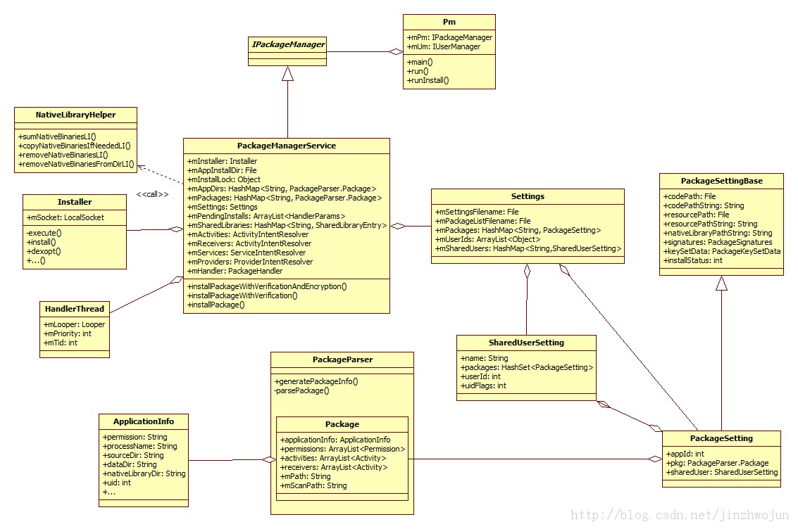

http://blog.csdn.net/new_abc/article/details/12966503
http://blog.csdn.net/luoshengyang/article/details/6766010

##大体分三步
+ 读安装信息
+ 扫描安装
+ 回写安装信息

##扫描目录

+ /system/app   系统app
+ /system/priv-app 系统核心app
+ /data/app  非系统app
+ /data/app-private 受drm保护app
+ /vendor/app vendor-specific app
+ /system/framework 资源型app

##开始

故事从System Server开始，实现在/frameworks/base/services/java/com/android/server/SystemServer.java中：

        pm = PackageManagerService.main(context, installer,
                          factoryTest != SystemServer.FACTORY_TEST_OFF,
                          onlyCore);

调用PMS的main()函数，其实现位于/frameworks/base/services/java/com/android/server/pm/PackageManagerService.java：

        public static final IPackageManager main(Context context, Installer installer,
              boolean factoryTest, boolean onlyCore) {
              PackageManagerService m = new PackageManagerService(context, installer,
                      factoryTest, onlyCore);
              ServiceManager.addService(package, m);
              return m;
          }

这里构造了PMS并加到ServiceManager中，这样其它的组件就可以用该服务了。

##PMS的构造函数中：

###创建

      mSettings = new Settings(context); // 用于存放和操作动态安装信息，具体地说，如uid, permission等。
    ...
          mInstaller = installer;  // installd daemon的proxy类。
    …
          mHandlerThread.start(); // 启动PMS的工作线程。
          mHandler = new PackageHandler(mHandlerThread.getLooper()); // PMS会通过mHandler丢活给工作线程。
    ...
          File dataDir = Environment.getDataDirectory(); // /data
          mAppDataDir = new File(dataDir, data); // /data/data
          mAppInstallDir = new File(dataDir, app); // /data/app
          mAppLibInstallDir = new File(dataDir, app-lib); // /data/app-lib

###读取

            mRestoredSettings = mSettings.readLPw(this, sUserManager.getUsers(false),
                    mSdkVersion, mOnlyCore);

###扫描
    ///vendor/overlay
     scanDirLI(vendorOverlayDir, PackageParser.PARSE_IS_SYSTEM
                        | PackageParser.PARSE_IS_SYSTEM_DIR, scanFlags | SCAN_TRUSTED_OVERLAY, 0);

    ///system/framework

   scanDirLI(frameworkDir, PackageParser.PARSE_IS_SYSTEM
                    | PackageParser.PARSE_IS_SYSTEM_DIR
                    | PackageParser.PARSE_IS_PRIVILEGED,
                    scanFlags | SCAN_NO_DEX, 0);

    ///system/priv-app
    final File privilegedAppDir = new File(Environment.getRootDirectory(), "priv-app");
            scanDirLI(privilegedAppDir, PackageParser.PARSE_IS_SYSTEM
                    | PackageParser.PARSE_IS_SYSTEM_DIR
                    | PackageParser.PARSE_IS_PRIVILEGED, scanFlags, 0);

    ///system/app
    final File systemAppDir = new File(Environment.getRootDirectory(), "app");
    scanDirLI(systemAppDir, PackageParser.PARSE_IS_SYSTEM
                    | PackageParser.PARSE_IS_SYSTEM_DIR, scanFlags, 0);

    ///vendor/app
    scanDirLI(vendorAppDir, PackageParser.PARSE_IS_SYSTEM
                    | PackageParser.PARSE_IS_SYSTEM_DIR, scanFlags, 0);

    ///oem 分区 /app
    final File oemAppDir = new File(Environment.getOemDirectory(), "app");
    scanDirLI(oemAppDir, PackageParser.PARSE_IS_SYSTEM
                    | PackageParser.PARSE_IS_SYSTEM_DIR, scanFlags, 0);

    ///data/app
    ///data/app-private
    scanDirLI(mAppInstallDir, 0, scanFlags | SCAN_REQUIRE_KNOWN, 0);
    scanDirLI(mDrmAppPrivateInstallDir, PackageParser.PARSE_FORWARD_LOCK,
                        scanFlags | SCAN_REQUIRE_KNOWN, 0);

###update packages

    mPackageUsage.readLP();

##回写

    mSettings.writeLPr();
    void writeLPr() {
    ...
            serializer.startTag(null, "permission-trees");
            for (BasePermission bp : mPermissionTrees.values()) {
                writePermissionLPr(serializer, bp);
            }
            serializer.endTag(null, "permission-trees");

            serializer.startTag(null, "permissions");
            for (BasePermission bp : mPermissions.values()) {
                writePermissionLPr(serializer, bp);
            }
            serializer.endTag(null, "permissions");

            for (final PackageSetting pkg : mPackages.values()) {
                writePackageLPr(serializer, pkg);
            }

readPackageLPw()调用addPackageLPw()注册app信息到变量mPackages中，uid信息到 UserIds/mOtherUserIds中，准确地说，应该是把这些信息从文件恢复回去。

readSharedUserLPw()用来处理app安装信息中的共享用户部分。

##dexopt

回到readLPw()后，处理前面那些因为用了共享用户而待处理的app，也就是mPendingPackages里的那坨。完了再回到PackageManagerService()。mSharedLibraries里放的一些共享的java库，这里会调用dexopt()对它们进行优化。

 if (dalvik.system.DexFile.isDexOptNeeded(lib)) {
                            alreadyDexOpted.add(lib);
                            mInstaller.dexopt(lib, Process.SYSTEM_UID, true);
                            didDexOpt = true;
                        }

##ServiceThread and PackageHandler

##scanDirLI()
目录扫描
  调用scanPackageLI 解析apk文件。更新setting内容，之后回写。

在scanPackageLI(pkg, ...)函数中，下面调用getPackageLPw()得到该apk包的PackageSetting对象，有些在前面readPackageLPw()时就已经恢复好了，还没有的那些这儿就会新建：

      // Just create the setting, don't add it yet. For already existing packages
      // the PkgSetting exists already and doesn't have to be created.
         pkgSetting = mSettings.getPackageLPw(pkg, origPackage, realName, suid,             destCodeFile,
          destResourceFile, pkg.applicationInfo.nativeLibraryDir,
          pkg.applicationInfo.flags, user, false);

getPackageLPw()实现在/frameworks/base/services/java/com/android/server/pm/Settings.java中：

      private PackageSetting getPackageLPw(String name, PackageSetting origPackage,
              String realName, SharedUserSetting sharedUser, File codePath, File resourcePath,
              String nativeLibraryPathString, int vc, int pkgFlags,
              UserHandle installUser, boolean add, boolean allowInstall) {
    …
                p = new PackageSetting(name, realName, codePath, resourcePath,
                          nativeLibraryPathString, vc, pkgFlags);
    ...
                          // Assign new user id
                          p.appId = newUserIdLPw(p);

newUserIdLPw()函数为app分配uid。这样，该应用对应的uid就设置好了。

回到scanPackageLI()中，下面设置进程名，进程名默认就是包名。所以我们在ps里看到的都是包名。

        pkg.applicationInfo.processName = fixProcessName(
                pkg.applicationInfo.packageName,
                pkg.applicationInfo.processName,
                pkg.applicationInfo.uid);

对于大部分全新安装的一般应用而言，接下来为应用创建数据目录：

   private int createDataDirsLI(String packageName, int uid, String seinfo) {
        int[] users = sUserManager.getUserIds();
        int res = mInstaller.install(packageName, uid, uid, seinfo);
...
        for (int user : users) {
            if (user != 0) {
                res = mInstaller.createUserData(packageName,
                        UserHandle.getUid(user, uid), user);

##分配uid
getSharedUserLPw

##总结下几个主要类的用途：
PackageManagerService: apk包安装服务
Settings: 管理app的安装信息
PackageSetting: app的动态安装信息
SharedUserSetting: 共享Linux用户
PackageParser.Package: app的静态配置信息。
Pm: pm命令实现类
Installer: installd daemon代理类
HandlerThread: PMS工作线程
它们之间的大致关系见

#ADB 命令行安装

host机上的adb从/system/core/adb/adb.c中的main()开始：

main()->adb_commandline()->install_app()->pm_command()->send_shellcommand()

发送pm命令

/frameworks/base/cmds/pm/src/com/android/commands/pm/Pm.java

main:

  public static void main(String[] args) {
          int exitCode = 1;
          try {
              exitCode = new Pm().run(args);
          } catch (Exception e) {
              Log.e(TAG, "Error", e);
              System.err.println("Error: " + e);
              if (e instanceof RemoteException) {
                  System.err.println(PM_NOT_RUNNING_ERR);
              }
          }
          System.exit(exitCode);
      }

run:

   mPm = IPackageManager.Stub.asInterface(ServiceManager.getService("package"));
          if (mPm == null) {
              System.err.println(PM_NOT_RUNNING_ERR);
              return 1;
          }
          mInstaller = mPm.getPackageInstaller();

check args

        if ("install".equals(op)) {
            return runInstall();
        }

remote call package manger service :

    mPm.installPackageAsUser(apkFilePath, obs.getBinder(), installFlags,
                      installerPackageName, verificationParams, abi, userId);

handler

  final Message msg = mHandler.obtainMessage(INIT_COPY);
          msg.obj = new InstallParams(origin, null, observer, installFlags, installerPackageName,
                  null, verificationParams, user, packageAbiOverride, null);
          mHandler.sendMessage(msg);

#ServiceThread & PackageHandler

    final ServiceThread mHandlerThread;  // a thread for handler.
    final PackageHandler mHandler;  // handler apk install step by step in background thread.

...
