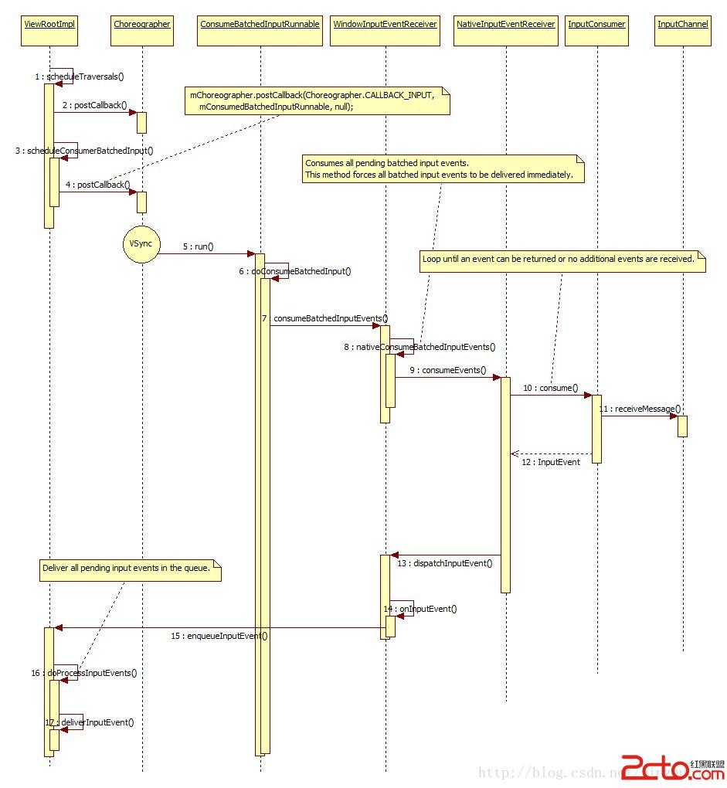

#Android 5.0(Lollipop)事件输入系统(Input System)

[Android 5.0(Lollipop)事件输入系统(Input System)](http://www.android100.org/html/201502/14/118879.html)

其实Android 5.0中事件输入子系统的框架和流程没有本质变化。Service端的实现在/frameworks/native/services/inputflinger/下（4.4中在/frameworks/base/services/input下）。通用部分的实现在/frameworks/native/libs/input/下。Android系统中负责管理输入事件的主要是InputManagerService（IMS）。它主要的任务就是从设备中读事件数据，然后将输入事件发送到焦点窗口中去，另外还需要让系统有机会来处理一些系统按键。显然，要完成这个工作，IMS需要与其它模块打交道，其中最主要的就是WMS和ViewRootImpl。主要的几个模块示意如下：		

为了故事的完整性，还是先看下初始化。SystemServer中初始化IMS，然后初始化WMS，把IMS作为参数传入。

		470            Slog.i(TAG, "Input Manager");
		471            inputManager = new InputManagerService(context);
		472
		473            Slog.i(TAG, "Window Manager");
		474            wm = WindowManagerService.main(context, inputManager,
		475                    mFactoryTestMode != FactoryTest.FACTORY_TEST_LOW_LEVEL,
		476                    !mFirstBoot, mOnlyCore);
		...
		483            inputManager.start();
		
IMS的构造函数中，调用nativeInit()来初始化。注意这里拿了DisplayThread的Handler，意味着IMS中的消息队列处理都是在单独的DisplayThread中进行的。它是系统中共享的单例前台线程，主要用作输入输出的处理用。这样可以使用户体验敏感的处理少受其它工作的影响，减少延时。整个初始化过程流程如下：

可以看到，初始化时依次初始化NativeInputManager，EventHub，InputManager, InputDispatcher，InputReader，InputReaderThread, InputDispatcherThread。NativeInputManager可看作IMS和InputManager的中间层，将IMS的请求转化为对InputManager及其内部对象的操作，同时将InputManager中模块的请求通过JNI调回IMS。InputManager是输入控制中心，它有两个关键线程InputReaderThread和InputDispatcherThread，它们的主要功能部分分别在InputReader和InputDispacher。前者用于从设备中读取事件，后者将事件分发给目标窗口。EventHub是输入设备的控制中心，它直接与input driver打交道。负责处理输入设备的增减，查询，输入事件的处理并向上层提供getEvents()接口接收事件。在它的构造函数中，主要做三件事：

1. 创建epoll对象，之后就可以把各输入设备的fd挂在上面多路等待输入事件。
2. 建立用于唤醒的pipe，把读端挂到epoll上，以后如果有设备参数的变化需要处理，而getEvents()又阻塞在设备上，就可以调用wake()在pipe的写端写入，就可以让线程从等待中返回。
3. 利用inotify机制监听/dev/input目录下的变更，如有则意味着设备的变化，需要处理。

因为事件的处理是流水线，需要InputReader先读事件，然后InputDispatcher才能进一步处理和分发。因此InputDispatcher需要监听InputReader。这里使用了Listener模式，InputDispacher作为InputReader构造函数的第三个参数，它实现InputListenerInterface接口。到了InputReader的构造函数中，将之包装成QueuedInputListener。QueuedInputListener中的成员变量mArgsQueue是一个缓冲队列，只有在flush()时，才会一次性通知InputDispatcher。QueuedInputListener应用了Command模式，它通过包装InputDispatcher(实现InputListenerInterface接口)，将事件的处理请求封装成NotifyArgs，使其有了缓冲执行的功能。

全初始化好后，SystemServer调用start()函数让InputManager中两个线程开始运行。先看InputReaderThread，它是事件在用户态处理过程的起点。这里以按键事件的处理为例。

InputReaderThread不断调用InputReader的pollOnce()->getEvents()函数来得到事件，这些事件可以是输入事件，也可以是由inotify监测到设备增减变更所触发的事件。第一次进入时会扫描/dev/input目录建立设备列表，存在mDevice成员变量中(EventHub中有设备列表KeyedVector mDevices；对应的，InputReader中也有设备列表KeyedVector mDevices。这里先添加到前者，然后会在InputReader::addDeviceLocked()中添加到后者。)，同时将增加的fd加到epoll的等待集合中。在接下来的epoll_wait()等待时，如果有事件就会返回，同时返回可读事件数量。在这里，从Input driver读出的事件从原始的input_event结构转为RawEvent结构，放到getEvents()的输出参数buffer中。getEvents()返回后，InputReader调用processEventsLocked()处理事件，对于设备改变，会根据实际情况调用addDeviceLocked(), removeDeviceLocked()和handleConfigurationChangedLocked()。对于其它设备中来的输入事件，会调用processEventsForDeviceLocked()进一步处理。其中会根据当时注册的InputMapper对事件进行处理，然后将事件处理请求放入缓冲队列（QueuedInputListener中的mArgsQueue）。

		155void QueuedInputListener::notifyKey(const NotifyKeyArgs* args) {
		156    mArgsQueue.push(new NotifyKeyArgs(*args));
		157}

在InputReader的loopOnce()的结尾会调用QueuedInputListener::flush()统一回调缓冲队列中各元素的notify()接口：

		171void QueuedInputListener::flush() {
		172    size_t count = mArgsQueue.size();
		173    for (size_t i = 0; i notify(mInnerListener);
		176        delete args;
		177    }
		178    mArgsQueue.clear();
		179}

以按键事件为例，最后会调用到InputDispatcher的notifyKey()函数中。这里先将参数封装成KeyEvent：

		2416    KeyEvent event;
		2417    event.initialize(args->deviceId, args->source, args->action,
		2418            flags, keyCode, args->scanCode, metaState, 0,
		2419            args->downTime, args->eventTime);

然后把它作为参数调用NativeInputManager的interceptKeyBeforeQueueing()函数。顾名思义，就是在放到待处理队列前看看是不是需要系统处理的系统按键，它会通过JNI调回Java世界，最终调到PhoneWindowManager的interceptKeyBeforeQueueing()。然后，基于输入事件信息创建KeyEntry对象，调用enqueueInboundEventLocked()将之放入队列等待InputDiaptcherThread线程拿出处理。

		2439        KeyEntry* newEntry = new KeyEntry(args->eventTime,
		2440                args->deviceId, args->source, policyFlags,
		2441                args->action, flags, keyCode, args->scanCode,
		2442                metaState, repeatCount, args->downTime);
		2443
		2444        needWake = enqueueInboundEventLocked(newEntry);

下面该InputDispatcherThread登场了。

可以看到，InputDisptacher的主要任务是把前面收到的输入事件发送到PWM及App端的焦点窗口。前面提到InputReaderThread中收到事件后会调用notifyKey()来通知InputDispatcher，也就是放在mInboundQueue中，在InputDispatcher的dispatchOnce()函数中，会从这个队列拿出处理。
		
		234        if (!haveCommandsLocked()) {
		235            dispatchOnceInnerLocked(&nextWakeupTime);
		236        }
		...
		240        if (runCommandsLockedInterruptible()) {
		241            nextWakeupTime = LONG_LONG_MIN;
		242        }
		
其中dispatchOnceInnerLocked()会根据拿出的EventEntry类型调用相应的处理函数，以Key事件为例会调用dispatchKeyLocked()：
		
		767            CommandEntry* commandEntry = postCommandLocked(
		768                    & InputDispatcher::doInterceptKeyBeforeDispatchingLockedInterruptible);
		769            if (mFocusedWindowHandle != NULL) {
		770                commandEntry->inputWindowHandle = mFocusedWindowHandle;
		771            }
		772            commandEntry->keyEntry = entry;
		...
		791    // Identify targets.
		792    Vector inputTargets;
		793    int32_t injectionResult = findFocusedWindowTargetsLocked(currentTime,
		794            entry, inputTargets, nextWakeupTime);
		..
		804    addMonitoringTargetsLocked(inputTargets);
		805
		806    // Dispatch the key.
		807    dispatchEventLocked(currentTime, entry, inputTargets);
		
它会找到目标窗口，然后通过之前和App间建立的连接发送事件。如果是个需要系统处理的Key事件，这里会封装成CommandEntry插入到mCommandQueue队列中，后面的runCommandLockedInterruptible()函数中会调用doInterceptKeyBeforeDispatchingLockedInterruptible()来让PWM有机会进行处理。最后dispatchOnce()调用pollOnce()从和App的连接上接收处理完成消息。那么，InputDispatcher是怎么确定要往哪个窗口中发事件呢？这里的成员变量mFocusedWindowHandle指示了焦点窗口，然后findFocusedWindowTargetsLocked()会调用一系列函数（handleTargetsNotReadyLocked(), checkInjectionPermission(), checkWindowReadyForMoreInputLocked()等）检查mFocusedWindowHandle是否能接收输入事件。如果可以，将之以InputTarget的形式加到目标窗口数组中。然后就会调用dispatchEventLocked()进行发送。那么，这个mFocusedWindowHandle是如何维护的呢？为了更好地理解，这里回头分析下窗口连接的管理及焦点窗口的管理。 
在App端，新的顶层窗口需要被注册到WMS中，这是在ViewRootImpl::setView()中做的。

其中与输入相关的主要有以下几步：
先创建InputChannel，注意还没初始化。
	
	521                     mInputChannel = new InputChannel();
	
初始化InputChannel，通过WMS的相应接口addToDisplay()：
		
		527                     res = mWindowSession.addToDisplay(mWindow, mSeq, mWindowAttributes,
		528                             getHostVisibility(), mDisplay.getDisplayId(),
		529                             mAttachInfo.mContentInsets, mInputChannel);
		
WMS会建立与InputDispatcher的连接。流程如下：

ViewRootImpl通过Session中的addToDisplay()会最终调用WMS的addWindow()。在WMS中，会创建一对InputChannel，本质上是一对本地socket。然后一个注册给InputDispatcher，一个作为输出参数传回给App的ViewRootImpl。这样就建立了App与IMS的一对连接。

		2409            if (outInputChannel != null && (attrs.inputFeatures
		2410                    & WindowManager.LayoutParams.INPUT_FEATURE_NO_INPUT_CHANNEL) == 0) {
		2411                String name = win.makeInputChannelName();
		2412                InputChannel[] inputChannels = InputChannel.openInputChannelPair(name);
		2413                win.setInputChannel(inputChannels[0]);
		2414                inputChannels[1].transferTo(outInputChannel);
		2415
		2416                mInputManager.registerInputChannel(win.mInputChannel, win.mInputWindowHandle);
		2417            }

在InputDispatcher::registerInputChannel()中：

		3327        sp connection = new Connection(inputChannel, inputWindowHandle, monitor);
		3328
		3329        int fd = inputChannel->getFd();
		3330        mConnectionsByFd.add(fd, connection);
		...
		3336        mLooper->addFd(fd, 0, ALOOPER_EVENT_INPUT, handleReceiveCallback, this);

这里创建的Connection表示一个InputDispatcher到应用窗口的连接，里边除了用于传输的inputChannel，inputPublisher和表示事件接收窗口的inputWindowHandle，还有两个队列，outboundQueue是要发的事件，waitQueue是已发事件但还没有从App端收到完成通知的。这是因为对于一些事件，Input Dispatcher在App没处理完前一个时不会发第二个。mLooper->addFd()将相应的fd放入InputDispatcher等待的集合中，回调函数为handleReceiveCallback()，也就是说InputDispatcher在收到App发来的消息时是调用它进行处理的。最后调用mLooper->wake()使InputDispatcherThread从epoll_wait()中返回。

回到App端，如果前面没啥问题，接下来会创建WindowInputEventReceiver，它是App的事件接收端。
		
		 607                     mInputEventReceiver = new WindowInputEventReceiver(mInputChannel,
		 608                             Looper.myLooper());

初始化完后，这个连接的fd就被挂到主线程的等待fd集合去了(InputEventReceiver::nativeInit())。也就是说，当连接上有消息来，主线程就会调用相应的回调处理NativeInputEventReceiver::handleEvent()。

接下来初始化App端事件处理的流水线，这里使用了Chain of responsibility模式，让事件经过各个InputStage，每一个Stage可以决定是否自己处理，也可以传递给下一家。下一家也是如此。在后面的handleEvent()可以看到它们的用法。

		 623                 // Set up the input pipeline.
		 624                 CharSequence counterSuffix = attrs.getTitle();
		 625                 mSyntheticInputStage = new SyntheticInputStage();
		 626                 InputStage viewPostImeStage = new ViewPostImeInputStage(mSyntheticInputStage);
		 627                 InputStage nativePostImeStage = new NativePostImeInputStage(viewPostImeStage,
		 628                         "aq:native-post-ime:" + counterSuffix);
		 629                 InputStage earlyPostImeStage = new EarlyPostImeInputStage(nativePostImeStage);
		 630                 InputStage imeStage = new ImeInputStage(earlyPostImeStage,
		 631                         "aq:ime:" + counterSuffix);
		 632                 InputStage viewPreImeStage = new ViewPreImeInputStage(imeStage);
		 633                 InputStage nativePreImeStage = new NativePreImeInputStage(viewPreImeStage,
		 634                         "aq:native-pre-ime:" + counterSuffix);
		 635
		 636                 mFirstInputStage = nativePreImeStage;
		 637                 mFirstPostImeInputStage = earlyPostImeStage;

到这里，可以知道，InputDispatcher会维护和WMS中所有窗口的连接，虽然一般只会往焦点窗口发事件。如下所示。

连接建立后，接下来要考虑WMS如何将焦点窗口信息传给InputDispatcher。举例来说，当新的窗口加入到WMS中，一般焦点会放到新加窗口上。来看下WMS中的addWindow()函数。

首先，当焦点需要变化时。当焦点窗口变化时，WMS调用
mInputMonitor.setInputFocusLw(mCurrentFocus, updateInputWindows);
将焦点窗口设到InputMonitor的mInputFocus中。然后调用
mInputMonitor.updateInputWindowsLw(true);
来创建InputWindowHandle列表，其中被设成焦点窗口的InputWindowHandle的hasFocus会被置位。之后会调用
mService.mInputManager.setInputWindows(mInputWindowHandles);
将这些信息传到Native层的InputDispatcher。这样InputDispatcher就能够知道要往哪个窗口传事件。在InputDispatcher的setInputWindows()中，会更新InputDispatcher中的焦点窗口句柄。这样，InputDispatcher中就记录下了焦点窗口信息。当IMS的InputDispatcher通过InputChannel发事件到焦点窗口时，NativeInputEventReceiver的handleEvent()会被调用。

基本流程比较直观，先接收事件，然后放入ViewRootImpl的处理队列，然后dispatch给View处理，经过上面提到的一系列InputStage，最后App处理完事件后还需要向IMS发送一个完成信号。

注意上面是以Key事件为例的。对于Motion事件就有差别了。因为触摸移动中的事件不一定要每一个都处理，因为显示也就60HZ，你如果100HZ的输入事件，全处理只会浪费计算资源。上面这条路是每当InputDispatcher有事件发过来时就会触发的，而对于Motion事件，系统会把一个VSync周期内的事件存为Batch，当VSync到来时一起处理。从JB开始，App对输入事件的处理是由VSync信号来驱动的。可以看Choreographer中的VSync回调中首先处理的就是输入事件。

		542        doCallbacks(Choreographer.CALLBACK_INPUT, frameTimeNanos);
		543        doCallbacks(Choreographer.CALLBACK_ANIMATION, frameTimeNanos);
		544        doCallbacks(Choreographer.CALLBACK_TRAVERSAL, frameTimeNanos);

在非VSync触发的情况下，NativeInputEventReceiver::handleEvent()调用consumeEvents()时参数consumeBatches为false，通过InputConsumper::consume()函数得知，它会被放到Batch当中：

		448                if (canAddSample(batch, &mMsg)) {
		449                    batch.samples.push(mMsg);

循环退出条件不满足所以一直读到receiveMessage()失败，退出后在consumeEvents()中由于返回值不为0所以事件不会被马上处理；而当VSync信号到来时，下面流程会被触发，这里consumeEvents()的参数consumeBatches为true，意味着要处理Batch。

ViewRootImpl中维护了pending input event的列表，用mPendingInputEventHead和mPendingInputEventTail指示，其中的元素为QueuedInputEvent类型。这个队列会由InputEventReceiver调用enqueueInputEvent()加入元素，然后ViewRootImpl延时或非延时在doProcessInputEvents()中读出并处理。处理的方法如前图调用deliverInputEvent()，然后调用InputStage的deliver()方法进行处理。最后调用finishInputEvent()向IMS发送完成信息，它实际是调用了NativeInputEventReceiver::finishInputEvent()，该函数内部使用InputConsumer的sendFinishedSignal()发送处理结束信号。

事实上，当Input resample机制打开时（系统属性ro_input.noresample控制），对于Motion事件在InputConsumer里的处理会更复杂一点。Android在InputConsumer中加入了对Motion事件的重采样。VSync代表Display已完成一帧的显示，系统需要准备下一帧，也就是说我们需要知道VSync信号来到时触摸的坐标。那么问题来了，输入设备的事件不是按VSync来的，比如是10ms为周期（VSync周期为16.67ms）。那么怎么知道VSync的时刻的输入坐标呢，只能靠估计。怎么估计呢，靠的是采样加上内外插值结合的估值方法。详细可参见http://www.masonchang.com/blog/2014/8/25/androids-touch-resampling-algorithm 。

前面提到，InputDispatcher除了给App端传事件外，还有个任务是处理系统按键。系统中有一些特殊的按键，是系统需要处理的，如音量，电源键等。它是通过interceptKeyBeforeDispatching()和interceptKeyBeforeQueueing()两个函数来截获的。interceptKeyBeforeDispatching()主要用于处理home, menu和search，interceptkeyBeforeQueueing()主要用于处理音量和电源键。这些处理的实现都放在PWM中，而调用者是在InputDispatcherThread。这样的好处是把平台相关的东西都放在PWM中，而InputDispatcher中是平台通用的东西，厂商要定制策略只需修改PWM。这样，做到了Mechanism和Policy的分离。那InputDisaptcher是如何调用到PWM中的呢？首先InputDispatcher中的代码中有几个hook的地方：

		3510     nsecs_t delay = mPolicy->interceptKeyBeforeDispatching(commandEntry->inputWindowHandle,
		3511             &event, entry->policyFlags);

这里的mPolicy其实是NativeInputManager。NativeInputManager会通过JNI调用到Java世界中的IMS的相应函数：

		1463     // Native callback.
		1464     private long interceptKeyBeforeDispatching(InputWindowHandle focus,
		1465             KeyEvent event, int policyFlags) {
		1466         return mWindowManagerCallbacks.interceptKeyBeforeDispatching(focus, event,      policyFlags);
		1467     }

这里的mWindowManagerCallbacks其实是InputMonitor。然后就调用到PWM了。

		380     public long interceptKeyBeforeDispatching(
		381             InputWindowHandle focus, KeyEvent event, int policyFlags) {
		382         WindowState windowState = focus != null ? (WindowState) focus.windowState :     null;
		383         return mService.mPolicy.interceptKeyBeforeDispatching(windowState, event,       policyFlags);
		384     }

好了，到这里可以小结一下了。输入事件从Kernel到App和PWM的旅程大体如下图所示：

可以看到，从Input driver中读出的是input_event结构，之后在经过中间模块时会按需对其进行封装，变成或被封装进RawEvent, KeyEntry, DispatchEntry, InputMessage, InputEvent, QueuedInputEvent等结构。其中有些结构是对另一些结构的封装，如DispatchEntry中封装了KeyEntry，QueuedInputEvent是对InputEvent的封装等。

回到主线，故事来没讲完。上面说到App这端处理完输入事件，然后通过和IMS中InputDispacher的通信管道InputChannel发了处理完成通知。那InputDispatcher这边收到后如何处理呢？

InputDispatcher会调用handleReceiveCallback()来处理完成信号。这里先是往Command队列里放一个处理事务执行doDispatchCycleFinishedLockedInterruptible()，后面在runCommandsLockedInterruptible()中会取出执行。在doDispatchCycleFinishedLockedInterruptible()函数中，会先调用afterKeyEventLockedInterruptible()。Android中可以定义一些Fallback键，即如果一个Key事件App没有处理，可以Fallback成另外默认的Key事件，这是在这里的dispatchUnhandledKey()函数中进行处理的。接着InputDispatcher会将该收到完成信号的事件项从等待队列中移除。同时由于上一个事件已被App处理完，就可以调用startDispatchCycleLocked()来进行下一轮事件的处理了。
		
		3558        // Dequeue the event and start the next cycle.
		3559        // Note that because the lock might have been released, it is possible that the
		3560        // contents of the wait queue to have been drained, so we need to double-check
		3561        // a few things.
		3562        if (dispatchEntry == connection->findWaitQueueEntry(seq)) {
		3563            connection->waitQueue.dequeue(dispatchEntry);
		...
		3571        }
		3572
		3573        // Start the next dispatch cycle for this connection.
		3574        startDispatchCycleLocked(now(), connection);
		
		
startDispatchCycleLocked函数会检查相应连接的输出缓冲中(connection->outboundQueue)是否有事件要发送的，有的话会通过InputChannel发送出去。
