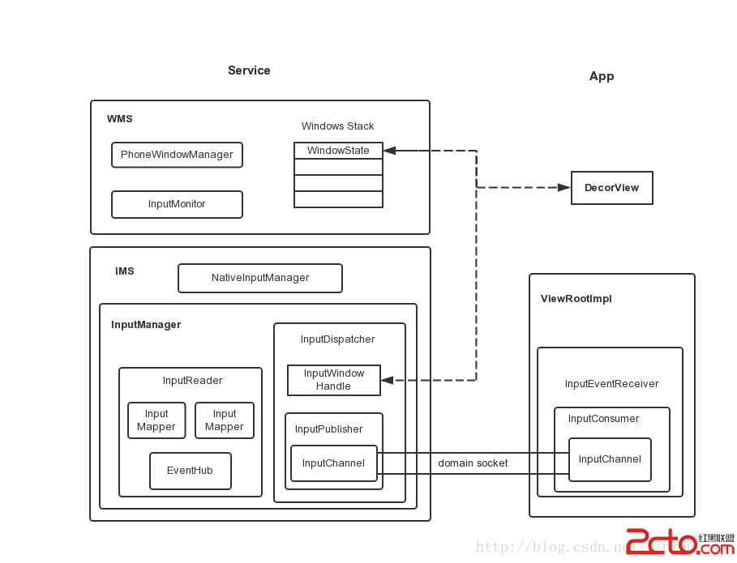
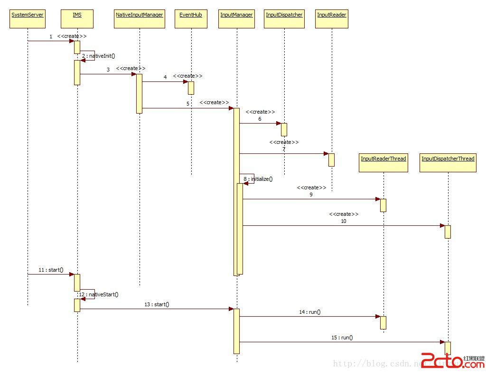
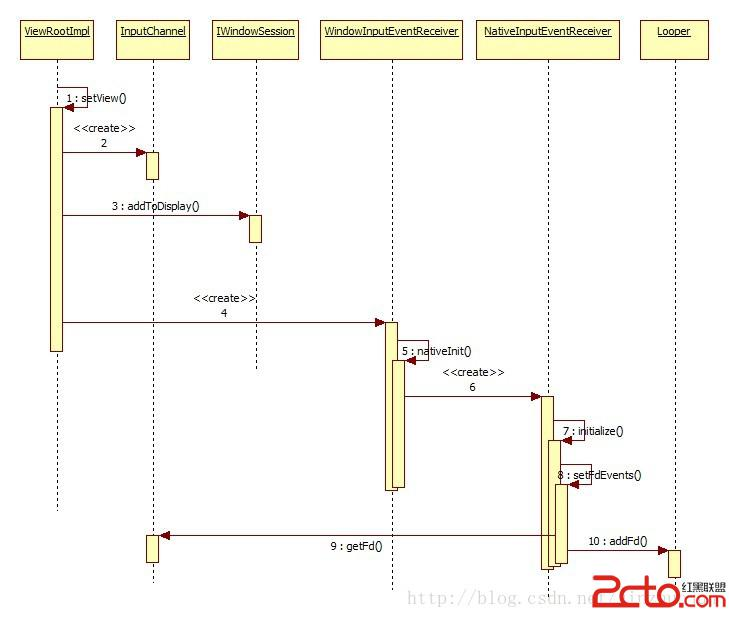
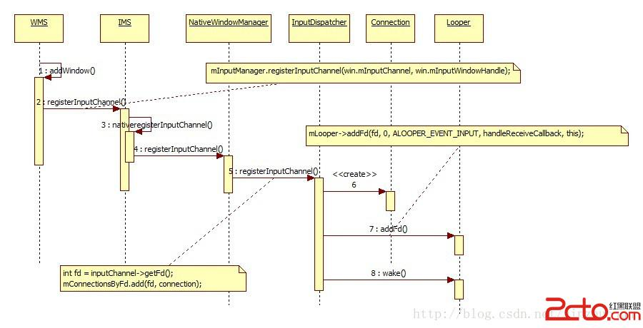
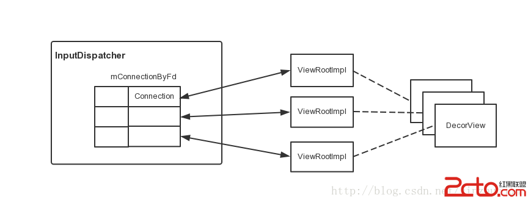
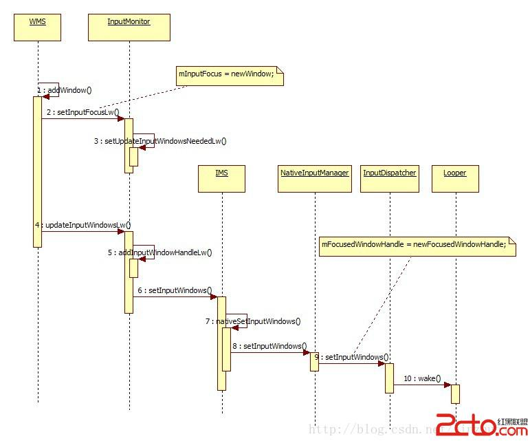
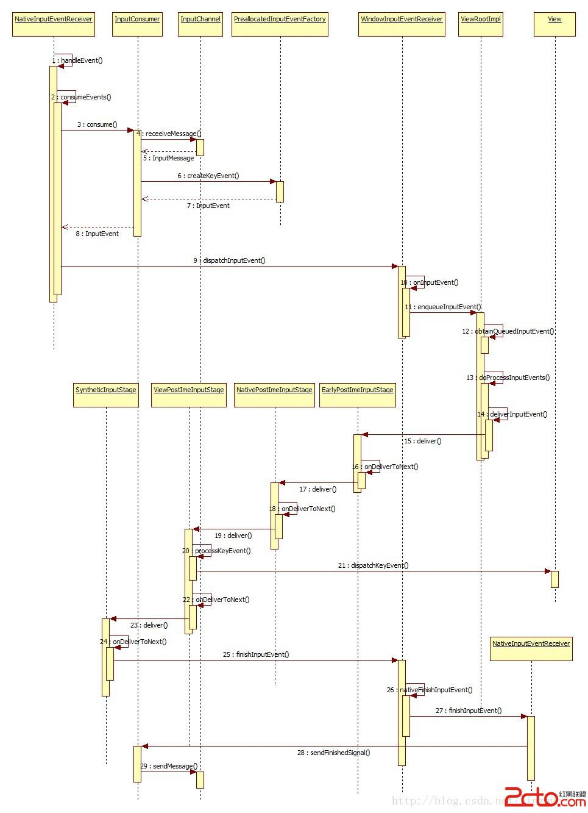
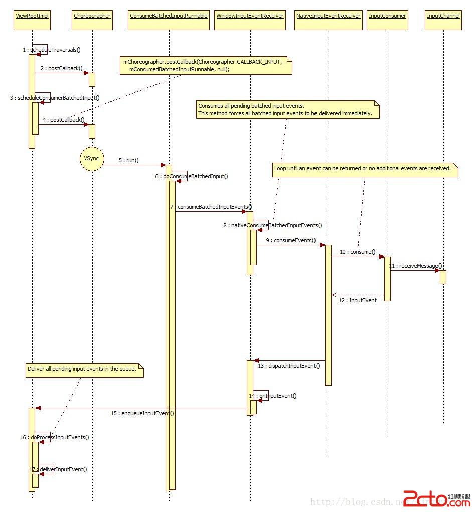

#Android Input 子系统模块分析以及Qcom Latency项目总结
> 对应代码 Android 6.0

**Revision History**
> Zhao Hongjun, 2016.09.01, Initial

##1. 概述

事件输入子系统Service端的实现在/frameworks/native/services/inputflinger/目录，通用部分的实现在/frameworks/native/libs/input/目录。Android系统中负责管理输入事件的主要是InputManagerService（IMS）。它主要的任务就是从设备中读事件数据，然后将输入事件发送到焦点窗口中去，另外还需要让系统有机会来处理一些系统按键。显然，要完成这个工作，IMS需要与其它模块打交道，其中最主要的就是WMS和ViewRootImpl。主要的几个模块示意如下：

SystemServer中初始化IMS，然后初始化WMS，把IMS作为参数传入。

SystemServer.java (frameworks\base\services\java\com\android\server)

            Slog.i(TAG, "Input Manager");
            inputManager = new InputManagerService(context);

            Slog.i(TAG, "Window Manager");
            wm = WindowManagerService.main(context, inputManager,
                    mFactoryTestMode != FactoryTest.FACTORY_TEST_LOW_LEVEL,
                    !mFirstBoot, mOnlyCore);
            ServiceManager.addService(Context.WINDOW_SERVICE, wm);
            ServiceManager.addService(Context.INPUT_SERVICE, inputManager);

            inputManager.setWindowManagerCallbacks(wm.getInputMonitor());
            inputManager.start();

IMS的构造函数

InputManagerService.java (frameworks\base\services\core\java\com\android\server\input)

        public InputManagerService(Context context) {
            this.mContext = context;
            this.mHandler = new InputManagerHandler(DisplayThread.get().getLooper());//这里使用的是DisplayThread,一个单例线程。

            mUseDevInputEventForAudioJack =  context.getResources().getBoolean(R.bool.config_useDevInputEventForAudioJack);
            Slog.i(TAG, "Initializing input manager, mUseDevInputEventForAudioJack="
                    + mUseDevInputEventForAudioJack);
            mPtr = nativeInit(this, mContext, mHandler.getLooper().getQueue());

            LocalServices.addService(InputManagerInternal.class, new LocalService());
        }

注意在IMS的构造函数中，调用nativeInit()来初始化。注意这里拿了DisplayThread的Handler，意味着IMS中的消息队列处理都是在单独的DisplayThread中进行的。它是系统中共享的单例前台线程，主要用作输入输出的处理用。这样可以使用户体验敏感的处理少受其它工作的影响，减少延时。整个初始化过程流程如下：

可以看到，初始化时依次初始化NativeInputManager，EventHub，InputManager, InputDispatcher，InputReader，InputReaderThread, InputDispatcherThread。NativeInputManager可看作IMS和InputManager的中间层，将IMS的请求转化为对InputManager及其内部对象的操作，同时将InputManager中模块的请求通过JNI调回IMS。InputManager是输入控制中心，它有两个关键线程InputReaderThread和InputDispatcherThread，它们的主要功能部分分别在InputReader和InputDispacher。前者用于从设备中读取事件，后者将事件分发给目标窗口。

##2. IMS

###2.1 EventHub

EventHub是输入设备的控制中心，它直接与input driver打交道。负责处理输入设备的增减，查询，输入事件的处理并向上层提供getEvents()接口接收事件。在它的构造函数中，主要做三件事：

1. 创建epoll对象，之后就可以把各输入设备的fd挂在上面多路等待输入事件。
2. 建立用于唤醒的pipe，把读端挂到epoll上，以后如果有设备参数的变化需要处理，而getEvents()又阻塞在设备上，就可以调用wake()在pipe的写端写入，就可以让线程从等待中返回。
3. 利用inotify机制监听/dev/input目录下的变更，如有则意味着设备的变化，需要处理。

####2.1.1 EventHub中的epoll机制建立

先看一下EventHub的构造函数

    EventHub::EventHub(void) :
            mBuiltInKeyboardId(NO_BUILT_IN_KEYBOARD), mNextDeviceId(1), mControllerNumbers(),
            mOpeningDevices(0), mClosingDevices(0),
            mNeedToSendFinishedDeviceScan(false),
            mNeedToReopenDevices(false), mNeedToScanDevices(true),
            mPendingEventCount(0), mPendingEventIndex(0), mPendingINotify(false) {
        acquire_wake_lock(PARTIAL_WAKE_LOCK, WAKE_LOCK_ID);

        mEpollFd = epoll_create(EPOLL_SIZE_HINT);//创建epoll对象
        LOG_ALWAYS_FATAL_IF(mEpollFd < 0, "Could not create epoll instance.  errno=%d", errno);

        mINotifyFd = inotify_init();
        int result = inotify_add_watch(mINotifyFd, DEVICE_PATH, IN_DELETE | IN_CREATE);
        //监听/dev/input目录的创建删除动作
        LOG_ALWAYS_FATAL_IF(result < 0, "Could not register INotify for %s.  errno=%d",
                DEVICE_PATH, errno);

        struct epoll_event eventItem;
        memset(&eventItem, 0, sizeof(eventItem));
        eventItem.events = EPOLLIN;
        eventItem.data.u32 = EPOLL_ID_INOTIFY;
        result = epoll_ctl(mEpollFd, EPOLL_CTL_ADD, mINotifyFd, &eventItem);
        LOG_ALWAYS_FATAL_IF(result != 0, "Could not add INotify to epoll instance.  errno=%d", errno);

        int wakeFds[2];
        result = pipe(wakeFds);//创建用于唤醒block动作的pipe
        LOG_ALWAYS_FATAL_IF(result != 0, "Could not create wake pipe.  errno=%d", errno);

        mWakeReadPipeFd = wakeFds[0];
        mWakeWritePipeFd = wakeFds[1];

        result = fcntl(mWakeReadPipeFd, F_SETFL, O_NONBLOCK);
        LOG_ALWAYS_FATAL_IF(result != 0, "Could not make wake read pipe non-blocking.  errno=%d",
                errno);

        result = fcntl(mWakeWritePipeFd, F_SETFL, O_NONBLOCK);
        LOG_ALWAYS_FATAL_IF(result != 0, "Could not make wake write pipe non-blocking.  errno=%d",
                errno);

        eventItem.data.u32 = EPOLL_ID_WAKE;
        result = epoll_ctl(mEpollFd, EPOLL_CTL_ADD, mWakeReadPipeFd, &eventItem);//挂载到epoll上
        LOG_ALWAYS_FATAL_IF(result != 0, "Could not add wake read pipe to epoll instance.  errno=%d",
                errno);

        int major, minor;
        getLinuxRelease(&major, &minor);
        // EPOLLWAKEUP was introduced in kernel 3.5
        mUsingEpollWakeup = major > 3 || (major == 3 && minor >= 5);
    }

在getEvents函数中首先判断是否需要扫描目录，如果需要，打开/dev/input目录下所有的驱动文件节点，并挂载到epoll上。

getEvents:

    size_t EventHub::getEvents(int timeoutMillis, RawEvent* buffer, size_t bufferSize) {
    ......

            if (mNeedToScanDevices) {
                mNeedToScanDevices = false;
                scanDevicesLocked();//此处扫描目录
                mNeedToSendFinishedDeviceScan = true;
            }
    ........
    }

scanDevicesLocked：

    void EventHub::scanDevicesLocked() {
        status_t res = scanDirLocked(DEVICE_PATH);//此处扫描目录
        if(res < 0) {
            ALOGE("scan dir failed for %s\n", DEVICE_PATH);
        }
        if (mDevices.indexOfKey(VIRTUAL_KEYBOARD_ID) < 0) {
            createVirtualKeyboardLocked();
        }
    }

scanDirLocked：

    status_t EventHub::scanDirLocked(const char *dirname)
    {
        char devname[PATH_MAX];
        char *filename;
        DIR *dir;
        struct dirent *de;
        dir = opendir(dirname);
        if(dir == NULL)
            return -1;
        strcpy(devname, dirname);
        filename = devname + strlen(devname);
        *filename++ = '/';
        while((de = readdir(dir))) {//找出/dev/input目录下的所有文件节点
            if(de->d_name[0] == '.' &&
               (de->d_name[1] == '\0' ||
                (de->d_name[1] == '.' && de->d_name[2] == '\0')))
                continue;
            strcpy(filename, de->d_name);
            openDeviceLocked(devname);//打开单个驱动节点文件
        }
        closedir(dir);
        return 0;
    }

openDeviceLocked：

打开设备节点会将设备挂载到epoll,监听事件输入

    status_t EventHub::openDeviceLocked(const char *devicePath) {
        char buffer[80];

        ALOGV("Opening device: %s", devicePath);

        int fd = open(devicePath, O_RDWR | O_CLOEXEC);
        if(fd < 0) {
            ALOGE("could not open %s, %s\n", devicePath, strerror(errno));
            return -1;
        }
        ......

        // Allocate device.  (The device object takes ownership of the fd at this point.)
        int32_t deviceId = mNextDeviceId++;
        Device* device = new Device(fd, deviceId, String8(devicePath), identifier);

		......

        // Register with epoll.
        struct epoll_event eventItem;
        memset(&eventItem, 0, sizeof(eventItem));
        eventItem.events = EPOLLIN;
        if (mUsingEpollWakeup) {
            eventItem.events |= EPOLLWAKEUP;
        }
        eventItem.data.u32 = deviceId;
        if (epoll_ctl(mEpollFd, EPOLL_CTL_ADD, fd, &eventItem)) { //将驱动文件节点加入epoll
            ALOGE("Could not add device fd to epoll instance.  errno=%d", errno);
            delete device;
            return -1;
        }
        ......
        addDeviceLocked(device);//将设备信息加到设备信息列表
        return 0;
    }

打开设备节点的同时，通过ioctl获得设备的属性，比如是按键，触屏，sensor等等。创建设备信息并加入设备列表。设备列表的结构如下：

    struct Device {
        Device* next;

        int fd; // may be -1 if device is virtual
        const int32_t id;
        const String8 path;
        const InputDeviceIdentifier identifier;

        uint32_t classes;
		......
    };

####2.1.2 EventHub创建

在NativeInputManager 的构造函数中创建EventHub, 并一层一层一直传到InputReader中。

com_android_server_input_InputManagerService.cpp (frameworks\base\services\core\jni)

    NativeInputManager::NativeInputManager(jobject contextObj,
            jobject serviceObj, const sp<Looper>& looper) :
            mLooper(looper), mInteractive(true) {
        JNIEnv* env = jniEnv();

        mContextObj = env->NewGlobalRef(contextObj);
        mServiceObj = env->NewGlobalRef(serviceObj);

        {
            AutoMutex _l(mLock);
            mLocked.systemUiVisibility = ASYSTEM_UI_VISIBILITY_STATUS_BAR_VISIBLE;
            mLocked.pointerSpeed = 0;
            mLocked.pointerGesturesEnabled = true;
            mLocked.showTouches = false;
        }
        mInteractive = true;

        sp<EventHub> eventHub = new EventHub();//此处创建
        mInputManager = new InputManager(eventHub, this, this); //传给InputManager
    }

InputManager

InputManager.cpp (frameworks\native\services\inputflinger)

    InputManager::InputManager(
            const sp<EventHubInterface>& eventHub,
            const sp<InputReaderPolicyInterface>& readerPolicy,
            const sp<InputDispatcherPolicyInterface>& dispatcherPolicy) {
        mDispatcher = new InputDispatcher(dispatcherPolicy);
        mReader = new InputReader(eventHub, readerPolicy, mDispatcher);//传给InputReader
        initialize();
    }

InputReader赋值到成员变量

    sp<EventHubInterface> mEventHub;

####2.1.3 EventHub使用

在InputReader的线程循环中，调用EventHub的getEvents函数，获得输入事件，并处理。

    void InputReader::loopOnce() {//此处是InputReaderThread的线程循环
        ......
        size_t count = mEventHub->getEvents(timeoutMillis, mEventBuffer, EVENT_BUFFER_SIZE);
		//在线程循环中读事件，如果没有事件，此处会等待。
        { // acquire lock
            AutoMutex _l(mLock);
            mReaderIsAliveCondition.broadcast();

            if (count) {
                processEventsLocked(mEventBuffer, count);//处理输入事件
            }
        ......
    }

###2.2 InputReader

####2.2.1 InputReaderThread

InputReaderThread在InputManager初始化时创建，InputManager start时启动。

    bool InputReaderThread::threadLoop() {
        mReader->loopOnce();
        return true;
    }

####2.2.2 InputDevice

InputReader 中定义了InputDevice的映射表。

    KeyedVector<int32_t, InputDevice*> mDevices;

是Device ID 和 Device Info 的对应关系。 这张表根据EventHub反馈的Events信息创建。createDeviceLocked根据EventHub反馈的事件，获得设备的ID, 类型等等信息，创建输入设备，并根据类型创建对应的InputMapper; InputMapper有很多子类，负责处理从EventHub中度出来的原生数据

    InputDevice* InputReader::createDeviceLocked(int32_t deviceId, int32_t controllerNumber,
            const InputDeviceIdentifier& identifier, uint32_t classes) {
        InputDevice* device = new InputDevice(&mContext, deviceId, bumpGenerationLocked(),
                controllerNumber, identifier, classes);

        // External devices.
        if (classes & INPUT_DEVICE_CLASS_EXTERNAL) {
            device->setExternal(true);
        }

        // Devices with mics.
        if (classes & INPUT_DEVICE_CLASS_MIC) {
            device->setMic(true);
        }

        // Switch-like devices.
        if (classes & INPUT_DEVICE_CLASS_SWITCH) {
            device->addMapper(new SwitchInputMapper(device)); //创建对应的InputMapper
        }
		......

        return device;
    }

####2.2.3 InputMapper

InputMapper是抽象类，每个子类负责处理一种输入事件，把驱动提供的原始数据转换成IMS的数据结构。下面以KeyInputMapper为例子说明。

在InputReader通过EventHub读出原始数据之后，经过调用

	processEventsLocked ->
    processEventsForDeviceLocked ->
    device->process(rawEvents, count);->
    KeyboardInputMapper::process(const RawEvent* rawEvent)->
    void KeyboardInputMapper::processKey(nsecs_t when, bool down, int32_t scanCode,
        int32_t usageCode)

在processKey函数中，把按键扫描码转换为安卓系统按键码，创建NotifyKeyArgs，调用对应listener的notifyKey方法，送出按键事件。

	NotifyKeyArgs args(when, getDeviceId(), mSource, policyFlags,
            down ? AKEY_EVENT_ACTION_DOWN : AKEY_EVENT_ACTION_UP,
            AKEY_EVENT_FLAG_FROM_SYSTEM, keyCode, scanCode, keyMetaState, downTime);
    getListener()->notifyKey(&args);

####2.2.4 send to InputDispatcher

所有的InputDevice, InputMapper的mContext都是InputReader中的mContext,

    class ContextImpl : public InputReaderContext {
        InputReader* mReader;

    public:
        ContextImpl(InputReader* reader);

        virtual void updateGlobalMetaState();
        virtual int32_t getGlobalMetaState();
        virtual void disableVirtualKeysUntil(nsecs_t time);
        virtual bool shouldDropVirtualKey(nsecs_t now,
                InputDevice* device, int32_t keyCode, int32_t scanCode);
        virtual void fadePointer();
        virtual void requestTimeoutAtTime(nsecs_t when);
        virtual int32_t bumpGeneration();
        virtual void getExternalStylusDevices(Vector<InputDeviceInfo>& outDevices);
        virtual void dispatchExternalStylusState(const StylusState& outState);
        virtual InputReaderPolicyInterface* getPolicy();
        virtual InputListenerInterface* getListener();
        virtual EventHubInterface* getEventHub();
    } mContext;

mContext提供获取 InputReaderPolicyInterface, InputListenerInterface, EventHubInterface等外部环境。 其中，InputListenerInterface是InputReader用来输出InputEvent的接口。

    class InputListenerInterface : public virtual RefBase {
    protected:
        InputListenerInterface() { }
        virtual ~InputListenerInterface() { }

    public:
        virtual void notifyConfigurationChanged(const NotifyConfigurationChangedArgs* args) = 0;
        virtual void notifyKey(const NotifyKeyArgs* args) = 0;
        virtual void notifyMotion(const NotifyMotionArgs* args) = 0;
        virtual void notifySwitch(const NotifySwitchArgs* args) = 0;
        virtual void notifyDeviceReset(const NotifyDeviceResetArgs* args) = 0;
    };

但是，我们看一下ContextImpl的getListener实现：

    InputListenerInterface* InputReader::ContextImpl::getListener() {
        return mReader->mQueuedListener.get();
    }

返回的是QueuedInputListener，它是InputListenerInterface的子类

作用是把一次读上来的多个输入事件缓存到队列，然后一次提交给InputDispatcher. 看下面的定义：

    class QueuedInputListener : public InputListenerInterface {
    protected:
        virtual ~QueuedInputListener();

    public:
        QueuedInputListener(const sp<InputListenerInterface>& innerListener);

        virtual void notifyConfigurationChanged(const NotifyConfigurationChangedArgs* args);
        virtual void notifyKey(const NotifyKeyArgs* args);
        virtual void notifyMotion(const NotifyMotionArgs* args);
        virtual void notifySwitch(const NotifySwitchArgs* args);
        virtual void notifyDeviceReset(const NotifyDeviceResetArgs* args);

        void flush();//用于把缓存在队列里面的事件，通过mInnerListener，这里其实是InputDispatcher的接口，提交给InputDispatcher

    private:
        sp<InputListenerInterface> mInnerListener;//这里是InputDispatcher的提交事件接口。
        Vector<NotifyArgs*> mArgsQueue;//缓存队列
    };

###2.3 InputDispatcher

####2.2.1 InputDispatcherThread

InputDispatcherThread 在InputManager初始化时创建，InputManager start时启动。

    bool InputDispatcherThread::threadLoop() {
        mDispatcher->dispatchOnce();
        return true;
    }

####2.2.2 事件进入InputDispatcher

以KeyEvent为例子，事件通过QueuedInputListener，调用InputDispatcher实现的notifyKey，进入到InputDispatcher.

	void InputDispatcher::notifyKey(const NotifyKeyArgs* args) {
        ......
        KeyEntry* newEntry = new KeyEntry(args->eventTime,
                    args->deviceId, args->source, policyFlags,
                    args->action, flags, keyCode, args->scanCode,
                    metaState, repeatCount, args->downTime);

        needWake = enqueueInboundEventLocked(newEntry);
        ......
    }
这里经过事件转换之后，进入InputDispatcher的事件处理队列。InputDisptacher的主要任务是把前面收到的输入事件发送到PWM及App端的焦点窗口。前面提到InputReaderThread中收到事件后会调用notifyKey()来通知InputDispatcher，也就是放在mInboundQueue中，在InputDispatcher的dispatchOnce()函数中，会从这个队列拿出处理。

事件队列的定义在这里

    Queue<EventEntry> mInboundQueue;

####2.2.3 事件发送给应用

InputDispatcher也是一个线程，会不断循环调用dispatchOnce. 在dispatchOnce中，会不断从输入事件列表取出事件，派发给相关应用。

        void InputDispatcher::dispatchOnce() {
            nsecs_t nextWakeupTime = LONG_LONG_MAX;
            { // acquire lock
                AutoMutex _l(mLock);
                mDispatcherIsAliveCondition.broadcast();

                // Run a dispatch loop if there are no pending commands.
                // The dispatch loop might enqueue commands to run afterwards.
                if (!haveCommandsLocked()) {
                    dispatchOnceInnerLocked(&nextWakeupTime);
                }

                // Run all pending commands if there are any.
                // If any commands were run then force the next poll to wake up immediately.
                if (runCommandsLockedInterruptible()) {
                    nextWakeupTime = LONG_LONG_MIN;
                }
            } // release lock

            // Wait for callback or timeout or wake.  (make sure we round up, not down)
            nsecs_t currentTime = now();
            int timeoutMillis = toMillisecondTimeoutDelay(currentTime, nextWakeupTime);
            mLooper->pollOnce(timeoutMillis);
        }

其中dispatchOnceInnerLocked()会根据拿出的EventEntry类型调用相应的处理函数，以Key事件为例会调用dispatchKeyLocked()：

        // Identify targets.
        Vector<InputTarget> inputTargets;
        int32_t injectionResult = findFocusedWindowTargetsLocked(currentTime,
                entry, inputTargets, nextWakeupTime);
        if (injectionResult == INPUT_EVENT_INJECTION_PENDING) {
            return false;
        }

        setInjectionResultLocked(entry, injectionResult);
        if (injectionResult != INPUT_EVENT_INJECTION_SUCCEEDED) {
            return true;
        }

        addMonitoringTargetsLocked(inputTargets);

        // Dispatch the key.
        dispatchEventLocked(currentTime, entry, inputTargets);

它会找到目标窗口，然后通过之前和App间建立的连接发送事件。如果是个需要系统处理的Key事件，这里会封装成CommandEntry插入到mCommandQueue队列中，后面的runCommandLockedInterruptible()函数中会调用doInterceptKeyBeforeDispatchingLockedInterruptible()来让PWM有机会进行处理。最后dispatchOnce()调用pollOnce()从和App的连接上接收处理完成消息。

发送事件的位置

InputTarget描述事件发送的对象，其中包括InputChannel

    struct InputTarget {
      // The input channel to be targeted.
        sp<InputChannel> inputChannel;
        ......
        }

Connection 有几个重要的成员

        sp<InputChannel> inputChannel; // never null
        InputPublisher inputPublisher; //封装将事件通过inputChannel发送的逻辑
        Queue<DispatchEntry> outboundQueue;//存放所有要发布给这个channel的输入事件。

dispatchEventLocked 中，找到target对应的connection,把事件缓存到outboundQueue,并使用其中的publisher把事件发送出去

            // Publish the key event.
            status = connection->inputPublisher.publishKeyEvent(dispatchEntry->seq,
                    keyEntry->deviceId, keyEntry->source,
                    dispatchEntry->resolvedAction, dispatchEntry->resolvedFlags,
                    keyEntry->keyCode, keyEntry->scanCode,
                    keyEntry->metaState, keyEntry->repeatCount, keyEntry->downTime,
                    keyEntry->eventTime);

publishKeyEvent 最终会调用

    status_t InputChannel::sendMessage(const InputMessage* msg) {
        size_t msgLength = msg->size();
        ssize_t nWrite;
        do {
            nWrite = ::send(mFd, msg, msgLength, MSG_DONTWAIT | MSG_NOSIGNAL);
        } while (nWrite == -1 && errno == EINTR);

InputChanel 包含socket句柄，是用于应用和InputDispatcher之间传递数据的通道。

        class InputChannel : public RefBase {
        protected:
            virtual ~InputChannel();

        public:
            InputChannel(const String8& name, int fd);

            /* Creates a pair of input channels.
             *
             * Returns OK on success.
             */
            static status_t openInputChannelPair(const String8& name,
                    sp<InputChannel>& outServerChannel, sp<InputChannel>& outClientChannel);

            inline String8 getName() const { return mName; }
            inline int getFd() const { return mFd; }

            status_t sendMessage(const InputMessage* msg);

            status_t receiveMessage(InputMessage* msg);

        private:
            String8 mName;
            int mFd;
        };

##3. IMS和WMS之间的联系

###3.1 InputChannel的创建和连接

在App端，新的顶层窗口需要被注册到WMS中，这是在ViewRootImpl::setView()中做的。

其中与输入相关的主要有以下几步：
先创建InputChannel，注意还没初始化。

                if ((mWindowAttributes.inputFeatures
                        & WindowManager.LayoutParams.INPUT_FEATURE_NO_INPUT_CHANNEL) == 0) {
                    mInputChannel = new InputChannel();  //创建InputChannel, 还没初始化。
                }
                try {
                    mOrigWindowType = mWindowAttributes.type;
                    mAttachInfo.mRecomputeGlobalAttributes = true;
                    collectViewAttributes();
                    res = mWindowSession.addToDisplay(mWindow, mSeq, mWindowAttributes,
                            getHostVisibility(), mDisplay.getDisplayId(),
                            mAttachInfo.mContentInsets, mAttachInfo.mStableInsets,
                            mAttachInfo.mOutsets, mInputChannel); //加入WindowSession
                }

ViewRootImpl通过Session中的addToDisplay()会最终调用WMS的addWindow()。WMS会建立与InputDispatcher的连接。流程如下：

在WMS中，会创建一对InputChannel，本质上是一对本地socket。然后一个注册给InputDispatcher，一个作为输出参数传回给App的ViewRootImpl。这样就建立了App与IMS的一对连接。

            if (outInputChannel != null && (attrs.inputFeatures
                    & WindowManager.LayoutParams.INPUT_FEATURE_NO_INPUT_CHANNEL) == 0) {
                String name = win.makeInputChannelName();
                InputChannel[] inputChannels = InputChannel.openInputChannelPair(name);
                win.setInputChannel(inputChannels[0]);//保存到WindowState，这个会被注册到InputDispatcher中
                inputChannels[1].transferTo(outInputChannel)//这个是ViewRootImpl中的InputChannel,在这里初始化。

                mInputManager.registerInputChannel(win.mInputChannel, win.mInputWindowHandle);//注册到InputManager
            }

回头看addToDisplay在AIDL中单定义，outInputChannel前面有out标志，表示这里是要输出给调用这ViewRootImpl的。

    int addToDisplay(IWindow window, int seq, in WindowManager.LayoutParams attrs,
            in int viewVisibility, in int layerStackId, out Rect outContentInsets,
            out Rect outStableInsets, out Rect outOutsets, out InputChannel outInputChannel);

在InputDispatcher::registerInputChannel()中：

		{
            sp<Connection> connection = new Connection(inputChannel, inputWindowHandle, monitor);

            int fd = inputChannel->getFd();
            mConnectionsByFd.add(fd, connection);

            if (monitor) {
                mMonitoringChannels.push(inputChannel);
            }

            mLooper->addFd(fd, 0, ALOOPER_EVENT_INPUT, handleReceiveCallback, this);//此处用于监听来自应用的反馈
        }
        // Wake the looper because some connections have changed.
    	mLooper->wake();

这里创建的Connection表示一个InputDispatcher到应用窗口的连接，里边除了用于传输的inputChannel，inputPublisher和表示事件接收窗口的inputWindowHandle，还有两个队列，outboundQueue是要发的事件，waitQueue是已发事件但还没有从App端收到完成通知的。这是因为对于一些事件，Input Dispatcher在App没处理完前一个时不会发第二个。mLooper->addFd()将相应的fd放入InputDispatcher等待的集合中，回调函数为handleReceiveCallback()，也就是说InputDispatcher在收到App发来的消息时是调用它进行处理的。

最后调用mLooper->wake()使InputDispatcherThread从epoll_wait()中返回。

回到ViewRootImpl, 在调用addToDispaly之后，mInputChannel已经被初始化了。接下来创建WindowInputEventReceiver

				if (mInputChannel != null) {
                    if (mInputQueueCallback != null) {
                        mInputQueue = new InputQueue();
                        mInputQueueCallback.onInputQueueCreated(mInputQueue);
                    }
                    mInputEventReceiver = new WindowInputEventReceiver(mInputChannel,
                            Looper.myLooper());
                }
初始化完后，这个连接的fd就被挂到主线程的等待fd集合去了(InputEventReceiver::nativeInit())。也就是说，当连接上有消息来，主线程就会调用相应的回调处理NativeInputEventReceiver::handleEvent()。收到socket pair发来的事件之后，从native层经过重重回调，最终到达WindowInputEventReceiver的onInputEvent, 最后事件进入ViewRootImpl的事件队列。

        @Override
        public void onInputEvent(InputEvent event) {
            enqueueInputEvent(event, this, 0, true);//此处加入事件队列
        }

接下来初始化App端事件处理的流水线，这里使用了Chain of responsibility模式，让事件经过各个InputStage，每一个Stage可以决定是否自己处理，也可以传递给下一家。下一家也是如此。在后面的handleEvent()可以看到它们的用法。

		 623                 // Set up the input pipeline.
		 624                 CharSequence counterSuffix = attrs.getTitle();
		 625                 mSyntheticInputStage = new SyntheticInputStage();
		 626                 InputStage viewPostImeStage = new ViewPostImeInputStage(mSyntheticInputStage);
		 627                 InputStage nativePostImeStage = new NativePostImeInputStage(viewPostImeStage,
		 628                         "aq:native-post-ime:" + counterSuffix);
		 629                 InputStage earlyPostImeStage = new EarlyPostImeInputStage(nativePostImeStage);
		 630                 InputStage imeStage = new ImeInputStage(earlyPostImeStage,
		 631                         "aq:ime:" + counterSuffix);
		 632                 InputStage viewPreImeStage = new ViewPreImeInputStage(imeStage);
		 633                 InputStage nativePreImeStage = new NativePreImeInputStage(viewPreImeStage,
		 634                         "aq:native-pre-ime:" + counterSuffix);
		 635
		 636                 mFirstInputStage = nativePreImeStage;
		 637                 mFirstPostImeInputStage = earlyPostImeStage;

到这里，可以知道，InputDispatcher会维护和WMS中所有窗口的连接，虽然一般只会往焦点窗口发事件。如下所示。

###3.2 窗口焦点

InputDispatcher并不是往所有的窗口发送事件，用触屏事件为例，只需要发送给当前被点到的窗口应用。

连接建立后，接下来要考虑WMS如何将焦点窗口信息传给InputDispatcher。举例来说，当新的窗口加入到WMS中，一般焦点会放到新加窗口上。来看下WMS中的addWindow()函数。

也就是说，屏幕窗口每次变化，WMS 都会通过InputMonitor通知并登记到InputDispatcher. 看下面的代码：

    public void updateInputWindowsLw(boolean force) {
    	......
        // Send windows to native code.
        mService.mInputManager.setInputWindows(mInputWindowHandles);
        ......
    }

然后，InputDispacher 通过findFocusedWindowTargetsLocked()会调用一系列函数（handleTargetsNotReadyLocked(), checkInjectionPermission(), checkWindowReadyForMoreInputLocked()等）检查mFocusedWindowHandle是否能接收输入事件。如果可以，将之以InputTarget的形式加到目标窗口数组中。然后就会调用dispatchEventLocked()进行发送。

###3.3 Vsync和窗口绘制

VSync代表Display已完成一帧的显示，系统需要准备下一帧.

APP侧处理输入事件的基本流程：

基本流程比较直观，先接收事件，然后放入ViewRootImpl的处理队列，然后dispatch给View处理，经过上面提到的一系列InputStage，最后App处理完事件后还需要向IMS发送一个完成信号。

注意上面是以Key事件为例的。对于Motion事件就有差别了。因为触摸移动中的事件不一定要每一个都处理，因为显示也就60HZ，你如果100HZ的输入事件，全处理只会浪费计算资源。上面这条路是每当InputDispatcher有事件发过来时就会触发的，而对于Motion事件，系统会把一个VSync周期内的事件存为Batch，当VSync到来时一起处理。从JB开始，App对输入事件的处理是由VSync信号来驱动的。可以看Choreographer中的VSync回调中首先处理的就是输入事件。

在非VSync触发的情况下，NativeInputEventReceiver::handleEvent()调用consumeEvents()时参数consumeBatches为false，通过InputConsumper::consume()函数得知，它会被放到Batch当中：

		448                if (canAddSample(batch, &mMsg)) {
		449                    batch.samples.push(mMsg);

循环退出条件不满足所以一直读到receiveMessage()失败，退出后在consumeEvents()中由于返回值不为0所以事件不会被马上处理；而当VSync信号到来时，下面流程会被触发，这里consumeEvents()的参数consumeBatches为true，意味着要处理Batch。

###3.4 按键预处理

####3.4.1 before dispatch

在dispatchKeyLocked中有下面的逻辑

        // Give the policy a chance to intercept the key.
        if (entry->interceptKeyResult == KeyEntry::INTERCEPT_KEY_RESULT_UNKNOWN) {
            if (entry->policyFlags & POLICY_FLAG_PASS_TO_USER) {
                CommandEntry* commandEntry = postCommandLocked(
                        & InputDispatcher::doInterceptKeyBeforeDispatchingLockedInterruptible);//需要运行的callback
                if (mFocusedWindowHandle != NULL) {
                    commandEntry->inputWindowHandle = mFocusedWindowHandle;
                }
                commandEntry->keyEntry = entry;
                entry->refCount += 1;
                return false; //等等commandEntry运行结果
            } else {
                entry->interceptKeyResult = KeyEntry::INTERCEPT_KEY_RESULT_CONTINUE;
            }
        } else if (entry->interceptKeyResult == KeyEntry::INTERCEPT_KEY_RESULT_SKIP) {
            if (*dropReason == DROP_REASON_NOT_DROPPED) {
                *dropReason = DROP_REASON_POLICY;
            }
        }

        void InputDispatcher::doInterceptKeyBeforeDispatchingLockedInterruptible(
                CommandEntry* commandEntry) {
            KeyEntry* entry = commandEntry->keyEntry;

            KeyEvent event;
            initializeKeyEvent(&event, entry);

            mLock.unlock();

            nsecs_t delay = mPolicy->interceptKeyBeforeDispatching(commandEntry->inputWindowHandle,
                    &event, entry->policyFlags);//回调到PhoneWindowManager

            mLock.lock();

            if (delay < 0) {
                entry->interceptKeyResult = KeyEntry::INTERCEPT_KEY_RESULT_SKIP;//返回小于0，不发送给应用
            } else if (!delay) {
                entry->interceptKeyResult = KeyEntry::INTERCEPT_KEY_RESULT_CONTINUE;//如果返回0，继续发送
            } else {
                entry->interceptKeyResult = KeyEntry::INTERCEPT_KEY_RESULT_TRY_AGAIN_LATER;//等一段时间，再次回调
                entry->interceptKeyWakeupTime = now() + delay;
            }
            entry->release();
        }

这里的mPolicy其实是NativeInputManager。NativeInputManager会通过JNI调用到Java世界中的IMS的相应函数：

    nsecs_t NativeInputManager::interceptKeyBeforeDispatching(
            const sp<InputWindowHandle>& inputWindowHandle,
            const KeyEvent* keyEvent, uint32_t policyFlags) {
        // Policy:
        // - Ignore untrusted events and pass them along.
        // - Filter normal events and trusted injected events through the window manager policy to
        //   handle the HOME key and the like.
        nsecs_t result = 0;
        if (policyFlags & POLICY_FLAG_TRUSTED) {
            JNIEnv* env = jniEnv();

            // Note: inputWindowHandle may be null.
            jobject inputWindowHandleObj = getInputWindowHandleObjLocalRef(env, inputWindowHandle);
            jobject keyEventObj = android_view_KeyEvent_fromNative(env, keyEvent);
            if (keyEventObj) {
                jlong delayMillis = env->CallLongMethod(mServiceObj,
                        gServiceClassInfo.interceptKeyBeforeDispatching,
                        inputWindowHandleObj, keyEventObj, policyFlags);//这里是通往java世界的回调
                bool error = checkAndClearExceptionFromCallback(env, "interceptKeyBeforeDispatching");
                android_view_KeyEvent_recycle(env, keyEventObj);
                env->DeleteLocalRef(keyEventObj);
                if (!error) {
                    if (delayMillis < 0) {
                        result = -1;
                    } else if (delayMillis > 0) {
                        result = milliseconds_to_nanoseconds(delayMillis);
                    }
                }
            } else {
                ALOGE("Failed to obtain key event object for interceptKeyBeforeDispatching.");
            }
            env->DeleteLocalRef(inputWindowHandleObj);
        }
        return result;
    }

在InputManagerService.java中

    // Native callback.
    private long interceptKeyBeforeDispatching(InputWindowHandle focus,
            KeyEvent event, int policyFlags) {
        return mWindowManagerCallbacks.interceptKeyBeforeDispatching(focus, event, policyFlags);
    }

这里的mWindowManagerCallbacks其实是InputMonitor。然后就调用到PWM了。

    /* Provides an opportunity for the window manager policy to process a key before
     * ordinary dispatch. */
    @Override
    public long interceptKeyBeforeDispatching(
            InputWindowHandle focus, KeyEvent event, int policyFlags) {
        WindowState windowState = focus != null ? (WindowState) focus.windowState : null;
        return mService.mPolicy.interceptKeyBeforeDispatching(windowState, event, policyFlags);
    }

####3.4.2 interceptKeyBeforeQueueing

InputReader将按键事件发送给InputDispatcher是通过InputListener接口的notifyKey函数。通过这个接口，把 按键加入到InputDispatcher的队列中。在加入队列之前，会调用PhoneWindowManager的interceptKeyBeforeQueueing。

    void InputDispatcher::notifyKey(const NotifyKeyArgs* args) {
    	......
        mPolicy->interceptKeyBeforeQueueing(&event, /*byref*/ policyFlags);//回调PhoneWindowManager接口
			......
            int32_t repeatCount = 0;
            KeyEntry* newEntry = new KeyEntry(args->eventTime,
                    args->deviceId, args->source, policyFlags,
                    args->action, flags, keyCode, args->scanCode,
                    metaState, repeatCount, args->downTime);

            needWake = enqueueInboundEventLocked(newEntry);//加入队列
            ......
        if (needWake) {
            mLooper->wake();//唤醒InputDiapatcherThread,处理输入事件。
        }
    }

同样， interceptKeyBeforeQueueing也会通过回调到达InputMonitor.java

    /* Provides an opportunity for the window manager policy to intercept early key
     * processing as soon as the key has been read from the device. */
    @Override
    public int interceptKeyBeforeQueueing(KeyEvent event, int policyFlags) {
        return mService.mPolicy.interceptKeyBeforeQueueing(event, policyFlags);
    }

