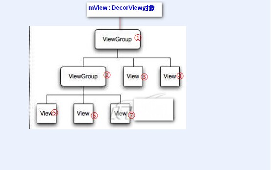

# 应用侧按键处理

ViewRootImpl.java 中的enqueueInputEvent接收InputReceiver从native层回调上来的输入事件。

    void enqueueInputEvent(InputEvent event,
            InputEventReceiver receiver, int flags, boolean processImmediately) {
        adjustInputEventForCompatibility(event);
        QueuedInputEvent q = obtainQueuedInputEvent(event, receiver, flags);

        // Always enqueue the input event in order, regardless of its time stamp.
        // We do this because the application or the IME may inject key events
        // in response to touch events and we want to ensure that the injected keys
        // are processed in the order they were received and we cannot trust that
        // the time stamp of injected events are monotonic.
        QueuedInputEvent last = mPendingInputEventTail;
        if (last == null) {
            mPendingInputEventHead = q;
            mPendingInputEventTail = q;
        } else {
            last.mNext = q;
            mPendingInputEventTail = q;
        }
        mPendingInputEventCount += 1;
        Trace.traceCounter(Trace.TRACE_TAG_INPUT, mPendingInputEventQueueLengthCounterName,
                mPendingInputEventCount);

        if (processImmediately) {
            doProcessInputEvents();
        } else {
            scheduleProcessInputEvents();
        }
    }

doProcessInputEvents函数中调用了deliverInputEvent函数

    void doProcessInputEvents() {
        // Deliver all pending input events in the queue.
        while (mPendingInputEventHead != null) {
            QueuedInputEvent q = mPendingInputEventHead;
            mPendingInputEventHead = q.mNext;
            if (mPendingInputEventHead == null) {
                mPendingInputEventTail = null;
            }
            q.mNext = null;

            mPendingInputEventCount -= 1;
            Trace.traceCounter(Trace.TRACE_TAG_INPUT, mPendingInputEventQueueLengthCounterName,
                    mPendingInputEventCount);

            long eventTime = q.mEvent.getEventTimeNano();
            long oldestEventTime = eventTime;
            if (q.mEvent instanceof MotionEvent) {
                MotionEvent me = (MotionEvent)q.mEvent;
                if (me.getHistorySize() > 0) {
                    oldestEventTime = me.getHistoricalEventTimeNano(0);
                }
            }
            mChoreographer.mFrameInfo.updateInputEventTime(eventTime, oldestEventTime);

            deliverInputEvent(q);
        }

        // We are done processing all input events that we can process right now
        // so we can clear the pending flag immediately.
        if (mProcessInputEventsScheduled) {
            mProcessInputEventsScheduled = false;
            mHandler.removeMessages(MSG_PROCESS_INPUT_EVENTS);
        }
    }

deliverInputEvent函数，进去上层InputState流程。

    private void deliverInputEvent(QueuedInputEvent q) {
        Trace.asyncTraceBegin(Trace.TRACE_TAG_VIEW, "deliverInputEvent",
                q.mEvent.getSequenceNumber());
        if (mInputEventConsistencyVerifier != null) {
            mInputEventConsistencyVerifier.onInputEvent(q.mEvent, 0);
        }

        InputStage stage;
        if (q.shouldSendToSynthesizer()) {
            stage = mSyntheticInputStage;
        } else {
            stage = q.shouldSkipIme() ? mFirstPostImeInputStage : mFirstInputStage;
        }

        if (stage != null) {
            stage.deliver(q);
        } else {
            finishInputEvent(q);
        }
    }

## InputStage的各个流程

InputState流程就不多分析了，处理流程从NativeRreImeInputStage -> ViewPreImeStage -> ImeStage -> EarlyPostImeStage -> NativePostImeStage -> ViewPostImeInputStage -> SyntheticInputStage。

我们先来看setView下面一段代码：

                // Set up the input pipeline.
                CharSequence counterSuffix = attrs.getTitle();
                mSyntheticInputStage = new SyntheticInputStage();
                InputStage viewPostImeStage = new ViewPostImeInputStage(mSyntheticInputStage);
                InputStage nativePostImeStage = new NativePostImeInputStage(viewPostImeStage,
                        "aq:native-post-ime:" + counterSuffix);
                InputStage earlyPostImeStage = new EarlyPostImeInputStage(nativePostImeStage);
                InputStage imeStage = new ImeInputStage(earlyPostImeStage,
                        "aq:ime:" + counterSuffix);
                InputStage viewPreImeStage = new ViewPreImeInputStage(imeStage);
                InputStage nativePreImeStage = new NativePreImeInputStage(viewPreImeStage,
                        "aq:native-pre-ime:" + counterSuffix);

                mFirstInputStage = nativePreImeStage;
                mFirstPostImeInputStage = earlyPostImeStage;

我们注意到除了第一个SyntheticInputStage的构造函数为null，其它的都是拿上一个对象作为参数。而最后mFirstInputStage 指向NativePreImeInputStage，mFirstPostImeInputStage 指向EarlyPostImeInputStage对象。

Input消息的处理流程：

处理流程从NativeRreImeInputStage -> ViewPreImeStage -> ImeStage -> EarlyPostImeStage -> NativePostImeStage -> ViewPostImeInputStage -> SyntheticInputStage。

具体我们不分析了。

## ViewPostImelInputStage

而我们分析下ViewPostImeInputStage：

InputStage的deliver函数会调用onProcess函数，我们就分析下ViewPostImeInputStage的onProcess函数

      protected int onProcess(QueuedInputEvent q) {
            if (q.mEvent instanceof KeyEvent) {
                return processKeyEvent(q);
            } else {
                // If delivering a new non-key event, make sure the window is
                // now allowed to start updating.
                handleDispatchWindowAnimationStopped();
                final int source = q.mEvent.getSource();
                if ((source & InputDevice.SOURCE_CLASS_POINTER) != 0) {
                    return processPointerEvent(q);
                } else if ((source & InputDevice.SOURCE_CLASS_TRACKBALL) != 0) {
                    return processTrackballEvent(q);
                } else {
                    return processGenericMotionEvent(q);
                }
            }
        }

processKeyEvent函数

        private int processKeyEvent(QueuedInputEvent q) {
            final KeyEvent event = (KeyEvent)q.mEvent;

            if (event.getAction() != KeyEvent.ACTION_UP) {
                // If delivering a new key event, make sure the window is
                // now allowed to start updating.
                handleDispatchWindowAnimationStopped();
            }

            // Deliver the key to the view hierarchy.
            if (mView.dispatchKeyEvent(event)) {
                return FINISH_HANDLED;
            }

            if (shouldDropInputEvent(q)) {
                return FINISH_NOT_HANDLED;
            }

processKeyEvent函数会调用mView.dispatchKeyEvent函数。

这里的mView是phoneWindow的DecorView类，因此先调用了DecorView的dispatchKeyEvent函数，下面我们看下DecorView的dispatchKeyEvent函数：

        @Override
        public boolean dispatchKeyEvent(KeyEvent event) {
            final int keyCode = event.getKeyCode();
            final int action = event.getAction();
            final boolean isDown = action == KeyEvent.ACTION_DOWN;

            /// 1. 第一次down事件的时候，处理panel的快捷键
            if (isDown && (event.getRepeatCount() == 0)) {
                // First handle chording of panel key: if a panel key is held
                // but not released, try to execute a shortcut in it.
                if ((mPanelChordingKey > 0) && (mPanelChordingKey != keyCode)) {
                    boolean handled = dispatchKeyShortcutEvent(event);
                    if (handled) {
                        return true;
                    }
                }

                // If a panel is open, perform a shortcut on it without the
                // chorded panel key
                if ((mPreparedPanel != null) && mPreparedPanel.isOpen) {
                    if (performPanelShortcut(mPreparedPanel, keyCode, event, 0)) {
                        return true;
                    }
                }
            }

            /// 2. 这里是我们本文的重点，当window没destroy且其Callback非空的话，交给其Callback处理
            if (!isDestroyed()) { // Activity、Dialog都是Callback接口的实现
                final Callback cb = getCallback(); // mFeatureId < 0 表示是application的DecorView，比如Activity、Dialog
                final boolean handled = cb != null && mFeatureId < 0 ? cb.dispatchKeyEvent(event) // 派发给callback的方法
                        : super.dispatchKeyEvent(event); // 否则直接派发到ViewGroup#dispatchKeyEvent（View层次结构）
                if (handled) {
                    return true; // 如果被上面的步骤处理了则直接返回true，不再往下传递
                }
            }

            /// 3. 这是key事件的最后一步，如果到这一步还没处理掉，则派发到PhoneWindow对应的onKeyDown, onKeyUp方法
            return isDown ? PhoneWindow.this.onKeyDown(mFeatureId, event.getKeyCode(), event)
                    : PhoneWindow.this.onKeyUp(mFeatureId, event.getKeyCode(), event);
        }

上面Callback一般不为NULL，所以是调用的CallBack的dispatchKeyEvent，如果CallBack为NULL，会调用super的dispatchKeyEvent，最终会调用View的dispatchKeyEvent函数中。

下面我们来看下Activity的attach函数中调用了mWindow的setCallBack函数。因此上面的CallBack最后会调用到Activity的dispatchKeyEvent函数中。

    final void attach(Context context, ActivityThread aThread,
            Instrumentation instr, IBinder token, int ident,
            Application application, Intent intent, ActivityInfo info,
            CharSequence title, Activity parent, String id,
            NonConfigurationInstances lastNonConfigurationInstances,
            Configuration config, String referrer, IVoiceInteractor voiceInteractor) {
        attachBaseContext(context);

        mFragments.attachHost(null /*parent*/);

        mWindow = new PhoneWindow(this);
        mWindow.setCallback(this);
        mWindow.setOnWindowDismissedCallback(this);

最后上面在phonewindow的DecorView中最后调用了Activity的dispatchKeyEvent函数

我们来看看Acitivity的dispatchKeyEvent函数

      public boolean dispatchKeyEvent(KeyEvent event) {
          onUserInteraction();/// 2.1. 回调接口，实际开发中用处不大，你感兴趣可以参看其方法doc

          // Let action bars open menus in response to the menu key prioritized over
          // the window handling it
          if (event.getKeyCode() == KeyEvent.KEYCODE_MENU &&
                  mActionBar != null && mActionBar.onMenuKeyEvent(event)) {
              return true;
          }

          Window win = getWindow();

          /// 2.2. 从这里事件的处理交给了与之相关的window对象，实质是派发到了view层次结构
          if (win.superDispatchKeyEvent(event)) {
              return true;
          }
          View decor = mDecor;
          if (decor == null) decor = win.getDecorView();
          /// 2.3. 到这里如果view层次结构没处理则交给KeyEvent本身的dispatch方法，Activity的各种回调方法会被触发
          return event.dispatch(this, decor != null
                  ? decor.getKeyDispatcherState() : null, this);
      }

再来看看KeyEvent的dispatch函数，这个receiver就只Activity本身，如果是应用调的话就是应用的Activity的onKeyDown，onKeyUp。

      public final boolean dispatch(Callback receiver, DispatcherState state,
            Object target) {
        switch (mAction) {
            case ACTION_DOWN: {
                mFlags &= ~FLAG_START_TRACKING;
                if (DEBUG) Log.v(TAG, "Key down to " + target + " in " + state
                        + ": " + this);
                boolean res = receiver.onKeyDown(mKeyCode, this);
                if (state != null) {
                    if (res && mRepeatCount == 0 && (mFlags&FLAG_START_TRACKING) != 0) {
                        if (DEBUG) Log.v(TAG, "  Start tracking!");
                        state.startTracking(this, target);
                    } else if (isLongPress() && state.isTracking(this)) {
                        try {
                            if (receiver.onKeyLongPress(mKeyCode, this)) {
                                if (DEBUG) Log.v(TAG, "  Clear from long press!");
                                state.performedLongPress(this);
                                res = true;
                            }
                        } catch (AbstractMethodError e) {
                        }
                    }
                }
                return res;
            }
            case ACTION_UP:
                if (DEBUG) Log.v(TAG, "Key up to " + target + " in " + state
                        + ": " + this);
                if (state != null) {
                    state.handleUpEvent(this);
                }
                return receiver.onKeyUp(mKeyCode, this);

紧接着我们看看，Window#superDispatchKeyEvent方法，相关代码如下：

        <!-- Window.java -->
        /**
         * Used by custom windows, such as Dialog, to pass the key press event
         * further down the view hierarchy. Application developers should
         * not need to implement or call this.
         *
         */
        public abstract boolean superDispatchKeyEvent(KeyEvent event);

        <!-- PhoneWindow.java -->

        @Override
        public boolean superDispatchKeyEvent(KeyEvent event) {
            return mDecor.superDispatchKeyEvent(event);
        }

       <!-- DecorView.superDispatchKeyEvent -->

    　　public boolean superDispatchKeyEvent(KeyEvent event) {
                /// 2.2.1. 进入view层次结构了，即调用ViewGroup的对应实现了。。。
                if (super.dispatchKeyEvent(event)) {
                    return true; // 如果被view层次结构处理了则直接返回true。
                }

                // Not handled by the view hierarchy, does the action bar want it
                // to cancel out of something special?
                /// 2.2.2. ActionBar对BACK key的特殊处理
                if (event.getKeyCode() == KeyEvent.KEYCODE_BACK) {
                    final int action = event.getAction();
                    // Back cancels action modes first.
                    if (mActionMode != null) {
                        if (action == KeyEvent.ACTION_UP) {
                            mActionMode.finish();
                        }
                        return true;
                    }

                    // Next collapse any expanded action views.
                    if (mActionBar != null && mActionBar.hasExpandedActionView()) {
                        if (action == KeyEvent.ACTION_UP) {
                            mActionBar.collapseActionView();
                        }
                        return true;
                    }
                }
                /// 2.2.3. 最后返回false表示没处理掉，会接着2.3.步骤处理
                return false;
            }

然后我们接着看看2.2.1.包括的小步骤，即ViewGroup#dispatchKeyEvent的实现，代码如下：

    @Override
    public boolean dispatchKeyEvent(KeyEvent event) {
        /// 2.2.1.1. KeyEvent一致性检测用的，可忽略。。。
        if (mInputEventConsistencyVerifier != null) {
            mInputEventConsistencyVerifier.onKeyEvent(event, 1);
        }

        if ((mPrivateFlags & (PFLAG_FOCUSED | PFLAG_HAS_BOUNDS))
                == (PFLAG_FOCUSED | PFLAG_HAS_BOUNDS)) {
            /// 2.2.1.2. 如果此ViewGroup是focused或者具体的大小被设置了（有边界），则交给它处理，即调用View的实现
            if (super.dispatchKeyEvent(event)) {// super即View的实现
                return true;
            }
        } else if (mFocused != null && (mFocused.mPrivateFlags & PFLAG_HAS_BOUNDS)
                == PFLAG_HAS_BOUNDS) {
            /// 2.2.1.3. 否则，如果此ViewGroup中有focused的child，且child有具体的大小，则交给mFocused处理
            if (mFocused.dispatchKeyEvent(event)) { // 注意这里可能是个递归调用
                return true; // 我们可以看到并不是每个child都能响应key事件，前提必须是focused child才有机会响应
            }
        }

        if (mInputEventConsistencyVerifier != null) {
            mInputEventConsistencyVerifier.onUnhandledEvent(event, 1);
        }
        /// 2.2.1.4. 最后都没被处理返回false，2.2.2.步骤会接着执行。。。
        return false;
    }

这里我们可以看出对KeyEvent来说在View层次结构中，如果ViewGroup条件满足则会优先处理事件而不是先派发给其孩子view，

这一点和touch事件有所不同。这里我们看看View的dispatchKeyEvent实现：

      /**
       * Dispatch a key event to the next view on the focus path. This path runs
       * from the top of the view tree down to the currently focused view. If this
       * view has focus, it will dispatch to itself. Otherwise it will dispatch
       * the next node down the focus path. This method also fires any key
       * listeners.
       *
       * @param event The key event to be dispatched.
       * @return True if the event was handled, false otherwise.
       */
      public boolean dispatchKeyEvent(KeyEvent event) {
          if (mInputEventConsistencyVerifier != null) {
              mInputEventConsistencyVerifier.onKeyEvent(event, 0);
          }

          // Give any attached key listener a first crack at the event.
          //noinspection SimplifiableIfStatement
          ListenerInfo li = mListenerInfo;
          /// 2.2.1.2(3).1. 调用onKeyListener，如果它非空且view是ENABLED状态，监听器优先触发
          if (li != null && li.mOnKeyListener != null && (mViewFlags & ENABLED_MASK) == ENABLED
                  && li.mOnKeyListener.onKey(this, event.getKeyCode(), event)) {
              return true;
          }

          /// 2.2.1.2(3).2. 调用KeyEvent.dispatch方法，并将view对象本身作为参数传递进去，view的各种callback方法在这里被触发
          if (event.dispatch(this, mAttachInfo != null
                  ? mAttachInfo.mKeyDispatchState : null, this)) {
              return true;
          }

          if (mInputEventConsistencyVerifier != null) {
              mInputEventConsistencyVerifier.onUnhandledEvent(event, 0);
          }
          /// 2.2.1.2(3).3. 还没处理掉返回false，接着2.2.1.4.执行
          return false;
      }

这里关于View和ViewGroup的dispatchKeyEvent方法我们多说几句。这2个方法一起就实现了view层次结构按照focus路线从上到下

派发KeyEvent的整个流程，后面我会专门用一篇文章来详解下ViewGroup里mFocused变量和View里focus变化的处理过程。

　　言归正传，不管是这里的2.2.1.2(3).2.步骤还是前面Activity里的2.3.步骤，都调到了KeyEvent.dispatch方法，不过在看其代码之前我们

先来看看这里用到的mAttachInfo.mKeyDispatchState对象是咋来的，代码如下：

      // 这句代码位于View.AttachInfo类里
      final KeyEvent.DispatcherState mKeyDispatchState
                      = new KeyEvent.DispatcherState();

      /**
           * Return the global {@link KeyEvent.DispatcherState KeyEvent.DispatcherState}
           * for this view's window.  Returns null if the view is not currently attached
           * to the window.  Normally you will not need to use this directly, but
           * just use the standard high-level event callbacks like
           * {@link #onKeyDown(int, KeyEvent)}.
           */
          public KeyEvent.DispatcherState getKeyDispatcherState() {
              return mAttachInfo != null ? mAttachInfo.mKeyDispatchState : null;
          }

      // KeyEvent.DispatcherState类
          /**
           * Use with {@link KeyEvent#dispatch(Callback, DispatcherState, Object)}
           * for more advanced key dispatching, such as long presses.
           */
          public static class DispatcherState {
              int mDownKeyCode;
              Object mDownTarget;
              SparseIntArray mActiveLongPresses = new SparseIntArray();

              /**
               * Reset back to initial state.
               */
              public void reset() { // 清空内部状态
                  if (DEBUG) Log.v(TAG, "Reset: " + this);
                  mDownKeyCode = 0;
                  mDownTarget = null;
                  mActiveLongPresses.clear();
              }

              /**
               * Stop any tracking associated with this target.
               */
              public void reset(Object target) { // 清空target对应的内部状态
                  if (mDownTarget == target) { // 只有相同时才清空，否则啥也不做
                      if (DEBUG) Log.v(TAG, "Reset in " + target + ": " + this);
                      mDownKeyCode = 0;
                      mDownTarget = null;
                  }
              }

              /**
               * Start tracking the key code associated with the given event.  This
               * can only be called on a key down.  It will allow you to see any
               * long press associated with the key, and will result in
               * {@link KeyEvent#isTracking} return true on the long press and up
               * events.
               *
               * 
This is only needed if you are directly dispatching events, rather
               * than handling them in {@link Callback#onKeyDown}.
               */
              public void startTracking(KeyEvent event, Object target) {
                  if (event.getAction() != ACTION_DOWN) { // 状态检测
                      throw new IllegalArgumentException(
                              "Can only start tracking on a down event");
                  }
                  if (DEBUG) Log.v(TAG, "Start trackingt in " + target + ": " + this);
                  mDownKeyCode = event.getKeyCode(); // 赋值，表示正在track某个keycode
                  mDownTarget = target;
              }

              /**
               * Return true if the key event is for a key code that is currently
               * being tracked by the dispatcher.
               */
              public boolean isTracking(KeyEvent event) {
                  return mDownKeyCode == event.getKeyCode();
              }

              /**
               * Keep track of the given event's key code as having performed an
               * action with a long press, so no action should occur on the up.
               * 
This is only needed if you are directly dispatching events, rather
               * than handling them in {@link Callback#onKeyLongPress}.
               */
              public void performedLongPress(KeyEvent event) {// 用来记录发生了生理长按事件
                  mActiveLongPresses.put(event.getKeyCode(), 1);
              }

              /**
               * Handle key up event to stop tracking.  This resets the dispatcher state,
               * and updates the key event state based on it.
               * 
This is only needed if you are directly dispatching events, rather
               * than handling them in {@link Callback#onKeyUp}.
               */
              public void handleUpEvent(KeyEvent event) {
                  final int keyCode = event.getKeyCode();
                  if (DEBUG) Log.v(TAG, "Handle key up " + event + ": " + this);
                  int index = mActiveLongPresses.indexOfKey(keyCode);
                  if (index >= 0) { // 如果发生过生理长按则设置event.mFlags为CACELED，这样在接下来的receiver.onKeyUp中有些处理就不会发生了
                      if (DEBUG) Log.v(TAG, "  Index: " + index); // 因为事件被标记为CANCELED了
                      event.mFlags |= FLAG_CANCELED | FLAG_CANCELED_LONG_PRESS;
                      mActiveLongPresses.removeAt(index);
                  }
                  if (mDownKeyCode == keyCode) {
                      if (DEBUG) Log.v(TAG, "  Tracking!");
                      event.mFlags |= FLAG_TRACKING; // 设置event正确的mFlags，接下来的receiver.onKeyUp可能会检测此状态
                      mDownKeyCode = 0; // reset，表示此keycode的tracking到此结束了
                      mDownTarget = null;
                  }
              }
          }

大概了解了KeyEvent.DispatcherState类，我们就可以来看看KeyEvent.dispatch方法了，代码如下：

       /**
           * Deliver this key event to a {@link Callback} interface.  If this is
           * an ACTION_MULTIPLE event and it is not handled, then an attempt will
           * be made to deliver a single normal event.
           *
           * @param receiver The Callback that will be given the event.
           * @param state State information retained across events.
           * @param target The target of the dispatch, for use in tracking.
           *
           * @return The return value from the Callback method that was called.
           */
          public final boolean dispatch(Callback receiver, DispatcherState state,
                  Object target) {
              switch (mAction) {
                  case ACTION_DOWN: { // DOWN事件
                      mFlags &= ~FLAG_START_TRACKING; //先清掉START_TRACKING标记
                      if (DEBUG) Log.v(TAG, "Key down to " + target + " in " + state
                              + ": " + this);
                      boolean res = receiver.onKeyDown(mKeyCode, this); // 回调Callback接口的onKeyDown方法，View和Activity都是此接口的实现者
                      if (state != null) { // 一般都成立
                          if (res && mRepeatCount == 0 && (mFlags&FLAG_START_TRACKING) != 0) {
                              if (DEBUG) Log.v(TAG, "  Start tracking!"); // receiver.onKeyDown返回true了且不是repeated
                              state.startTracking(this, target); // 并且也没有开始tracking，则开始tracking当前的KeyEvent和target
                          } else if (isLongPress() && state.isTracking(this)) { // 处理生理长按
                              try { // 检测到生理长按则调用receiver.onKeyLongPress方法
                                  if (receiver.onKeyLongPress(mKeyCode, this)) {
                                      if (DEBUG) Log.v(TAG, "  Clear from long press!");
                                      state.performedLongPress(this); // 记录此event已经有生理long press发生了。。。
                                      res = true; // 设置为处理了
                                  }
                              } catch (AbstractMethodError e) {
                              }
                          }
                      }
                      return res; // 返回down事件处理的结果
                  }
                  case ACTION_UP: // UP事件
                      if (DEBUG) Log.v(TAG, "Key up to " + target + " in " + state
                              + ": " + this);
                      if (state != null) {
                          state.handleUpEvent(this); // reset state的内部状态，也改变了KeyEvent的某些状态
                      }
                      return receiver.onKeyUp(mKeyCode, this); // 最后调用receiver.onKeyUp方法
                  case ACTION_MULTIPLE: // 这里可以忽略掉
                      final int count = mRepeatCount;
                      final int code = mKeyCode;
                      if (receiver.onKeyMultiple(code, count, this)) {
                          return true;
                      }
                      if (code != KeyEvent.KEYCODE_UNKNOWN) {
                          mAction = ACTION_DOWN;
                          mRepeatCount = 0;
                          boolean handled = receiver.onKeyDown(code, this);
                          if (handled) {
                              mAction = ACTION_UP;
                              receiver.onKeyUp(code, this);
                          }
                          mAction = ACTION_MULTIPLE;
                          mRepeatCount = count;
                          return handled;
                      }
                      return false;
              }
              return false;
          }

看完了KeyEvent的具体实现，我们接着看看receiver（Callback接口）的onKeyDown、onKeyUp实现，先来看View相关的，代码如下：

      /**
           * Default implementation of {@link KeyEvent.Callback#onKeyDown(int, KeyEvent)
           * KeyEvent.Callback.onKeyDown()}: perform press of the view
           * when {@link KeyEvent#KEYCODE_DPAD_CENTER} or {@link KeyEvent#KEYCODE_ENTER}
           * is released, if the view is enabled and clickable.
           *
           * 
Key presses in software keyboards will generally NOT trigger this listener,
           * although some may elect to do so in some situations. Do not rely on this to
           * catch software key presses.
           *
           * @param keyCode A key code that represents the button pressed, from
           *                {@link android.view.KeyEvent}.
           * @param event   The KeyEvent object that defines the button action.
           */
      public boolean onKeyDown(int keyCode, KeyEvent event) {
              boolean result = false;

              if (KeyEvent.isConfirmKey(keyCode)) { // 只处理KEYCODE_DPAD_CENTER、KEYCODE_ENTER这2个按键
                  if ((mViewFlags & ENABLED_MASK) == DISABLED) {
                      return true; // 针对disabled View直接返回true表示处理过了
                  }
                  // Long clickable items don't necessarily have to be clickable
                  if (((mViewFlags & CLICKABLE) == CLICKABLE ||
                          (mViewFlags & LONG_CLICKABLE) == LONG_CLICKABLE) &&
                          (event.getRepeatCount() == 0)) { // clickable或者long_clickable且是第一次down事件
                      setPressed(true); // 标记pressed，你可能设置了View不同的background，这时候就会有所体现（比如高亮效果）
                      checkForLongClick(0); // 启动View的long click检测
                      return true; // 到达这一步就表示KeyEvent被处理掉了
                  }
              }
              return result;
          }

      /**
           * Default implementation of {@link KeyEvent.Callback#onKeyUp(int, KeyEvent)
           * KeyEvent.Callback.onKeyUp()}: perform clicking of the view
           * when {@link KeyEvent#KEYCODE_DPAD_CENTER} or
           * {@link KeyEvent#KEYCODE_ENTER} is released.
           * 
Key presses in software keyboards will generally NOT trigger this listener,
           * although some may elect to do so in some situations. Do not rely on this to
           * catch software key presses.
           *
           * @param keyCode A key code that represents the button pressed, from
           *                {@link android.view.KeyEvent}.
           * @param event   The KeyEvent object that defines the button action.
           */
          public boolean onKeyUp(int keyCode, KeyEvent event) {
              if (KeyEvent.isConfirmKey(keyCode)) { // 同onKeyDown，默认也只处理confirm key
                  if ((mViewFlags & ENABLED_MASK) == DISABLED) {
                      return true; // 同样的逻辑，如果是DISABLED view，直接返回true表示处理过了
                  }
                  if ((mViewFlags & CLICKABLE) == CLICKABLE && isPressed()) {
                      setPressed(false); // 重置pressed状态

                      if (!mHasPerformedLongPress) { // 长按没发生的话，
                          // This is a tap, so remove the longpress check
                          removeLongPressCallback(); // 当up事件发生的时候，移除这些已经没用的callback
                          return performClick(); // 调用单击onClick监听器
                      }
                  }
              }
              return false; // 其他所有的Key默认不处理
          }

      /**
           * Sets the pressed state for this view.
           *
           * @see #isClickable()
           * @see #setClickable(boolean)
           *
           * @param pressed Pass true to set the View's internal state to "pressed", or false to reverts
           *        the View's internal state from a previously set "pressed" state.
           */
          public void setPressed(boolean pressed) {
              final boolean needsRefresh = pressed != ((mPrivateFlags & PFLAG_PRESSED) == PFLAG_PRESSED);

              if (pressed) {
                  mPrivateFlags |= PFLAG_PRESSED;
              } else {
                  mPrivateFlags &= ~PFLAG_PRESSED;
              }

              if (needsRefresh) {
                  refreshDrawableState(); // 这行代码会刷新View的显示状态
              }
              dispatchSetPressed(pressed);
          }

      private void checkForLongClick(int delayOffset) {
              if ((mViewFlags & LONG_CLICKABLE) == LONG_CLICKABLE) { // 必须得是LONG_CLICKABLE的View
                  mHasPerformedLongPress = false; // 设置初始值

                  if (mPendingCheckForLongPress == null) { // 只非空的时候才new一个
                      mPendingCheckForLongPress = new CheckForLongPress();
                  }
                  mPendingCheckForLongPress.rememberWindowAttachCount();
                  postDelayed(mPendingCheckForLongPress, // post一个Runnable，注意延迟是个差值，而不是delayOffset
                          ViewConfiguration.getLongPressTimeout() - delayOffset);
              }
          }

      class CheckForLongPress implements Runnable {

              private int mOriginalWindowAttachCount;

              public void run() {
                  if (isPressed() && (mParent != null) // 当时间到了，此Runnable没被移除掉的话，并且这些条件都满足的时候，
                          && mOriginalWindowAttachCount == mWindowAttachCount) {
                      if (performLongClick()) { // 客户端定义的onLongClickListener监听器被触发
                          mHasPerformedLongPress = true; // 只有当被上面的方法处理掉了，才表示LongPress发生过了
                      }
                  }
              }

              public void rememberWindowAttachCount() {
                  mOriginalWindowAttachCount = mWindowAttachCount;
              }
          }

      /**
           * Call this view's OnLongClickListener, if it is defined. Invokes the context menu if the
           * OnLongClickListener did not consume the event.
           *
           * @return True if one of the above receivers consumed the event, false otherwise.
           */
          public boolean performLongClick() {
              sendAccessibilityEvent(AccessibilityEvent.TYPE_VIEW_LONG_CLICKED);

              boolean handled = false;
              ListenerInfo li = mListenerInfo;
              if (li != null && li.mOnLongClickListener != null) { // 优先触发监听器
                  handled = li.mOnLongClickListener.onLongClick(View.this);
              }
              if (!handled) { // 如果还没处理，显示ContextMenu如果定义了的话
                  handled = showContextMenu();
              }
              if (handled) {
                  performHapticFeedback(HapticFeedbackConstants.LONG_PRESS);
              }
              return handled; // 返回处理结果
          }

接下来，看看Activity对应的onKeyDown，onKeyUp方法：

    /**
         * Called when a key was pressed down and not handled by any of the views
         * inside of the activity. So, for example, key presses while the cursor
         * is inside a TextView will not trigger the event (unless it is a navigation
         * to another object) because TextView handles its own key presses.
         *
         * 
If the focused view didn't want this event, this method is called.
         *
         * 
The default implementation takes care of {@link KeyEvent#KEYCODE_BACK}
         * by calling {@link #onBackPressed()}, though the behavior varies based
         * on the application compatibility mode: for
         * {@link android.os.Build.VERSION_CODES#ECLAIR} or later applications,
         * it will set up the dispatch to call {@link #onKeyUp} where the action
         * will be performed; for earlier applications, it will perform the
         * action immediately in on-down, as those versions of the platform
         * behaved.
         *
         * 
Other additional default key handling may be performed
         * if configured with {@link #setDefaultKeyMode}.
         *
         * @return Return <code>true</code> to prevent this event from being propagated
         * further, or <code>false</code> to indicate that you have not handled
         * this event and it should continue to be propagated.
         * @see #onKeyUp
         * @see android.view.KeyEvent
         */
        public boolean onKeyDown(int keyCode, KeyEvent event)  {
            if (keyCode == KeyEvent.KEYCODE_BACK) {
                if (getApplicationInfo().targetSdkVersion
                        >= Build.VERSION_CODES.ECLAIR) { // >= Android 2.0之后
                    event.startTracking(); // 标记追踪这个key event
                } else {
                    onBackPressed(); // 2.0之前直接调用onBackPressed
                }
                return true; // 返回true表示被activity处理掉了
            }

            if (mDefaultKeyMode == DEFAULT_KEYS_DISABLE) {
                return false;
            } else if (mDefaultKeyMode == DEFAULT_KEYS_SHORTCUT) {
                if (getWindow().performPanelShortcut(Window.FEATURE_OPTIONS_PANEL,
                        keyCode, event, Menu.FLAG_ALWAYS_PERFORM_CLOSE)) {
                    return true;
                }
                return false;
            } else {
                // Common code for DEFAULT_KEYS_DIALER & DEFAULT_KEYS_SEARCH_*
                boolean clearSpannable = false;
                boolean handled;
                if ((event.getRepeatCount() != 0) || event.isSystem()) {
                    clearSpannable = true;
                    handled = false;
                } else {
                    handled = TextKeyListener.getInstance().onKeyDown(
                            null, mDefaultKeySsb, keyCode, event);
                    if (handled && mDefaultKeySsb.length() > 0) {
                        // something useable has been typed - dispatch it now.

                        final String str = mDefaultKeySsb.toString();
                        clearSpannable = true;

                        switch (mDefaultKeyMode) {
                        case DEFAULT_KEYS_DIALER:
                            Intent intent = new Intent(Intent.ACTION_DIAL,  Uri.parse("tel:" + str));
                            intent.addFlags(Intent.FLAG_ACTIVITY_NEW_TASK);
                            startActivity(intent);
                            break;
                        case DEFAULT_KEYS_SEARCH_LOCAL:
                            startSearch(str, false, null, false);
                            break;
                        case DEFAULT_KEYS_SEARCH_GLOBAL:
                            startSearch(str, false, null, true);
                            break;
                        }
                    }
                }
                if (clearSpannable) {
                    mDefaultKeySsb.clear();
                    mDefaultKeySsb.clearSpans();
                    Selection.setSelection(mDefaultKeySsb,0);
                }
                return handled;
            }
        }

    /**
         * Called when a key was released and not handled by any of the views
         * inside of the activity. So, for example, key presses while the cursor
         * is inside a TextView will not trigger the event (unless it is a navigation
         * to another object) because TextView handles its own key presses.
         *
         * 
The default implementation handles KEYCODE_BACK to stop the activity
         * and go back.
         *
         * @return Return <code>true</code> to prevent this event from being propagated
         * further, or <code>false</code> to indicate that you have not handled
         * this event and it should continue to be propagated.
         * @see #onKeyDown
         * @see KeyEvent
         */
        public boolean onKeyUp(int keyCode, KeyEvent event) {
            if (getApplicationInfo().targetSdkVersion
                    >= Build.VERSION_CODES.ECLAIR) { // 同onKeyDown，2.0之后的版本
                if (keyCode == KeyEvent.KEYCODE_BACK && event.isTracking()
                        && !event.isCanceled()) { // 是back key，且正在追踪&event没被取消掉（从前面的分析我们知道当发生生理长按时会被标记为Canceled）
                    onBackPressed(); // 在这种情况下执行onBackPressed表示处理掉了
                    return true;
                }
            }
            return false;
        }

最后是3.步骤，回到一开始DecorView.dispatchKeyEvent的最后几行代码，我们来看看PhoneWindow对应的onKeyDown，onKeyUp方法：

      /**
           * A key was pressed down and not handled by anything else in the window.
           *
           * @see #onKeyUp
           * @see android.view.KeyEvent
           */
          protected boolean onKeyDown(int featureId, int keyCode, KeyEvent event) {
              /* ****************************************************************************
               * HOW TO DECIDE WHERE YOUR KEY HANDLING GOES.
               *
               * If your key handling must happen before the app gets a crack at the event,
               * it goes in PhoneWindowManager.
               *
               * If your key handling should happen in all windows, and does not depend on
               * the state of the current application, other than that the current
               * application can override the behavior by handling the event itself, it
               * should go in PhoneFallbackEventHandler.
               *
               * Only if your handling depends on the window, and the fact that it has
               * a DecorView, should it go here.
               * ****************************************************************************/

              final KeyEvent.DispatcherState dispatcher =
                      mDecor != null ? mDecor.getKeyDispatcherState() : null;
              //Log.i(TAG, "Key down: repeat=" + event.getRepeatCount()
              //        + " flags=0x" + Integer.toHexString(event.getFlags()));

              switch (keyCode) {
                  case KeyEvent.KEYCODE_VOLUME_UP: // key event处理中的最后一步，
                  case KeyEvent.KEYCODE_VOLUME_DOWN:
                  case KeyEvent.KEYCODE_VOLUME_MUTE: { // 处理音量调节键
                      // Similar code is in PhoneFallbackEventHandler in case the window
                      // doesn't have one of these.  In this case, we execute it here and
                      // eat the event instead, because we have mVolumeControlStreamType
                      // and they don't.
                      getAudioManager().handleKeyDown(event, mVolumeControlStreamType);
                      return true;
                  }

                  case KeyEvent.KEYCODE_MENU: {
                      onKeyDownPanel((featureId < 0) ? FEATURE_OPTIONS_PANEL : featureId, event);
                      return true;
                  }

                  case KeyEvent.KEYCODE_BACK: {
                      if (event.getRepeatCount() > 0) break;
                      if (featureId < 0) break;
                      // Currently don't do anything with long press.
                      if (dispatcher != null) {
                          dispatcher.startTracking(event, this);
                      }
                      return true;
                  }

              }

              return false;
          }

      /**
           * A key was released and not handled by anything else in the window.
           *
           * @see #onKeyDown
           * @see android.view.KeyEvent
           */
          protected boolean onKeyUp(int featureId, int keyCode, KeyEvent event) {
              final KeyEvent.DispatcherState dispatcher =
                      mDecor != null ? mDecor.getKeyDispatcherState() : null;
              if (dispatcher != null) {
                  dispatcher.handleUpEvent(event);
              }
              //Log.i(TAG, "Key up: repeat=" + event.getRepeatCount()
              //        + " flags=0x" + Integer.toHexString(event.getFlags()));

              switch (keyCode) {
                  case KeyEvent.KEYCODE_VOLUME_UP:
                  case KeyEvent.KEYCODE_VOLUME_DOWN:
                  case KeyEvent.KEYCODE_VOLUME_MUTE: {
                      // Similar code is in PhoneFallbackEventHandler in case the window
                      // doesn't have one of these.  In this case, we execute it here and
                      // eat the event instead, because we have mVolumeControlStreamType
                      // and they don't.
                      getAudioManager().handleKeyUp(event, mVolumeControlStreamType);
                      return true;
                  }

                  case KeyEvent.KEYCODE_MENU: {
                      onKeyUpPanel(featureId < 0 ? FEATURE_OPTIONS_PANEL : featureId,
                              event);
                      return true;
                  }

                  case KeyEvent.KEYCODE_BACK: {
                      if (featureId < 0) break;
                      if (event.isTracking() && !event.isCanceled()) {
                          if (featureId == FEATURE_OPTIONS_PANEL) {
                              PanelFeatureState st = getPanelState(featureId, false);
                              if (st != null && st.isInExpandedMode) {
                                  // If the user is in an expanded menu and hits back, it
                                  // should go back to the icon menu
                                  reopenMenu(true);
                                  return true;
                              }
                          }
                          closePanel(featureId);
                          return true;
                      }
                      break;
                  }

                  case KeyEvent.KEYCODE_SEARCH: {
                      /*
                       * Do this in onKeyUp since the Search key is also used for
                       * chording quick launch shortcuts.
                       */
                      if (getKeyguardManager().inKeyguardRestrictedInputMode()) {
                          break;
                      }
                      if (event.isTracking() && !event.isCanceled()) {
                          launchDefaultSearch();
                      }
                      return true;
                  }
              }

              return false;
          }

至此所有按键事件的处理就分析完毕了，鉴于篇幅略长，我们最后稍微总结下。主要有这么几点：

1. View的各种KeyEvent.Callback接口早于Activity的对应接口被调用；

2. 整个处理环节中只要有一处表明处理掉了，则处理结束，不在往下传递；

3. 各种Callback接口的处理优先级低于监听器，也就是说各种onXXXListener的方法优先被调用。

## processPointerEvent函数 处理触屏事件

下面我们分析另一个处理函数processPointerEvent，处理触屏事件

      private int processPointerEvent(QueuedInputEvent q) {
            final MotionEvent event = (MotionEvent)q.mEvent;

            mAttachInfo.mUnbufferedDispatchRequested = false;
            boolean handled = mView.dispatchPointerEvent(event);
            if (mAttachInfo.mUnbufferedDispatchRequested && !mUnbufferedInputDispatch) {
                mUnbufferedInputDispatch = true;
                if (mConsumeBatchedInputScheduled) {
                    scheduleConsumeBatchedInputImmediately();
                }
            }
            return handled ? FINISH_HANDLED : FORWARD;
        }

调用顺序，

    ViewRootImpl->processPointerEvent
      -> mView(DecorView).dispatchPointerEvent
      -> DecorView.dispatchTouchEvent
      -> cb(activity) dispatchTouchEvent
      -> PhoneWindow.superDispatchTouchEvent
      -> DecorView.superDispatchTouchEvent
      -> ViewGroup.dispatchTouchEvent

***调用顺序不等于处理次序。实际情况是处理次序与之相反。但是如果子类重载，可以打断原有的调用链。***

由于phoneWindow的DecorView中没有实现dispatchPointerEvent，最终调用父类的，最后就到View类中了。我们再去看下view的dispatchPointerEvent函数

ouch事件分发中只有两个主角:ViewGroup和View。Activity的Touch事件事实上是调用它内部的ViewGroup的Touch事件，可以直接当成ViewGroup处理。

View在ViewGroup内，ViewGroup也可以在其他ViewGroup内，这时候把内部的ViewGroup当成View来分析。

ViewGroup的相关事件有三个：onInterceptTouchEvent、dispatchTouchEvent、onTouchEvent。View的相关事件只有两个：dispatchTouchEvent、onTouchEvent。

先分析ViewGroup的处理流程：首先得有个结构模型概念：ViewGroup和View组成了一棵树形结构，最顶层为Activity的ViewGroup，下面有若干的ViewGroup节点，每个节点之下又有若干的ViewGroup节点或者View节点，依次类推。如图：

当一个Touch事件(触摸事件为例)到达根节点，即Acitivty的ViewGroup时，它会依次下发，下发的过程是调用子View(ViewGroup)的dispatchTouchEvent方法实现的。简单来说，就是ViewGroup遍历它包含着的子View，调用每个View的dispatchTouchEvent方法，而当子View为ViewGroup时，又会通过调用ViwGroup的dispatchTouchEvent方法继续调用其内部的View的dispatchTouchEvent方法。上述例子中的消息下发顺序是这样的：①-②-⑤-⑥-⑦-③-④。dispatchTouchEvent方法只负责事件的分发，它拥有boolean类型的返回值，当返回为true时，顺序下发会中断。在上述例子中如果⑤的dispatchTouchEvent返回结果为true，那么⑥-⑦-③-④将都接收不到本次Touch事件。来个简单版的代码加深理解：

     /**
         * ViewGroup
         * @param ev
         * @return
         */
        public boolean dispatchTouchEvent(MotionEvent ev){
            ....//其他处理，在此不管
            View[] views=getChildView();
            for(int i=0;i<views.length;i++){
               //判断下Touch到屏幕上的点在该子View上面
                if(...){
                if(views[i].dispatchTouchEvent(ev))
                  return true;
                 }
            }
            ...//其他处理，在此不管
        }
        /**
         * View
         * @param ev
         * @return
         */
        public boolean dispatchTouchEvent(MotionEvent ev){
            ....//其他处理，在此不管
            return false;
        }

在此可以看出，ViewGroup的dispatchTouchEvent是真正在执行“分发”工作，而View的dispatchTouchEvent方法，并不执行分发工作，或者说它分发的对象就是自己，决定是否把touch事件交给自己处理，而处理的方法，便是onTouchEvent事件，事实上子View的dispatchTouchEvent方法真正执行的代码是这样的

    /**
         * View
         * @param ev
         * @return
         */
        public boolean dispatchTouchEvent(MotionEvent ev){
            ....//其他处理，在此不管
            return onTouchEvent(event);
        }

一般情况下，我们不该在普通View内重写dispatchTouchEvent方法，因为它并不执行分发逻辑。当Touch事件到达View时，我们该做的就是是否在onTouchEvent事件中处理它。

那么，ViewGroup的onTouchEvent事件是什么时候处理的呢？当ViewGroup所有的子View都返回false时，onTouchEvent事件便会执行。由于ViewGroup是继承于View的，它其实也是通过调用View的dispatchTouchEvent方法来执行onTouchEvent事件。

在目前的情况看来，似乎只要我们把所有的onTouchEvent都返回false，就能保证所有的子控件都响应本次Touch事件了。但必须要说明的是，这里的Touch事件，只限于Acition_Down事件，即触摸按下事件,而Aciton_UP和Action_MOVE却不会执行。事实上，一次完整的Touch事件，应该是由一个Down、一个Up和若干个Move组成的。Down方式通过dispatchTouchEvent分发，分发的目的是为了找到真正需要处理完整Touch请求的View。当某个View或者ViewGroup的onTouchEvent事件返回true时，便表示它是真正要处理这次请求的View，之后的Aciton_UP和Action_MOVE将由它处理。当所有子View的onTouchEvent都返回false时，这次的Touch请求就由根ViewGroup，即Activity自己处理了。

看看改进后的ViewGroup的dispatchTouchEvent方法

    View mTarget=null;//保存捕获Touch事件处理的View
        public boolean dispatchTouchEvent(MotionEvent ev) {

            //....其他处理，在此不管

            if(ev.getAction()==KeyEvent.ACTION_DOWN){
                //每次Down事件，都置为Null

                if(!onInterceptTouchEvent()){
                mTarget=null;
                View[] views=getChildView();
                for(int i=0;i<views.length;i++){
                    if(views[i].dispatchTouchEvent(ev))
                        mTarget=views[i];
                        return true;
                }
              }
            }
            //当子View没有捕获down事件时，ViewGroup自身处理。这里处理的Touch事件包含Down、Up和Move
            if(mTarget==null){
                return super.dispatchTouchEvent(ev);
            }
            //...其他处理，在此不管
            if(onInterceptTouchEvent()){

             //...其他处理，在此不管
             }

    //这一步在Action_Down中是不会执行到的，只有Move和UP才会执行到。
            return mTarget.dispatchTouchEvent(ev);

        }

ViewGroup还有个onInterceptTouchEvent，看名字便知道这是个拦截事件。这个拦截事件需要分两种情况来说明：

1.假如我们在某个ViewGroup的onInterceptTouchEvent中，将Action为Down的Touch事件返回true，那便表示将该ViewGroup的所有下发操作拦截掉，这种情况下，mTarget会一直为null，因为mTarget是在Down事件中赋值的。由于mTarge为null，该ViewGroup的onTouchEvent事件被执行。这种情况下可以把这个ViewGroup直接当成View来对待。

2.假如我们在某个ViewGroup的onInterceptTouchEvent中，将Acion为Down的Touch事件都返回false，其他的都返回True，这种情况下，Down事件能正常分发，若子View都返回false，那mTarget还是为空，无影响。若某个子View返回了true，mTarget被赋值了，在Action_Move和Aciton_UP分发到该ViewGroup时，便会给mTarget分发一个Action_Delete的MotionEvent，同时清空mTarget的值，使得接下去的Action_Move(如果上一个操作不是UP)将由ViewGroup的onTouchEvent处理。

情况一用到的比较多，情况二个人还未找到使用场景。

从头到尾总结一下：

1.Touch事件分发中只有两个主角:ViewGroup和View。ViewGroup包含onInterceptTouchEvent、dispatchTouchEvent、onTouchEvent三个相关事件。View包含dispatchTouchEvent、onTouchEvent两个相关事件。其中ViewGroup又继承于View。

2.ViewGroup和View组成了一个树状结构，根节点为Activity内部包含的一个ViwGroup。

3.触摸事件由Action_Down、Action_Move、Aciton_UP组成，其中一次完整的触摸事件中，Down和Up都只有一个，Move有若干个，可以为0个。

4.当Acitivty接收到Touch事件时，将遍历子View进行Down事件的分发。ViewGroup的遍历可以看成是递归的。分发的目的是为了找到真正要处理本次完整触摸事件的View，这个View会在onTouchuEvent结果返回true。

5.当某个子View返回true时，会中止Down事件的分发，同时在ViewGroup中记录该子View。接下去的Move和Up事件将由该子View直接进行处理。由于子View是保存在ViewGroup中的，多层ViewGroup的节点结构时，上级ViewGroup保存的会是真实处理事件的View所在的ViewGroup对象:如ViewGroup0-ViewGroup1-TextView的结构中，TextView返回了true，它将被保存在ViewGroup1中，而ViewGroup1也会返回true，被保存在ViewGroup0中。当Move和UP事件来时，会先从ViewGroup0传递至ViewGroup1，再由ViewGroup1传递至TextView。

6.当ViewGroup中所有子View都不捕获Down事件时，将触发ViewGroup自身的onTouch事件。触发的方式是调用super.dispatchTouchEvent函数，即父类View的dispatchTouchEvent方法。在所有子View都不处理的情况下，触发Acitivity的onTouchEvent方法。

7.onInterceptTouchEvent有两个作用：1.拦截Down事件的分发。2.中止Up和Move事件向目标View传递，使得目标View所在的ViewGroup捕获Up和Move事件。

另外，上文所列出的代码并非真正的源码，只是概括了源码在事件分发处理中的核心处理流程，真正源码各位可以自己去看，包含了更丰富的内容。
