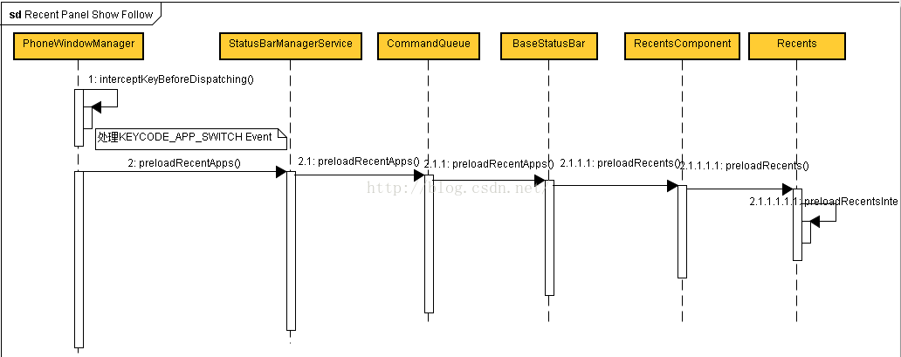
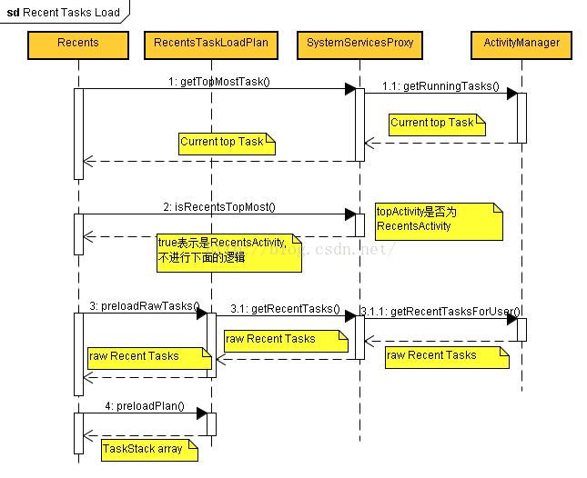
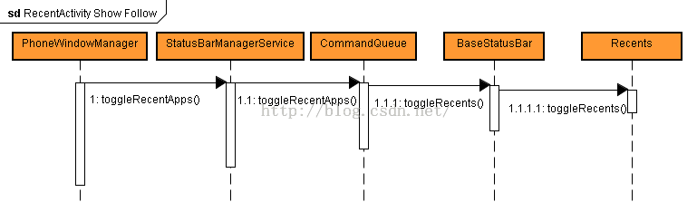

#Recent Panel按键处理流程

##KeyEvent.java中对于Switch按键的定义：

    /** Key code constant: App switch key.
     * Should bring up the application switcher dialog. */
    public static final int KEYCODE_APP_SWITCH      = 187;

##PhoneWindowManager处理(给系统一次机会，去处理按键消息)。

在KeyEvent出队列时，会走到interceptKeyBeforeDispatching函数，因此对于KEYCODE_APP_SWITCH的处理，会在这里进行。

	 /** {@inheritDoc} */
	    @Override
	    public long interceptKeyBeforeDispatching(WindowState win, KeyEvent event, int policyFlags) {
	    ....
	    else if (keyCode == KeyEvent.KEYCODE_APP_SWITCH) {
	            if (!keyguardOn) {
	                if (down && repeatCount == 0) {
	                    preloadRecentApps();
	                } else if (!down) {
	                    toggleRecentApps();
	                }
	            }
	            return -1;
	        }
	        
在key down时，load最近使用的apps->preloadRecentApps();

在key up时,打开或关闭Recent Panel-> toggleRecentApps();

##Recent Apps加载流程

在PhoneWindowManager里面开始执行preloadRecentApps()函数后，一步步调用，最终会call到我们熟悉的Recents.java，即最终是通过SystemUI去Reload Recent apps。
下面是这个函数的逻辑时序图：

	
预加载Recent Apps核心函数是Recents.java中的preloadRecentsInternal函数。
函数代码如下：
	
	void preloadRecentsInternal() {  
	      // Preload only the raw task list into a new load plan (which will be consumed by the  
	      // RecentsActivity) only if there is a task to animate to.  
	      ActivityManager.RunningTaskInfo topTask = mSystemServicesProxy.getTopMostTask();  
	      MutableBoolean topTaskHome = new MutableBoolean(true);  
	      RecentsTaskLoader loader = RecentsTaskLoader.getInstance();  
	      sInstanceLoadPlan = loader.createLoadPlan(mContext);  
	      if (topTask != null && !mSystemServicesProxy.isRecentsTopMost(topTask, topTaskHome)) {  
	          sInstanceLoadPlan.preloadRawTasks(topTaskHome.value);  
	          loader.preloadTasks(sInstanceLoadPlan, topTaskHome.value);  
	          TaskStack top = sInstanceLoadPlan.getAllTaskStacks().get(0);  
	          if (top.getTaskCount() > 0) {  
	              preCacheThumbnailTransitionBitmapAsync(topTask, top, mDummyStackView,  
	                      topTaskHome.value);  
	          }  
	      }  
	  }  
	  
函数主要做了如下几件事情：
1)获取当前运行的Task

	ActivityManager.RunningTaskInfo topTask = mSystemServicesProxy.getTopMostTask();
	
	 /** Returns the top task. */
	    public ActivityManager.RunningTaskInfo getTopMostTask() {
	        List<ActivityManager.RunningTaskInfo> tasks = getRunningTasks(1);
	        if (tasks != null && !tasks.isEmpty()) {
	            return tasks.get(0);
	        }
	        return null;
	    }
	
	  /** Returns a list of the running tasks */
	    private List<ActivityManager.RunningTaskInfo> getRunningTasks(int numTasks) {
	        if (mAm == null) return null;
	        return mAm.getRunningTasks(numTasks); ->最终call到ActivityManager里面的getRunningTasks
	    }

2)判定当前的task是否是RecentActivity
	
	if (topTask != null && !mSystemServicesProxy.isRecentsTopMost(topTask, topTaskHome)) 
	
	/** Returns whether the recents is currently running */
	    public boolean isRecentsTopMost(ActivityManager.RunningTaskInfo topTask,
	            MutableBoolean isHomeTopMost) {
	        if (topTask != null) {
	            ComponentName topActivity = topTask.topActivity;
	
	
	            // Check if the front most activity is recents
	            if (topActivity.getPackageName().equals(Recents.sRecentsPackage) &&
	                    topActivity.getClassName().equals(Recents.sRecentsActivity)) {
	                if (isHomeTopMost != null) {
	                    isHomeTopMost.value = false;
	                }
	                return true;
	            }
	
	
	            if (isHomeTopMost != null) {
	                isHomeTopMost.value = isInHomeStack(topTask.id);
	            }
	        }
	        return false;
	    }
其中，
	
	Recents.sRecentsPackage = "com.android.systemui"
	Recents.sRecentsActivity = "com.android.systemui.recents.RecentsActivity"

如果当前正在运行RecentActivity即Recent Panel正在显示，不去执行preload recent apps行为(因为没有意义，这个时候是去关闭Recent Panel)

3)获取raw recent tasks

	sInstanceLoadPlan.preloadRawTasks(topTaskHome.value);
	
这里获取的只是raw tasks数据，并不是真正在UI上显示的Tasks。

相关实现：

RecentsTaskLoadPlan.java
	
	/** 
	    * An optimization to preload the raw list of tasks. 
	    */  
	   public synchronized void preloadRawTasks(boolean isTopTaskHome) {  
	       mRawTasks = mSystemServicesProxy.getRecentTasks(mConfig.maxNumTasksToLoad,  
	               UserHandle.CURRENT.getIdentifier(), isTopTaskHome);  
	       Collections.reverse(mRawTasks);  
	  
	       if (DEBUG) Log.d(TAG, "preloadRawTasks, tasks: " + mRawTasks.size());  
	   }  
	   
调用SystemServicesProxy里的getRecentTasks函数去RecentTasks。
mConfig.maxNumTasksToLoad在lowRamDevice是50，其他为100(lowRamDevice是指内存等于或低于512M低端机)

RecentsConfiguration.java
	
	 // Loading
	maxNumTasksToLoad = ActivityManager.getMaxRecentTasksStatic();

ActivityManager.java

	/**
	     * Return the maximum number of recents entries that we will maintain and show.
	     * @hide
	     */
	    static public int getMaxRecentTasksStatic() {
	        if (gMaxRecentTasks < 0) {
	            return gMaxRecentTasks = isLowRamDeviceStatic() ? 50 : 100;
	        }
	        return gMaxRecentTasks;
	    }

获取到的Recent Tasks存放在mRamTasks全局变量。

SystemServicesProxy.java中获取当前的Recent Tasks，主要实现：

	/** Returns a list of the recents tasks */
	    public List<ActivityManager.RecentTaskInfo> getRecentTasks(int numLatestTasks, int userId,
	            boolean isTopTaskHome) {
	        if (mAm == null) return null;
	       ...
	      List<ActivityManager.RecentTaskInfo> tasks = mAm.getRecentTasksForUser(numTasksToQuery,
	                ActivityManager.RECENT_IGNORE_HOME_STACK_TASKS |
	                ActivityManager.RECENT_IGNORE_UNAVAILABLE |
	                ActivityManager.RECENT_INCLUDE_PROFILES |
	                ActivityManager.RECENT_WITH_EXCLUDED, userId);
	
	
	        // Break early if we can't get a valid set of tasks
	        if (tasks == null) {
	            return new ArrayList<>();
	        }

4)raw recent tasks转化为显示的recent Tasks

第三步获取的raw recent tasks仅仅是原始数据，需要配合UI显示出来。

	loader.preloadTasks(sInstanceLoadPlan, topTaskHome.value);

RecentsTaskLoadPlan.java
	
	 /**
	     * Preloads the list of recent tasks from the system.  After this call, the TaskStack will
	     * have a list of all the recent tasks with their metadata, not including icons or
	     * thumbnails which were not cached and have to be loaded.
	     */
	    synchronized void preloadPlan(RecentsTaskLoader loader, boolean isTopTaskHome) {
	   ....
	 int taskCount = mRawTasks.size();
	        for (int i = 0; i < taskCount; i++) {
	            ActivityManager.RecentTaskInfo t = mRawTasks.get(i);
	
	
	            // Compose the task key
	            Task.TaskKey taskKey = new Task.TaskKey(t.persistentId, t.stackId, t.baseIntent,
	                    t.userId, t.firstActiveTime, t.lastActiveTime);
	
	
	            // Get an existing activity info handle if possible
	            Task.ComponentNameKey cnKey = taskKey.getComponentNameKey();
	            ActivityInfoHandle infoHandle;
	            boolean hadCachedActivityInfo = false;
	            if (mActivityInfoCache.containsKey(cnKey)) {
	                infoHandle = mActivityInfoCache.get(cnKey);
	                hadCachedActivityInfo = true;
	            } else {
	                infoHandle = new ActivityInfoHandle();
	            }
	
	
	            // Load the label, icon, and color
	            String activityLabel = loader.getAndUpdateActivityLabel(taskKey, t.taskDescription,
	                    mSystemServicesProxy, infoHandle);
	            String contentDescription = loader.getAndUpdateContentDescription(taskKey,
	                    activityLabel, mSystemServicesProxy, res);
	            Drawable activityIcon = loader.getAndUpdateActivityIcon(taskKey, t.taskDescription,
	                    mSystemServicesProxy, res, infoHandle, false);
	            int activityColor = loader.getActivityPrimaryColor(t.taskDescription, mConfig);
	
	
	            // Update the activity info cache
	            if (!hadCachedActivityInfo && infoHandle.info != null) {
	                mActivityInfoCache.put(cnKey, infoHandle);
	            }
	
	
	            Bitmap icon = t.taskDescription != null
	                    ? t.taskDescription.getInMemoryIcon()
	                    : null;
	            String iconFilename = t.taskDescription != null
	                    ? t.taskDescription.getIconFilename()
	                    : null;
	
	
	            // Add the task to the stack
	            Task task = new Task(taskKey, (t.id != RecentsTaskLoader.INVALID_TASK_ID),
	                    t.affiliatedTaskId, t.affiliatedTaskColor, activityLabel, contentDescription,
	                    activityIcon, activityColor, (i == (taskCount - 1)), mConfig.lockToAppEnabled,
	                    icon, iconFilename);
	            task.thumbnail = loader.getAndUpdateThumbnail(taskKey, mSystemServicesProxy, false);
	            if (DEBUG) Log.d(TAG, "\tthumbnail: " + taskKey + ", " + task.thumbnail);
	
	
	            if (!mConfig.multiStackEnabled ||
	                    Constants.DebugFlags.App.EnableMultiStackToSingleStack) {
	                int firstStackId = 0;
	                ArrayList<Task> stackTasks = stacksTasks.get(firstStackId);
	                if (stackTasks == null) {
	                    stackTasks = new ArrayList<>();
	                    stacksTasks.put(firstStackId, stackTasks);
	                }
	                stackTasks.add(task);
	            } else {
	                ArrayList<Task> stackTasks = stacksTasks.get(t.stackId);
	                if (stackTasks == null) {
	                    stackTasks = new ArrayList<>();
	                    stacksTasks.put(t.stackId, stackTasks);
	                }
	                stackTasks.add(task);
	            }
	        }
	        
	        
获取RawTasks后，进行各种初始化，初始化的目的是为了配合UI显示。

Recent Tasks Preload Follow时序图如下：

##3.RecentActivity显示和隐藏流程

在第一部分已经讲到，PhoneWindowManager在接收到KEYCODE_APP_SWITCH KeyEvent后，在key up时会进行开关Recent Panel显示的逻辑处理。

整理为时序图如下：

即最终会call到SystemUI的Recents.java中的toggleRecents()。

下面分析一下这个函数的处理逻辑(注意在第二部分我们分析到Raw Recent Tasks的数据，怎么给到RecentActivity使用的)
1)RecentActivity显示或消失判定依据
RecentActivity.java
	
	
	/** Toggles the recents activity */  
	 void toggleRecentsActivity() {  
	     // If the user has toggled it too quickly, then just eat up the event here (it's better than  
	     // showing a janky screenshot).  
	     // NOTE: Ideally, the screenshot mechanism would take the window transform into account  
	     if ((SystemClock.elapsedRealtime() - mLastToggleTime) < sMinToggleDelay) {  
	         return;  
	     }  
	  
	     // If Recents is the front most activity, then we should just communicate with it directly  
	     // to launch the first task or dismiss itself  
	     ActivityManager.RunningTaskInfo topTask = mSystemServicesProxy.getTopMostTask();  
	     MutableBoolean isTopTaskHome = new MutableBoolean(true);  
	     if (topTask != null && mSystemServicesProxy.isRecentsTopMost(topTask, isTopTaskHome)) {  
	         // Notify recents to toggle itself  
	         Intent intent = createLocalBroadcastIntent(mContext, ACTION_TOGGLE_RECENTS_ACTIVITY);  
	         mContext.sendBroadcastAsUser(intent, UserHandle.CURRENT);  
	         mLastToggleTime = SystemClock.elapsedRealtime();  
	         return;  
	     } else {  
	         // Otherwise, start the recents activity  
	         startRecentsActivity(topTask, isTopTaskHome.value);  
	     }  
	 }  
	 
	 
	 
###RecentActivity消失的条件：当前Task的Activity为RecentActivity，则表示当前已经是RecentActivity,那么不刷新数据，直接消失。

	ActivityManager.RunningTaskInfo topTask = mSystemServicesProxy.getTopMostTask();
	topTask != null && mSystemServicesProxy.isRecentsTopMost(topTask, isTopTaskHome) 

->这段code第二部分有分析过实现过程

	// Notify recents to toggle itself
	Intent intent = createLocalBroadcastIntent(mContext, ACTION_TOGGLE_RECENTS_ACTIVITY);
	mContext.sendBroadcastAsUser(intent, UserHandle.CURRENT);
	mLastToggleTime = SystemClock.elapsedRealtime();

->这里会发送一个广播，通知RecentActivity

RecentActivity.java
注册上面提到的广播：

	// Register the broadcast receiver to handle messages from our service
	IntentFilter filter = new IntentFilter();
	filter.addAction(Recents.ACTION_HIDE_RECENTS_ACTIVITY);
	 filter.addAction(Recents.ACTION_TOGGLE_RECENTS_ACTIVITY);
	 filter.addAction(Recents.ACTION_START_ENTER_ANIMATION);
	registerReceiver(mServiceBroadcastReceiver, filter);

广播接收器mServiceBroadcastReceiver处理逻辑：

	else if (action.equals(Recents.ACTION_TOGGLE_RECENTS_ACTIVITY)) {
	// If we are toggling Recents, then first unfilter any filtered stacks first
	dismissRecentsToFocusedTaskOrHome(true);

如果当前不是RecentActivity,那么走显示RecentActivity逻辑。

	// Otherwise, start the recents activity
	startRecentsActivity(topTask, isTopTaskHome.value);
	

####2)启动RecentActivity

startRecentsActivity函数会根据两种不同的source，传入不同的参数，这里说的source只是从Home和非Home启动RecentActivity
从Home启动：

	 // Determine whether we are coming from a search owned home activity
	boolean fromSearchHome = (homeActivityPackage != null) &&
	                        homeActivityPackage.equals(searchWidgetPackage);
	ActivityOptions opts = getHomeTransitionActivityOptions(fromSearchHome);
	startAlternateRecentsActivity(topTask, opts, true /* fromHome */, fromSearchHome, false /* fromThumbnail */, stackVr);

从非Home启动：

	 // Otherwise we do the normal fade from an unknown source
	ActivityOptions opts = getUnknownTransitionActivityOptions();
	startAlternateRecentsActivity(topTask, opts, true /* fromHome */,false /* fromSearchHome */, false /* fromThumbnail */, stackVr);

最后在startAlternateRecentsActivity函数中启动RecentActivity：
 
	 Intent intent = new Intent(sToggleRecentsAction);
	intent.setClassName(sRecentsPackage, sRecentsActivity);
	 intent.setFlags(Intent.FLAG_ACTIVITY_NEW_TASK
	                | Intent.FLAG_ACTIVITY_EXCLUDE_FROM_RECENTS
	                | Intent.FLAG_ACTIVITY_TASK_ON_HOME);
	if (opts != null) {
	      mContext.startActivityAsUser(intent, opts.toBundle(), UserHandle.CURRENT);
	} else {
	     mContext.startActivityAsUser(intent, UserHandle.CURRENT);
	}

####3)在RecentActivity中刷新Recent Tasks

在RecentsActivity的onStart函数中，会call updateRecentsTasks()函数刷新Tasks数据。
RecentsActivity.java

	/** Updates the set of recent tasks */  
	void updateRecentsTasks() {  
	    // If AlternateRecentsComponent has preloaded a load plan, then use that to prevent  
	    // reconstructing the task stack  
	    RecentsTaskLoader loader = RecentsTaskLoader.getInstance();  
	    RecentsTaskLoadPlan plan = Recents.consumeInstanceLoadPlan();  
	    if (plan == null) {  
	        plan = loader.createLoadPlan(this);  
	    }  
	  
	    // Start loading tasks according to the load plan  
	    if (!plan.hasTasks()) {  
	        loader.preloadTasks(plan, mConfig.launchedFromHome);  
	    }  
	    RecentsTaskLoadPlan.Options loadOpts = new RecentsTaskLoadPlan.Options();  
	    loadOpts.runningTaskId = mConfig.launchedToTaskId;  
	    loadOpts.numVisibleTasks = mConfig.launchedNumVisibleTasks;  
	    loadOpts.numVisibleTaskThumbnails = mConfig.launchedNumVisibleThumbnails;  
	    loader.loadTasks(this, plan, loadOpts);  
	  
	    ArrayList<TaskStack> stacks = plan.getAllTaskStacks();  
	    mConfig.launchedWithNoRecentTasks = !plan.hasTasks();  
	    if (!mConfig.launchedWithNoRecentTasks) {  
	        mRecentsView.setTaskStacks(stacks);  
	    }  

mRecentsView设置的stacks就是我们在第二部获取的数据。

RecentsTaskLoadPlan.java

	/** 
	 * Returns all TaskStacks from the preloaded list of recent tasks. 
	 */  
	public ArrayList<TaskStack> getAllTaskStacks() {  
	    ArrayList<TaskStack> stacks = new ArrayList<TaskStack>();  
	    int stackCount = mStacks.size();  
	    for (int i = 0; i < stackCount; i++) {  
	        stacks.add(mStacks.valueAt(i));  
	    }  
	    // Ensure that we have at least one stack  
	    if (stacks.isEmpty()) {  
	        stacks.add(new TaskStack());  
	    }  
	    return stacks;  
	}  

这里的mStacks即我们第二步封装的数据。