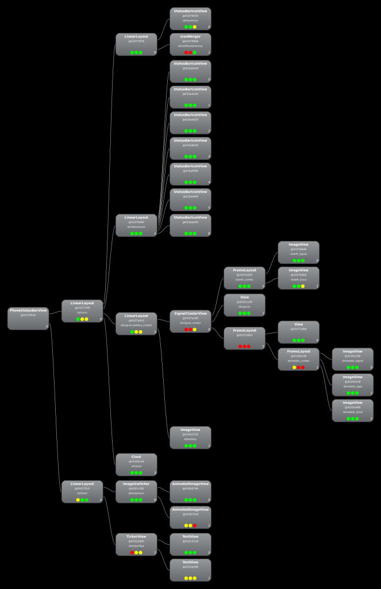
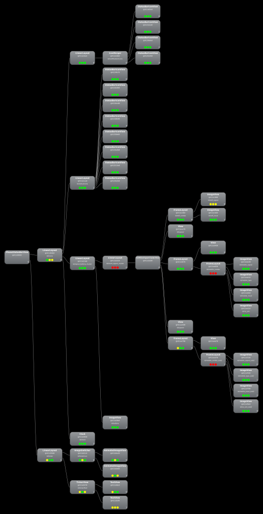
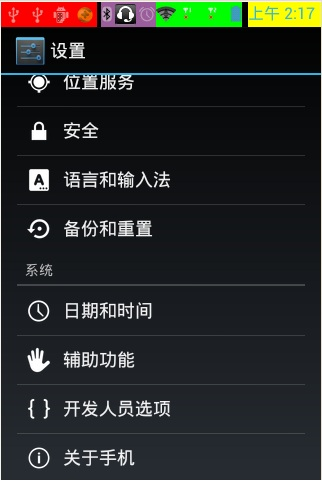
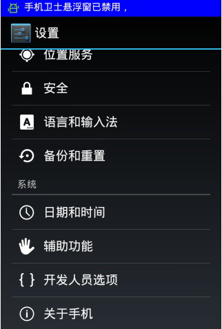
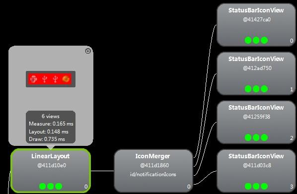
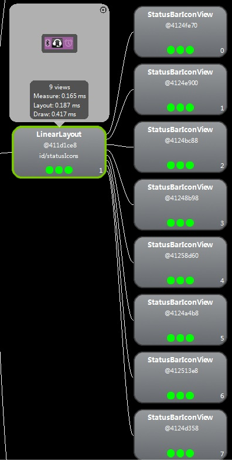
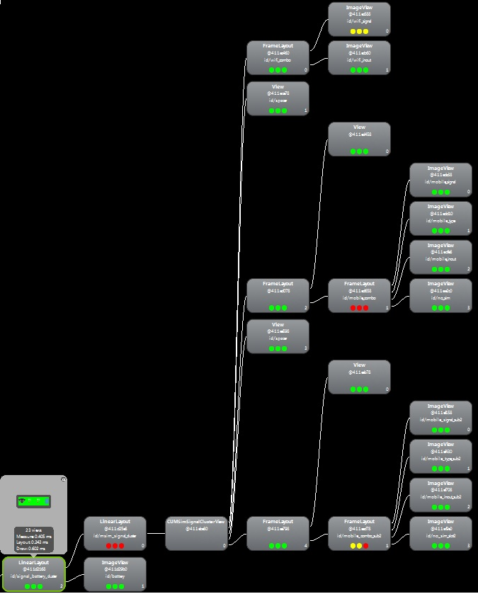
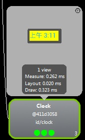
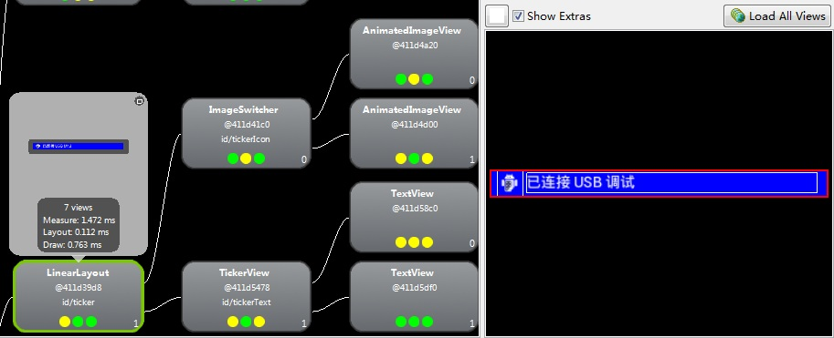

#System UI status bar icon 相关分析

##相关链接

[StatusBar加载流程分析](http://blog.csdn.net/yihongyuelan/article/details/7710584)
[Status Bar 显示流程](http://blog.csdn.net/zhudaozhuan/article/details/50829736)
		

##Status Bar 启动

StatusBar继承于SystemUI，在SystemUIApplication会启动SystemBar.

	mServices[i].start();

SystemBars.java
	
	@Override  
	   public void start() {  
	       if (DEBUG) Log.d(TAG, "start");  
	       mServiceMonitor = new ServiceMonitor(TAG, DEBUG,  
	               mContext, Settings.Secure.BAR_SERVICE_COMPONENT, this);  
	       mServiceMonitor.start();  // will call onNoService if no remote service is found  
	   } 
	   
在start函数会实例化ServiceMonitor以及start ServieMonitor。

ServiceMonitor.java	   
	   
		public void start() {  
	      // listen for setting changes  
	      ContentResolver cr = mContext.getContentResolver();  
	      cr.registerContentObserver(Settings.Secure.getUriFor(mSettingKey),  
	              false /*notifyForDescendents*/, mSettingObserver, UserHandle.USER_ALL);  
	  
	      // listen for package/component changes  
	      IntentFilter filter = new IntentFilter();  
	      filter.addAction(Intent.ACTION_PACKAGE_ADDED);  
	      filter.addAction(Intent.ACTION_PACKAGE_CHANGED);  
	      filter.addAction(Intent.ACTION_PACKAGE_REMOVED);  
	      filter.addDataScheme("package");  
	      mContext.registerReceiver(mBroadcastReceiver, filter);  
	  
	      mHandler.sendEmptyMessage(MSG_START_SERVICE);  
	  }  

这个函数主要做两件事情：

+ 监听apk的安装卸载，即apk变化事件
+ 发送MSG_START_SERVICE，启动service

ServiceMonitor.java
	
	private void startService() {  
	       mServiceName = getComponentNameFromSetting();  
	       if (mDebug) Log.d(mTag, "startService mServiceName=" + mServiceName);  
	       if (mServiceName == null) {  
	           mBound = false;  
	           mCallbacks.onNoService();  
	       } else {  
	           long delay = mCallbacks.onServiceStartAttempt();  
	           mHandler.sendEmptyMessageDelayed(MSG_CONTINUE_START_SERVICE, delay);  
	       }  
	   }  

当ServiceName为NULL时，会call到callbacks的onNoService函数。

不等于NULL，在下面的Handler消息也会call到callBacks的onNoService函数。

从SystemBars.java的继承关系可以看到：

	public class SystemBars extends SystemUI implements ServiceMonitor.Callbacks

最终会call到SystemBars.java的onNoService函数

SystemBars.java
	
	@Override  
	   public void onNoService() {  
	       if (DEBUG) Log.d(TAG, "onNoService");  
	       createStatusBarFromConfig();  // fallback to using an in-process implementation  
	   }  

createStatusBarFromConfig函数实现：
		
		private void createStatusBarFromConfig() {  
		       if (DEBUG) Log.d(TAG, "createStatusBarFromConfig");  
		       final String clsName = mContext.getString(R.string.config_statusBarComponent);  
		       if (clsName == null || clsName.length() == 0) {  
		           throw andLog("No status bar component configured", null);  
		       }  
		       Class<?> cls = null;  
		       try {  
		           cls = mContext.getClassLoader().loadClass(clsName);  
		       } catch (Throwable t) {  
		           throw andLog("Error loading status bar component: " + clsName, t);  
		       }  
		       try {  
		           mStatusBar = (BaseStatusBar) cls.newInstance();  
		       } catch (Throwable t) {  
		           throw andLog("Error creating status bar component: " + clsName, t);  
		       }  
		       mStatusBar.mContext = mContext;  
		       mStatusBar.mComponents = mComponents;  
		       mStatusBar.start();  
		       if (DEBUG) Log.d(TAG, "started " + mStatusBar.getClass().getSimpleName());  
		   }  
		   
		   
		   
会call到BaseStatusBar的start函数
	
	BaseStatusBars.java
	public void start() {
	...
	//各种实例化和初始化
	createAndAddWindows();
	}
	
具体代码：

PhonseStatusBar.java
		
		 @Override
		    public void start() {
		        mDisplay = ((WindowManager)mContext.getSystemService(Context.WINDOW_SERVICE))
		                .getDefaultDisplay();
		        updateDisplaySize();
		        mScrimSrcModeEnabled = mContext.getResources().getBoolean(
		                R.bool.config_status_bar_scrim_behind_use_src);
		
		        super.start(); // calls createAndAddWindows()
		
		        mMediaSessionManager
		                = (MediaSessionManager) mContext.getSystemService(Context.MEDIA_SESSION_SERVICE);
		        // TODO: use MediaSessionManager.SessionListener to hook us up to future updates
		        // in session state
		
		        addNavigationBar();
		
		        // Lastly, call to the icon policy to install/update all the icons.
		        mIconPolicy = new PhoneStatusBarPolicy(mContext, mCastController, mHotspotController,
		                mUserInfoController, mBluetoothController);
		        mIconPolicy.setCurrentUserSetup(mUserSetup);
		        mSettingsObserver.onChange(false); // set up
		
		        mHeadsUpObserver.onChange(true); // set up
		        if (ENABLE_HEADS_UP) {
		            mContext.getContentResolver().registerContentObserver(
		                    Settings.Global.getUriFor(Settings.Global.HEADS_UP_NOTIFICATIONS_ENABLED), true,
		                    mHeadsUpObserver);
		            mContext.getContentResolver().registerContentObserver(
		                    Settings.Global.getUriFor(SETTING_HEADS_UP_TICKER), true,
		                    mHeadsUpObserver);
		        }
		        mUnlockMethodCache = UnlockMethodCache.getInstance(mContext);
		        mUnlockMethodCache.addListener(this);
		        startKeyguard();
		
		        mDozeServiceHost = new DozeServiceHost();
		        KeyguardUpdateMonitor.getInstance(mContext).registerCallback(mDozeServiceHost);
		        putComponent(DozeHost.class, mDozeServiceHost);
		        putComponent(PhoneStatusBar.class, this);
		
		        setControllerUsers();
		
		        notifyUserAboutHiddenNotifications();
		
		        mScreenPinningRequest = new ScreenPinningRequest(mContext);
		    }
		
BaseStatusBar.java 
		
		
		    public void start() {
		        mWindowManager = (WindowManager)mContext.getSystemService(Context.WINDOW_SERVICE);
		        mWindowManagerService = WindowManagerGlobal.getWindowManagerService();
		        mDisplay = mWindowManager.getDefaultDisplay();
		        mDevicePolicyManager = (DevicePolicyManager)mContext.getSystemService(
		                Context.DEVICE_POLICY_SERVICE);
		
		        mNotificationColorUtil = NotificationColorUtil.getInstance(mContext);
		
		        mNotificationData = new NotificationData(this);
		
		        mAccessibilityManager = (AccessibilityManager)
		                mContext.getSystemService(Context.ACCESSIBILITY_SERVICE);
		
		        mDreamManager = IDreamManager.Stub.asInterface(
		                ServiceManager.checkService(DreamService.DREAM_SERVICE));
		        mPowerManager = (PowerManager) mContext.getSystemService(Context.POWER_SERVICE);
		
		        mContext.getContentResolver().registerContentObserver(
		                Settings.Global.getUriFor(Settings.Global.DEVICE_PROVISIONED), true,
		                mSettingsObserver);
		        mContext.getContentResolver().registerContentObserver(
		                Settings.Global.getUriFor(Settings.Global.ZEN_MODE), false,
		                mSettingsObserver);
		        mContext.getContentResolver().registerContentObserver(
		                Settings.Secure.getUriFor(Settings.Secure.LOCK_SCREEN_SHOW_NOTIFICATIONS), false,
		                mSettingsObserver,
		                UserHandle.USER_ALL);
		
		        mContext.getContentResolver().registerContentObserver(
		                Settings.Secure.getUriFor(Settings.Secure.LOCK_SCREEN_ALLOW_PRIVATE_NOTIFICATIONS),
		                true,
		                mLockscreenSettingsObserver,
		                UserHandle.USER_ALL);
		
		        mBarService = IStatusBarService.Stub.asInterface(
		                ServiceManager.getService(Context.STATUS_BAR_SERVICE));
		
		        mRecents = getComponent(Recents.class);
		        mRecents.setCallback(this);
		
		        final Configuration currentConfig = mContext.getResources().getConfiguration();
		        mLocale = currentConfig.locale;
		        mLayoutDirection = TextUtils.getLayoutDirectionFromLocale(mLocale);
		        mFontScale = currentConfig.fontScale;
		
		        mUserManager = (UserManager) mContext.getSystemService(Context.USER_SERVICE);
		
		        mLinearOutSlowIn = AnimationUtils.loadInterpolator(mContext,
		                android.R.interpolator.linear_out_slow_in);
		        mFastOutLinearIn = AnimationUtils.loadInterpolator(mContext,
		                android.R.interpolator.fast_out_linear_in);
		
		        // Connect in to the status bar manager service
		        StatusBarIconList iconList = new StatusBarIconList();
		        mCommandQueue = new CommandQueue(this, iconList);
		
		        int[] switches = new int[8];
		        ArrayList<IBinder> binders = new ArrayList<IBinder>();
		        try {
		            mBarService.registerStatusBar(mCommandQueue, iconList, switches, binders);
		        } catch (RemoteException ex) {
		            // If the system process isn't there we're doomed anyway.
		        }
		
		        createAndAddWindows();
		
		        mSettingsObserver.onChange(false); // set up
		        disable(switches[0], switches[6], false /* animate */);
		        setSystemUiVisibility(switches[1], 0xffffffff);
		        topAppWindowChanged(switches[2] != 0);
		        // StatusBarManagerService has a back up of IME token and it's restored here.
		        setImeWindowStatus(binders.get(0), switches[3], switches[4], switches[5] != 0);
		
		        // Set up the initial icon state
		        int N = iconList.size();
		        int viewIndex = 0;
		        for (int i=0; i<N; i++) {
		            StatusBarIcon icon = iconList.getIcon(i);
		            if (icon != null) {
		                addIcon(iconList.getSlot(i), i, viewIndex, icon);
		                viewIndex++;
		            }
		        }
		
		        // Set up the initial notification state.
		        try {
		            mNotificationListener.registerAsSystemService(mContext,
		                    new ComponentName(mContext.getPackageName(), getClass().getCanonicalName()),
		                    UserHandle.USER_ALL);
		        } catch (RemoteException e) {
		            Log.e(TAG, "Unable to register notification listener", e);
		        }
		
		
		        if (DEBUG) {
		            Log.d(TAG, String.format(
		                    "init: icons=%d disabled=0x%08x lights=0x%08x menu=0x%08x imeButton=0x%08x",
		                   iconList.size(),
		                   switches[0],
		                   switches[1],
		                   switches[2],
		                   switches[3]
		                   ));
		        }
		
		        mCurrentUserId = ActivityManager.getCurrentUser();
		        setHeadsUpUser(mCurrentUserId);
		
		        IntentFilter filter = new IntentFilter();
		        filter.addAction(Intent.ACTION_USER_SWITCHED);
		        filter.addAction(Intent.ACTION_USER_ADDED);
		        filter.addAction(Intent.ACTION_USER_PRESENT);
		        filter.addAction(BANNER_ACTION_CANCEL);
		        filter.addAction(BANNER_ACTION_SETUP);
		        mContext.registerReceiver(mBroadcastReceiver, filter);
		
		        IntentFilter allUsersFilter = new IntentFilter();
		        allUsersFilter.addAction(
		                DevicePolicyManager.ACTION_DEVICE_POLICY_MANAGER_STATE_CHANGED);
		        mContext.registerReceiverAsUser(mAllUsersReceiver, UserHandle.ALL, allUsersFilter,
		                null, null);
		        updateCurrentProfilesCache();
		    }
	
	
##2.StatusBars创建

在BaseStausBars中，createAndAddWindows函数是抽象函数，看来是call到子类的createAndAddWindows函数。
在SysemUI中，继承BaseStatusBars的类有：PhoneStatusBar和TvStatusBar，其中TvStatusBar是空实现，因此主要看PhoneStatusBar

PhoneStatusBar.java
	
	@Override  
	    public void createAndAddWindows() {  
	        addStatusBarWindow();  
	    }  
	  
	    private void addStatusBarWindow() {  
	        makeStatusBarView();  
	        mStatusBarWindowManager = new StatusBarWindowManager(mContext);  
	        mStatusBarWindowManager.add(mStatusBarWindow, getStatusBarHeight());  
	    }  
	    
1)makeStatusBarView函数代码很长，因为PhoneStatusBarView除了状态栏那一条之外，还包含Notification Panel，Heads up Panel以及包含drag行为。
主要还是实例化PhoneStatusBarView中各种UI控件。

2)StatusBarWindowManager类的add函数负责为PhoneStatusBarView新建Window，包括window大小，位置，是否透明等属性。

这里先分析一下makeStatusBarView函数，代码太长，不全部粘贴。

####(1)获取系统显示参数updateDisplaySize();
	   
	   // called by makeStatusbar and also by PhoneStatusBarView  
		void updateDisplaySize() {  
		    mDisplay.getMetrics(mDisplayMetrics);  
		    mDisplay.getSize(mCurrentDisplaySize);  
		    if (DEBUG_GESTURES) {  
		        mGestureRec.tag("display",  
		                String.format("%dx%d", mDisplayMetrics.widthPixels, mDisplayMetrics.heightPixels));  
		    }  
		}  
	   
获取系统分辨率，屏幕密度，便于根据不同的显示参数计算响应的值进行显示。

####2)更新Panels资源数据

StatusBar这个图层包含很多的Panel，在创建PhoneStatusBarView时需要更新Panels数据。

updateResources(); 
	
	/** 
	 * Reload some of our resources when the configuration changes. 
	 * 
	 * We don't reload everything when the configuration changes -- we probably 
	 * should, but getting that smooth is tough.  Someday we'll fix that.  In the 
	 * meantime, just update the things that we know change. 
	 */  
	void updateResources() {  
	    // Update the quick setting tiles  
	    if (mQSPanel != null) {  
	        mQSPanel.updateResources();  
	    }  
	  
	    loadDimens();  
	  
	    if (mNotificationPanel != null) {  
	        mNotificationPanel.updateResources();  
	    }  
	    if (mBrightnessMirrorController != null) {  
	        mBrightnessMirrorController.updateResources();  
	    }  
	}  
		   
+ QSPanel是快捷设置panel，一些主要应用，可以通过点击QSPanel的Button去进入apk，android和iphone都有这样的设计。
+ NotificationPanel是通知消息显示的Panel，在有消息(系统或apk发送Notification)，会在Panel里面显示，用户可以删除，或点击消息进入apk。
+ BrightnessMirrorController是控制亮度的Panel

####(3)注册系统的事件广播

 // receive broadcasts
        IntentFilter filter = new IntentFilter();
        filter.addAction(Intent.ACTION_CLOSE_SYSTEM_DIALOGS);
        filter.addAction(Intent.ACTION_SCREEN_OFF);
        filter.addAction(Intent.ACTION_SCREEN_ON);
        context.registerReceiverAsUser(mBroadcastReceiver, UserHandle.ALL, filter, null, null);

####(4)Panels & Views实例化以及事件注册

###3.StatusBar显示

显示主要是call StatusBarWindowManager类的add函数。
StatusBarWindowManager.java

WindowsManager:
	
	 public StatusBarWindowManager(Context context) {
	        mContext = context;
	        mWindowManager = (WindowManager) context.getSystemService(Context.WINDOW_SERVICE);
	        mKeyguardScreenRotation = shouldEnableKeyguardScreenRotation();
	        mScreenBrightnessDoze = mContext.getResources().getInteger(
	                com.android.internal.R.integer.config_screenBrightnessDoze) / 255f;
	    }		
	
Show Window:	
		
		
		/** 
		    * Adds the status bar view to the window manager. 
		    * 
		    * @param statusBarView The view to add. 
		    * @param barHeight The height of the status bar in collapsed state. 
		    */  
		   public void add(View statusBarView, int barHeight) {  
		  
		       // Now that the status bar window encompasses the sliding panel and its  
		       // translucent backdrop, the entire thing is made TRANSLUCENT and is  
		       // hardware-accelerated.  
		       mLp = new WindowManager.LayoutParams(  
		               ViewGroup.LayoutParams.MATCH_PARENT,  
		               barHeight,  
		               WindowManager.LayoutParams.TYPE_STATUS_BAR,  
		               WindowManager.LayoutParams.FLAG_NOT_FOCUSABLE  
		                       | WindowManager.LayoutParams.FLAG_TOUCHABLE_WHEN_WAKING  
		                       | WindowManager.LayoutParams.FLAG_SPLIT_TOUCH  
		                       | WindowManager.LayoutParams.FLAG_WATCH_OUTSIDE_TOUCH  
		                       | WindowManager.LayoutParams.FLAG_DRAWS_SYSTEM_BAR_BACKGROUNDS,  
		               PixelFormat.TRANSLUCENT);  
		       mLp.flags |= WindowManager.LayoutParams.FLAG_HARDWARE_ACCELERATED;  
		       mLp.gravity = Gravity.TOP;  
		       mLp.softInputMode = WindowManager.LayoutParams.SOFT_INPUT_ADJUST_RESIZE;  
		       mLp.setTitle("StatusBar");  
		       mLp.packageName = mContext.getPackageName();  
		       mStatusBarView = statusBarView;  
		       mBarHeight = barHeight;  
		       mWindowManager.addView(mStatusBarView, mLp);  
		       mLpChanged = new WindowManager.LayoutParams();  
		       mLpChanged.copyFrom(mLp);  
		   }  

barHeight表示状态栏的宽度，在dimen里面可以配置：

	 public int getStatusBarHeight() {
	        if (mNaturalBarHeight < 0) {
	            final Resources res = mContext.getResources();
	            mNaturalBarHeight =
	                    res.getDimensionPixelSize(com.android.internal.R.dimen.status_bar_height);
	        }
	        return mNaturalBarHeight;
	    }

若不想显示，可以设置为0

###StatusBar之庖丁解牛

首先，从界面上分析。通过hierarchyviewer来观察StatusBar的布局结构；其次，通过代码分析各个组件的具体实现(注：本文主要从界面进行结构分析)。

以为后面我将会用真机进行演示，因此这里贴出真机的StatusBar结构图以及原生的StatuBar结构图，以进行对比。真机采用的是高通双卡平台，在原生基础上进行的修改，原生StatusBar的结构如图2.1，真机StatusBar结构如图2.2：

       

 图2.1和2.2中清晰的列出了StatusBar的结构组成，StatusBar实际上是由PhoneStatusBarView构成，而PhoneStatusBarView又细分成两个大模块，分别是icons和ticker两个布局。我们知道，在通常情况下，系统左边放置通知图标(notificationIcons)，中间放置状态图标(statusIcons)以及信号图标(signal_battery_cluster)，右边放置日期(clock)，ticker默认是看不见的，因此实际上我们真正看到的StatusBar是icons的布局。下面我们分别介绍这些独立模块的结构。

 我将StatusBar的组成部件(notificationIcons、statusIcons、signal_battery_cluster、clock、ticker)分别使用了不同的背景，这样就能清晰直观的看到各个布局之间的关系了(注：我使用的是高通的双卡平台)。如图2.3和2.4：

在图2.3和图2.4中，各个颜色代表的含义如下：

红色：notificationIcons，通知图标，比如我们常见的360以及QQ等等，都会在这里显示自己的图标；

紫色：statusIcons，状态图标，这里会放置系统的一些状态图标，比如像蓝牙、闹钟、耳机插入等等；

绿色：signal_battery_cluster，信号以及电量图标，这里主要放置了wifi以及手机信号和电池电量的图标(注：没有插入SIM卡)；

黄色：clock，时钟图标；

蓝色：ticker，通知信息图标，当系统接收到通知后，有的通知具有通知信息，因此会通过ticker进行显示，比如禁用360的悬浮窗，插拔SD卡等等；

再次祭出我们的hierarchyviewer，查看每个部分的组成结构。

notificationIcons的布局如图2.5：

        

  这里和Android 4.0原生有一点点区别，因为这里有一些类似于Android 2.3的改动，但整体上是差不多的。4个StatusBarIconView对应图中的4个图标，通过IconMerger也就是nocificationIcons进行整合并显示。

statusIcons的布局如图2.6所示：

 从图2.6我们可以知道，statusIcons是一个包含了8个StatusBarIconView的LinearLayout，每个StatusBarIconView存放不同的系统Icon，像这里的蓝牙、耳机插入、闹钟等等。

signal_battery_cluster的布局如图2.7所示：        

从图2.7我们可以看到，这块是结构比较复杂的一块，因为与原生Android 4.0相比，高通使用了双卡，所以这里稍作了修改。

clock的布局如图2.8所示：

我们这里只看了一个Clock的布局，实际上Clock继承自TextView，后续在代码分析的时候会提到。

最后让我们看看ticker的布局结构，如图2.9：       

 图2.9中可以看到，ticker由TickerView和ImageSwitcher组成，而ImageSwitcher由两个自定义的ImageView构成，TickerView实际上就是两个TextView的组合。

3.StatusBar结构分析小结

Android 4.0的StatusBar相对于Android 2.3的改动还是比较大的，对于StatusBar的分析，有利于对StatusBar的个性化定制，详细了解各个模块的功能可以对Android系统有更加深入的认识。针对本次结构分析，更加熟悉了hierarchyviewer的使用，对于整个SystemUI中的StatusBar也有个更加深入的认知。

       后续将从代码的方向继续分析Android 4.0中StatusBar的加载以及工作流程。
       
       
              		
               
     

