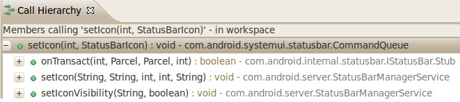
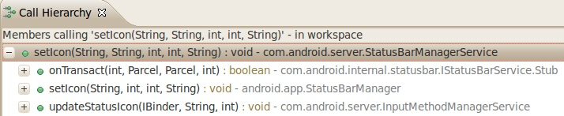
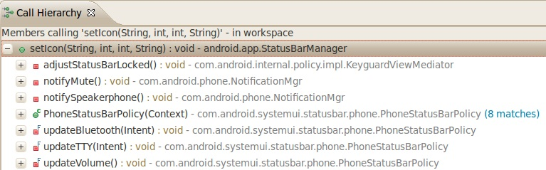
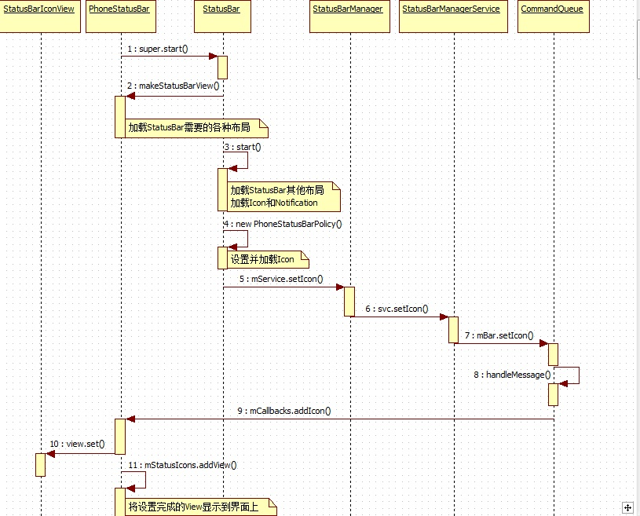
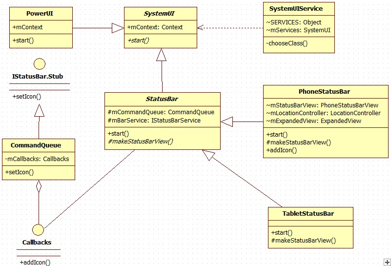
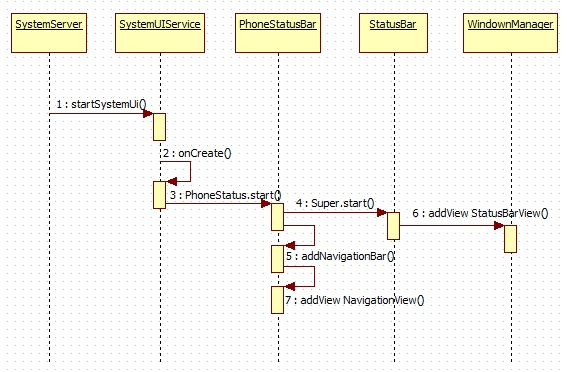

        
#StatusBar加载流程分析 Android 6.0

在《Android 4.0 ICS SystemUI浅析——SystemUI启动流程》中，我们提到了在Phone中，整个StatusBar和NavigationBar都是在/SourceCode/frameworks/base/packages/SystemUI/src/com/Android/systemui/statusbar/phone/PhoneStatusBar.java的start()方法中，完成初始化并显示到界面上的。因此，我们回到这段代码中查看：
			
			@Override
		607    public void start() {
		608        mDisplay = ((WindowManager)mContext.getSystemService(Context.WINDOW_SERVICE))
		609                .getDefaultDisplay();
		610        updateDisplaySize();
		611        mScrimSrcModeEnabled = mContext.getResources().getBoolean(
		612                R.bool.config_status_bar_scrim_behind_use_src);
		613
		614        super.start(); // calls createAndAddWindows() 这里会调用父类StatusBar.java中的start()方法 
		615
		616        mMediaSessionManager
		617                = (MediaSessionManager) mContext.getSystemService(Context.MEDIA_SESSION_SERVICE);
		618        // TODO: use MediaSessionManager.SessionListener to hook us up to future updates
		619        // in session state
		620
		621        addNavigationBar(); //加载导航栏，本文因以StatusBar为主，因此暂不分析NavigationBar 
		622
		623        // Lastly, call to the icon policy to install/update all the icons.
		624        mIconPolicy = new PhoneStatusBarPolicy(mContext, mCastController, mHotspotController,
		625                mUserInfoController, mBluetoothController);
		626        mIconPolicy.setCurrentUserSetup(mUserSetup);
		627        mSettingsObserver.onChange(false); // set up
		628
		629        mHeadsUpObserver.onChange(true); // set up
		630        if (ENABLE_HEADS_UP) {
		631            mContext.getContentResolver().registerContentObserver(
		632                    Settings.Global.getUriFor(Settings.Global.HEADS_UP_NOTIFICATIONS_ENABLED), true,
		633                    mHeadsUpObserver);
		634            mContext.getContentResolver().registerContentObserver(
		635                    Settings.Global.getUriFor(SETTING_HEADS_UP_TICKER), true,
		636                    mHeadsUpObserver);
		637        }
		638        mUnlockMethodCache = UnlockMethodCache.getInstance(mContext);
		639        mUnlockMethodCache.addListener(this);
		640        startKeyguard();
		641
		642        mDozeServiceHost = new DozeServiceHost();
		643        KeyguardUpdateMonitor.getInstance(mContext).registerCallback(mDozeServiceHost);
		644        putComponent(DozeHost.class, mDozeServiceHost);
		645        putComponent(PhoneStatusBar.class, this);
		646
		647        setControllerUsers();
		648
		649        notifyUserAboutHiddenNotifications();
		650
		651        mScreenPinningRequest = new ScreenPinningRequest(mContext);
		652    }
		653
	
	               
我们继续跟踪super.start()方法，来到/SourceCode/frameworks/base/packages/SystemUI/src/com/android/systemui/statusbar/StatusBar.java的start()方法中，如代码所示：
			
			public void start() {
		537        mWindowManager = (WindowManager)mContext.getSystemService(Context.WINDOW_SERVICE);
		538        mWindowManagerService = WindowManagerGlobal.getWindowManagerService();
		539        mDisplay = mWindowManager.getDefaultDisplay();
		......
		571        mBarService = IStatusBarService.Stub.asInterface(
		572                ServiceManager.getService(Context.STATUS_BAR_SERVICE));
		573
		......
		
		589        // Connect in to the status bar manager service
		590        StatusBarIconList iconList = new StatusBarIconList();
		591        mCommandQueue = new CommandQueue(this, iconList);
		592
		593        int[] switches = new int[8];
		594        ArrayList<IBinder> binders = new ArrayList<IBinder>();
		595        try {
		596            mBarService.registerStatusBar(mCommandQueue, iconList, switches, binders);
		597        } catch (RemoteException ex) {
		598            // If the system process isn't there we're doomed anyway.
		599        }
		600
		601        createAndAddWindows();
	

CreateAndAddWindows() will call PhoneStatusBar.java  createAndAddWindows(), then call makeStatusBarView();
接着将StatusBarView 加到WindowManager		
		
		2814    private void addStatusBarWindow() {
		2815        makeStatusBarView();
		2816        mStatusBarWindowManager = new StatusBarWindowManager(mContext);
		2817        mStatusBarWindowManager.add(mStatusBarWindow, getStatusBarHeight());
		2818    }
   
               
通过Open Implementation跳转到makeStatusBarView的实现，因为我们是针对Phone来分析的，因此选择PhoneStatusBar，代码如下：
	
			
		654    // ================================================================================
		655    // Constructing the view
		656    // ================================================================================
		657    protected PhoneStatusBarView makeStatusBarView() {
		658        final Context context = mContext;
		659
		660        Resources res = context.getResources();
		661			  //获取ExpandedView的尺寸  
		662        updateDisplaySize(); // populates mDisplayMetrics
		663        updateResources();  //定义icon的大小，缩放率和彼此间距  
		664        //创建StatusBarWindowView
		665        mStatusBarWindow = (StatusBarWindowView) View.inflate(context,
		666                R.layout.super_status_bar, null);
		667        mStatusBarWindow.setService(this);
		668        mStatusBarWindow.setOnTouchListener(new View.OnTouchListener() {
		669            @Override
		670            public boolean onTouch(View v, MotionEvent event) {
		671                checkUserAutohide(v, event);
		672                if (event.getAction() == MotionEvent.ACTION_DOWN) {
		673                    if (mExpandedVisible) {
		674                        animateCollapsePanels();
		675                    }
		676                }
		677                return mStatusBarWindow.onTouchEvent(event);
		678            }
		679        });
		680
		681        mStatusBarView = (PhoneStatusBarView) mStatusBarWindow.findViewById(R.id.status_bar);
		682        mStatusBarView.setBar(this);
		683
		684        PanelHolder holder = (PanelHolder) mStatusBarWindow.findViewById(R.id.panel_holder);
		685        mStatusBarView.setPanelHolder(holder);
		686
		687        mNotificationPanel = (NotificationPanelView) mStatusBarWindow.findViewById(
		688                R.id.notification_panel);
		689        mNotificationPanel.setStatusBar(this);
		690
		691        if (!ActivityManager.isHighEndGfx()) {
		692            mStatusBarWindow.setBackground(null);
		693            mNotificationPanel.setBackground(new FastColorDrawable(context.getColor(
		694                    R.color.notification_panel_solid_background)));
		695        }
		696
		697        mHeadsUpManager = new HeadsUpManager(context, mStatusBarWindow);
		698        mHeadsUpManager.setBar(this);
		699        mHeadsUpManager.addListener(this);
		700        mHeadsUpManager.addListener(mNotificationPanel);
		701        mNotificationPanel.setHeadsUpManager(mHeadsUpManager);
		702        mNotificationData.setHeadsUpManager(mHeadsUpManager);
		703
		704        if (MULTIUSER_DEBUG) {
		705            mNotificationPanelDebugText = (TextView) mNotificationPanel.findViewById(
		706                    R.id.header_debug_info);
		707            mNotificationPanelDebugText.setVisibility(View.VISIBLE);
		708        }
		709
		710        try {
		711            boolean showNav = mWindowManagerService.hasNavigationBar();
		712            if (DEBUG) Log.v(TAG, "hasNavigationBar=" + showNav);
		713            if (showNav) {
		714                mNavigationBarView =
		715                    (NavigationBarView) View.inflate(context, R.layout.navigation_bar, null);
		716
		717                mNavigationBarView.setDisabledFlags(mDisabled1);
		718                mNavigationBarView.setBar(this);
		719                mNavigationBarView.setOnVerticalChangedListener(
		720                        new NavigationBarView.OnVerticalChangedListener() {
		721                    @Override
		722                    public void onVerticalChanged(boolean isVertical) {
		723                        if (mAssistManager != null) {
		724                            mAssistManager.onConfigurationChanged();
		725                        }
		726                        mNotificationPanel.setQsScrimEnabled(!isVertical);
		727                    }
		728                });
		729                mNavigationBarView.setOnTouchListener(new View.OnTouchListener() {
		730                    @Override
		731                    public boolean onTouch(View v, MotionEvent event) {
		732                        checkUserAutohide(v, event);
		733                        return false;
		734                    }});
		735            }
		736        } catch (RemoteException ex) {
		737            // no window manager? good luck with that
		738        }
		739
		740        mAssistManager = new AssistManager(this, context);
		741
		742        // figure out which pixel-format to use for the status bar.
		743        mPixelFormat = PixelFormat.OPAQUE;
		744
		745        mStackScroller = (NotificationStackScrollLayout) mStatusBarWindow.findViewById(
		746                R.id.notification_stack_scroller);
		747        mStackScroller.setLongPressListener(getNotificationLongClicker());
		748        mStackScroller.setPhoneStatusBar(this);
		749        mStackScroller.setGroupManager(mGroupManager);
		750        mStackScroller.setHeadsUpManager(mHeadsUpManager);
		751        mGroupManager.setOnGroupChangeListener(mStackScroller);
		752
		753        mKeyguardIconOverflowContainer =
		754                (NotificationOverflowContainer) LayoutInflater.from(mContext).inflate(
		755                        R.layout.status_bar_notification_keyguard_overflow, mStackScroller, false);
		756        mKeyguardIconOverflowContainer.setOnActivatedListener(this);
		757        mKeyguardIconOverflowContainer.setOnClickListener(mOverflowClickListener);
		758        mStackScroller.setOverflowContainer(mKeyguardIconOverflowContainer);
		759
		760        SpeedBumpView speedBump = (SpeedBumpView) LayoutInflater.from(mContext).inflate(
		761                        R.layout.status_bar_notification_speed_bump, mStackScroller, false);
		762        mStackScroller.setSpeedBumpView(speedBump);
		763        mEmptyShadeView = (EmptyShadeView) LayoutInflater.from(mContext).inflate(
		764                R.layout.status_bar_no_notifications, mStackScroller, false);
		765        mStackScroller.setEmptyShadeView(mEmptyShadeView);
		766        mDismissView = (DismissView) LayoutInflater.from(mContext).inflate(
		767                R.layout.status_bar_notification_dismiss_all, mStackScroller, false);
		768        mDismissView.setOnButtonClickListener(new View.OnClickListener() {
		769            @Override
		770            public void onClick(View v) {
		771                MetricsLogger.action(mContext, MetricsLogger.ACTION_DISMISS_ALL_NOTES);
		772                clearAllNotifications();
		773            }
		774        });
		775        mStackScroller.setDismissView(mDismissView);
		776        mExpandedContents = mStackScroller;
		777
		778        mBackdrop = (BackDropView) mStatusBarWindow.findViewById(R.id.backdrop);
		779        mBackdropFront = (ImageView) mBackdrop.findViewById(R.id.backdrop_front);
		780        mBackdropBack = (ImageView) mBackdrop.findViewById(R.id.backdrop_back);
		781
		782        ScrimView scrimBehind = (ScrimView) mStatusBarWindow.findViewById(R.id.scrim_behind);
		783        ScrimView scrimInFront = (ScrimView) mStatusBarWindow.findViewById(R.id.scrim_in_front);
		784        View headsUpScrim = mStatusBarWindow.findViewById(R.id.heads_up_scrim);
		785        mScrimController = new ScrimController(scrimBehind, scrimInFront, headsUpScrim,
		786                mScrimSrcModeEnabled);
		787        mHeadsUpManager.addListener(mScrimController);
		788        mStackScroller.setScrimController(mScrimController);
		789        mScrimController.setBackDropView(mBackdrop);
		790        mStatusBarView.setScrimController(mScrimController);
		791        mDozeScrimController = new DozeScrimController(mScrimController, context);
		792
		793        mHeader = (StatusBarHeaderView) mStatusBarWindow.findViewById(R.id.header);
		794        mHeader.setActivityStarter(this);
		795        mKeyguardStatusBar = (KeyguardStatusBarView) mStatusBarWindow.findViewById(R.id.keyguard_header);
		796        mKeyguardStatusView = mStatusBarWindow.findViewById(R.id.keyguard_status_view);
		797        mKeyguardBottomArea =
		798                (KeyguardBottomAreaView) mStatusBarWindow.findViewById(R.id.keyguard_bottom_area);
		799        mKeyguardBottomArea.setActivityStarter(this);
		800        mKeyguardBottomArea.setAssistManager(mAssistManager);
		801        mKeyguardIndicationController = new KeyguardIndicationController(mContext,
		802                (KeyguardIndicationTextView) mStatusBarWindow.findViewById(
		803                        R.id.keyguard_indication_text),
		804                mKeyguardBottomArea.getLockIcon());
		805        mKeyguardBottomArea.setKeyguardIndicationController(mKeyguardIndicationController);
		806
		807        // set the inital view visibility
		808        setAreThereNotifications();
		809
		810        mIconController = new StatusBarIconController(
		811                mContext, mStatusBarView, mKeyguardStatusBar, this);
		812
		813        // Background thread for any controllers that need it.
		814        mHandlerThread = new HandlerThread(TAG, Process.THREAD_PRIORITY_BACKGROUND);
		815        mHandlerThread.start();
		816
		817        // Other icons
		818        mLocationController = new LocationControllerImpl(mContext,
		819                mHandlerThread.getLooper()); // will post a notification
		820        mBatteryController = new BatteryController(mContext);
		821        mBatteryController.addStateChangedCallback(new BatteryStateChangeCallback() {
		822            @Override
		823            public void onPowerSaveChanged() {
		824                mHandler.post(mCheckBarModes);
		825                if (mDozeServiceHost != null) {
		826                    mDozeServiceHost.firePowerSaveChanged(mBatteryController.isPowerSave());
		827                }
		828            }
		829            @Override
		830            public void onBatteryLevelChanged(int level, boolean pluggedIn, boolean charging) {
		831                // noop
		832            }
		833        });
		834        mNetworkController = new NetworkControllerImpl(mContext, mHandlerThread.getLooper());
		835        mHotspotController = new HotspotControllerImpl(mContext);
		836        mBluetoothController = new BluetoothControllerImpl(mContext, mHandlerThread.getLooper());
		837        mSecurityController = new SecurityControllerImpl(mContext);
		838        if (mContext.getResources().getBoolean(R.bool.config_showRotationLock)) {
		839            mRotationLockController = new RotationLockControllerImpl(mContext);
		840        }
		841        mUserInfoController = new UserInfoController(mContext);
		842        mVolumeComponent = getComponent(VolumeComponent.class);
		843        if (mVolumeComponent != null) {
		844            mZenModeController = mVolumeComponent.getZenController();
		845        }
		846        mCastController = new CastControllerImpl(mContext);
		847        final SignalClusterView signalCluster =
		848                (SignalClusterView) mStatusBarView.findViewById(R.id.signal_cluster);
		849        final SignalClusterView signalClusterKeyguard =
		850                (SignalClusterView) mKeyguardStatusBar.findViewById(R.id.signal_cluster);
		851        final SignalClusterView signalClusterQs =
		852                (SignalClusterView) mHeader.findViewById(R.id.signal_cluster);
		853        mNetworkController.addSignalCallback(signalCluster);
		854        mNetworkController.addSignalCallback(signalClusterKeyguard);
		855        mNetworkController.addSignalCallback(signalClusterQs);
		856        signalCluster.setSecurityController(mSecurityController);
		857        signalCluster.setNetworkController(mNetworkController);
		858        signalClusterKeyguard.setSecurityController(mSecurityController);
		859        signalClusterKeyguard.setNetworkController(mNetworkController);
		860        signalClusterQs.setSecurityController(mSecurityController);
		861        signalClusterQs.setNetworkController(mNetworkController);
		862        final boolean isAPhone = mNetworkController.hasVoiceCallingFeature();
		863        if (isAPhone) {
		864            mNetworkController.addEmergencyListener(mHeader);
		865        }
		866
		867        mFlashlightController = new FlashlightController(mContext);
		868        mKeyguardBottomArea.setFlashlightController(mFlashlightController);
		869        mKeyguardBottomArea.setPhoneStatusBar(this);
		870        mKeyguardBottomArea.setUserSetupComplete(mUserSetup);
		871        mAccessibilityController = new AccessibilityController(mContext);
		872        mKeyguardBottomArea.setAccessibilityController(mAccessibilityController);
		873        mNextAlarmController = new NextAlarmController(mContext);
		874        mKeyguardMonitor = new KeyguardMonitor(mContext);
		875        if (UserSwitcherController.isUserSwitcherAvailable(UserManager.get(mContext))) {
		876            mUserSwitcherController = new UserSwitcherController(mContext, mKeyguardMonitor,
		877                    mHandler);
		878        }
		879        mKeyguardUserSwitcher = new KeyguardUserSwitcher(mContext,
		880                (ViewStub) mStatusBarWindow.findViewById(R.id.keyguard_user_switcher),
		881                mKeyguardStatusBar, mNotificationPanel, mUserSwitcherController);
		882
		883
		884        // Set up the quick settings tile panel
		885        mQSPanel = (QSPanel) mStatusBarWindow.findViewById(R.id.quick_settings_panel);
		886        if (mQSPanel != null) {
		887            final QSTileHost qsh = new QSTileHost(mContext, this,
		888                    mBluetoothController, mLocationController, mRotationLockController,
		889                    mNetworkController, mZenModeController, mHotspotController,
		890                    mCastController, mFlashlightController,
		891                    mUserSwitcherController, mKeyguardMonitor,
		892                    mSecurityController);
		893            mQSPanel.setHost(qsh);
		894            mQSPanel.setTiles(qsh.getTiles());
		895            mBrightnessMirrorController = new BrightnessMirrorController(mStatusBarWindow);
		896            mQSPanel.setBrightnessMirror(mBrightnessMirrorController);
		897            mHeader.setQSPanel(mQSPanel);
		898            qsh.setCallback(new QSTileHost.Callback() {
		899                @Override
		900                public void onTilesChanged() {
		901                    mQSPanel.setTiles(qsh.getTiles());
		902                }
		903            });
		904        }
		905
		906        // User info. Trigger first load.
		907        mHeader.setUserInfoController(mUserInfoController);
		908        mKeyguardStatusBar.setUserInfoController(mUserInfoController);
		909        mKeyguardStatusBar.setUserSwitcherController(mUserSwitcherController);
		910        mUserInfoController.reloadUserInfo();
		911
		912        mHeader.setBatteryController(mBatteryController);
		913        ((BatteryMeterView) mStatusBarView.findViewById(R.id.battery)).setBatteryController(
		914                mBatteryController);
		915        mKeyguardStatusBar.setBatteryController(mBatteryController);
		916        mHeader.setNextAlarmController(mNextAlarmController);
		917
		918        PowerManager pm = (PowerManager) mContext.getSystemService(Context.POWER_SERVICE);
		919        mBroadcastReceiver.onReceive(mContext,
		920                new Intent(pm.isScreenOn() ? Intent.ACTION_SCREEN_ON : Intent.ACTION_SCREEN_OFF));
		921        mGestureWakeLock = pm.newWakeLock(PowerManager.SCREEN_BRIGHT_WAKE_LOCK,
		922                "GestureWakeLock");
		923        mVibrator = mContext.getSystemService(Vibrator.class);
		924
		925        // receive broadcasts
		926        IntentFilter filter = new IntentFilter();
		927        filter.addAction(Intent.ACTION_CLOSE_SYSTEM_DIALOGS);
		928        filter.addAction(Intent.ACTION_SCREEN_OFF);
		929        filter.addAction(Intent.ACTION_SCREEN_ON);
		930        context.registerReceiverAsUser(mBroadcastReceiver, UserHandle.ALL, filter, null, null);
		931
		932        IntentFilter demoFilter = new IntentFilter();
		933        if (DEBUG_MEDIA_FAKE_ARTWORK) {
		934            demoFilter.addAction(ACTION_FAKE_ARTWORK);
		935        }
		936        demoFilter.addAction(ACTION_DEMO);
		937        context.registerReceiverAsUser(mDemoReceiver, UserHandle.ALL, demoFilter,
		938                android.Manifest.permission.DUMP, null);
		939
		940        // listen for USER_SETUP_COMPLETE setting (per-user)
		941        resetUserSetupObserver();
		942
		943        // disable profiling bars, since they overlap and clutter the output on app windows
		944        ThreadedRenderer.overrideProperty("disableProfileBars", "true");
		945
		946        // Private API call to make the shadows look better for Recents
		947        ThreadedRenderer.overrideProperty("ambientRatio", String.valueOf(1.5f));
		948
		949        return mStatusBarView;
		950    }

通过makeStatusBarView()我们可以看到，在该方法中整个StatusBar根据获取的设备配置信息进行了布局，就好比我们去吃饭，先要安排好座位和桌子，最后才上菜，我们需要加载的icons——就是菜！！:D

我们回到StatusBar.java的start()方法中继续分析，代码如下：
			
		536    public void start() {
		537        mWindowManager = (WindowManager)mContext.getSystemService(Context.WINDOW_SERVICE);
		538        mWindowManagerService = WindowManagerGlobal.getWindowManagerService();
		539        mDisplay = mWindowManager.getDefaultDisplay();
		540        mDevicePolicyManager = (DevicePolicyManager)mContext.getSystemService(
		541                Context.DEVICE_POLICY_SERVICE);
		542
		543        mNotificationColorUtil = NotificationColorUtil.getInstance(mContext);
		544
		545        mNotificationData = new NotificationData(this);
		546
		547        mAccessibilityManager = (AccessibilityManager)
		548                mContext.getSystemService(Context.ACCESSIBILITY_SERVICE);
		549
		550        mDreamManager = IDreamManager.Stub.asInterface(
		551                ServiceManager.checkService(DreamService.DREAM_SERVICE));
		552        mPowerManager = (PowerManager) mContext.getSystemService(Context.POWER_SERVICE);
		553
		554        mContext.getContentResolver().registerContentObserver(
		555                Settings.Global.getUriFor(Settings.Global.DEVICE_PROVISIONED), true,
		556                mSettingsObserver);
		557        mContext.getContentResolver().registerContentObserver(
		558                Settings.Global.getUriFor(Settings.Global.ZEN_MODE), false,
		559                mSettingsObserver);
		560        mContext.getContentResolver().registerContentObserver(
		561                Settings.Secure.getUriFor(Settings.Secure.LOCK_SCREEN_SHOW_NOTIFICATIONS), false,
		562                mSettingsObserver,
		563                UserHandle.USER_ALL);
		564
		565        mContext.getContentResolver().registerContentObserver(
		566                Settings.Secure.getUriFor(Settings.Secure.LOCK_SCREEN_ALLOW_PRIVATE_NOTIFICATIONS),
		567                true,
		568                mLockscreenSettingsObserver,
		569                UserHandle.USER_ALL);
		570
		571        mBarService = IStatusBarService.Stub.asInterface(
		572                ServiceManager.getService(Context.STATUS_BAR_SERVICE));
		573
		574        mRecents = getComponent(Recents.class);
		575        mRecents.setCallback(this);
		576
		577        final Configuration currentConfig = mContext.getResources().getConfiguration();
		578        mLocale = currentConfig.locale;
		579        mLayoutDirection = TextUtils.getLayoutDirectionFromLocale(mLocale);
		580        mFontScale = currentConfig.fontScale;
		581
		582        mUserManager = (UserManager) mContext.getSystemService(Context.USER_SERVICE);
		583
		584        mLinearOutSlowIn = AnimationUtils.loadInterpolator(mContext,
		585                android.R.interpolator.linear_out_slow_in);
		586        mFastOutLinearIn = AnimationUtils.loadInterpolator(mContext,
		587                android.R.interpolator.fast_out_linear_in);
		588
		589        // Connect in to the status bar manager service
		590        StatusBarIconList iconList = new StatusBarIconList();
		591        mCommandQueue = new CommandQueue(this, iconList);
		592
		593        int[] switches = new int[8];
		594        ArrayList<IBinder> binders = new ArrayList<IBinder>();
		595        try {
		596            mBarService.registerStatusBar(mCommandQueue, iconList, switches, binders);
		597        } catch (RemoteException ex) {
		598            // If the system process isn't there we're doomed anyway.
		599        }
		600
		601        createAndAddWindows();
		602
		603        mSettingsObserver.onChange(false); // set up
		604        disable(switches[0], switches[6], false /* animate */);
		605        setSystemUiVisibility(switches[1], 0xffffffff);
		606        topAppWindowChanged(switches[2] != 0);
		607        // StatusBarManagerService has a back up of IME token and it's restored here.
		608        setImeWindowStatus(binders.get(0), switches[3], switches[4], switches[5] != 0);
		609
		610        // Set up the initial icon state
		611        int N = iconList.size();
		612        int viewIndex = 0;
		613        for (int i=0; i<N; i++) {
		614            StatusBarIcon icon = iconList.getIcon(i);
		615            if (icon != null) {
		616                addIcon(iconList.getSlot(i), i, viewIndex, icon);
		617                viewIndex++;
		618            }
		619        }
		620
		621        // Set up the initial notification state.
		622        try {
		623            mNotificationListener.registerAsSystemService(mContext,
		624                    new ComponentName(mContext.getPackageName(), getClass().getCanonicalName()),
		625                    UserHandle.USER_ALL);
		626        } catch (RemoteException e) {
		627            Log.e(TAG, "Unable to register notification listener", e);
		628        }
		629
		630
		631        if (DEBUG) {
		632            Log.d(TAG, String.format(
		633                    "init: icons=%d disabled=0x%08x lights=0x%08x menu=0x%08x imeButton=0x%08x",
		634                   iconList.size(),
		635                   switches[0],
		636                   switches[1],
		637                   switches[2],
		638                   switches[3]
		639                   ));
		640        }
		641
		642        mCurrentUserId = ActivityManager.getCurrentUser();
		643        setHeadsUpUser(mCurrentUserId);
		644
		645        IntentFilter filter = new IntentFilter();
		646        filter.addAction(Intent.ACTION_USER_SWITCHED);
		647        filter.addAction(Intent.ACTION_USER_ADDED);
		648        filter.addAction(Intent.ACTION_USER_PRESENT);
		649        filter.addAction(BANNER_ACTION_CANCEL);
		650        filter.addAction(BANNER_ACTION_SETUP);
		651        mContext.registerReceiver(mBroadcastReceiver, filter);
		652
		653        IntentFilter allUsersFilter = new IntentFilter();
		654        allUsersFilter.addAction(
		655                DevicePolicyManager.ACTION_DEVICE_POLICY_MANAGER_STATE_CHANGED);
		656        mContext.registerReceiverAsUser(mAllUsersReceiver, UserHandle.ALL, allUsersFilter,
		657                null, null);
		658        updateCurrentProfilesCache();
		659    }
		660
		
	                   
 可能大多数朋友都还是云里雾里的，先别急，我们只是把大致流程走完了，细节还没有去分析，接下来我们再来看看StatusBar到底是如何加载Icons的。

       需要分析如何加载Icons，首先我们根据StatusBar.java中的start()方法可以看到，addIcon()方法完成了Icons的加载。那么通过Open Implementation跳转到PhoneStatusBar.java中的addIcon()方法中(因为我们之前传递的Context是PhoneStatusBar的)，代码如下：

	public void addIcon(String slot, int index, int viewIndex, StatusBarIcon icon) {
	1180        mIconController.addSystemIcon(slot, index, viewIndex, icon);
	1181    }
	1182

/frameworks/base/packages/SystemUI/src/com/android/systemui/statusbar/phone/StatusBarIconController.java

164    public void addSystemIcon(String slot, int index, int viewIndex, StatusBarIcon icon) {
165        boolean blocked = mIconBlacklist.contains(slot);
166        StatusBarIconView view = new StatusBarIconView(mContext, slot, null, blocked);
167        view.set(icon);
168        mStatusIcons.addView(view, viewIndex, new LinearLayout.LayoutParams(
169                ViewGroup.LayoutParams.WRAP_CONTENT, mIconSize));
170        view = new StatusBarIconView(mContext, slot, null, blocked);
171        view.set(icon);
172        mStatusIconsKeyguard.addView(view, viewIndex, new LinearLayout.LayoutParams(
173                ViewGroup.LayoutParams.WRAP_CONTENT, mIconSize));
174        applyIconTint();
175    }
176

继续查看StatusBarIconView()方法，代码如下

/frameworks/base/packages/SystemUI/src/com/android/systemui/statusbar/StatusBarIconView.java

			
		57    public StatusBarIconView(Context context, String slot, Notification notification,
		58            boolean blocked) {
		59        super(context);
		60        final Resources res = context.getResources();
		61        mBlocked = blocked;
		62        mSlot = slot;
		63        mNumberPain = new Paint();
		64        mNumberPain.setTextAlign(Paint.Align.CENTER);
		65        mNumberPain.setColor(context.getColor(R.drawable.notification_number_text_color));
		66        mNumberPain.setAntiAlias(true);
		67        setNotification(notification);
		68
		69        // We do not resize and scale system icons (on the right), only notification icons (on the
		70        // left).
		71        if (notification != null) {
		72            final int outerBounds = res.getDimensionPixelSize(R.dimen.status_bar_icon_size);
		73            final int imageBounds = res.getDimensionPixelSize(R.dimen.status_bar_icon_drawing_size);
		74            final float scale = (float)imageBounds / (float)outerBounds;
		75            setScaleX(scale);
		76            setScaleY(scale);
		77        }
		78
		79        setScaleType(ImageView.ScaleType.CENTER);
		80    }
		
	
通过查看StatusBarIconView的继承关系我们可以发现public class StatusBarIconView extends AnimatedImageView ，继续跟踪可以看到public class AnimatedImageView extends ImageView，也就是说我们的StatusBarIconView其实就是一个封装过的ImageView，这样自然能够盛放我们的Icons了。继续查看StatusBarIconView的set()方法，代码如下：
			
			/**
		124     * Returns whether the set succeeded.
		125     */
		126    public boolean set(StatusBarIcon icon) {
		127        final boolean iconEquals = mIcon != null && equalIcons(mIcon.icon, icon.icon);
		128        final boolean levelEquals = iconEquals
		129                && mIcon.iconLevel == icon.iconLevel;
		130        final boolean visibilityEquals = mIcon != null
		131                && mIcon.visible == icon.visible;
		132        final boolean numberEquals = mIcon != null
		133                && mIcon.number == icon.number;
		134        mIcon = icon.clone();
		135        setContentDescription(icon.contentDescription);
		136        if (!iconEquals) {
		137            if (!updateDrawable(false /* no clear */)) return false;
		138        }
		139        if (!levelEquals) {
		140            setImageLevel(icon.iconLevel);
		141        }
		142
		143        if (!numberEquals) {
		144            if (icon.number > 0 && getContext().getResources().getBoolean(
		145                        R.bool.config_statusBarShowNumber)) {
		146                if (mNumberBackground == null) {
		147                    mNumberBackground = getContext().getResources().getDrawable(
		148                            R.drawable.ic_notification_overlay);
		149                }
		150                placeNumber();
		151            } else {
		152                mNumberBackground = null;
		153                mNumberText = null;
		154            }
		155            invalidate();
		156        }
		157        if (!visibilityEquals) {
		158            setVisibility(icon.visible && !mBlocked ? VISIBLE : GONE);
		159        }
		160        return true;
		161    }
		162
		
		
 到这一步时，我们已经将系统的Icons设置到了mStatusIcons这个mStatusIcons的LinearLayout上了。

 但是，事实真的如此吗？这样就完成icons的初始化了吗？还是那句话，实践是检验真理是否正确的唯一标准！那么我们在PhoneStatusBar.java的addIcon()方法中，加入代码，将程序调用栈打印出来，结果一看便知(当然，也可以用Eclipse的远程调试)！加入代码如下：
	        
	 StackTraceElement st[]= Thread.currentThread().getStackTrace();  
	for(int i=0;i<st.length;i++)  
	System.out.println(i+":"+st[i]); 
        
 重新编译SystemUI，push到/system/app目录下，重新启动，打印部分log如下：
	 
	 I/System.out(420): 0:dalvik.system.VMStack.getThreadStackTrace(Native Method)  
	I/System.out(420): 1:java.lang.Thread.getStackTrace(Thread.java:591)  
	I/System.out(420): 2:com.android.systemui.statusbar.phone.PhoneStatusBar.addIcon(PhoneStatusBar.java:562)  
	I/System.out(420): 3:com.android.systemui.statusbar.CommandQueue$H.handleMessage(CommandQueue.java:212)  
	I/System.out(420): 4:android.os.Handler.dispatchMessage(Handler.java:99)  
	I/System.out(420): 5:android.os.Looper.loop(Looper.java:137)  
	I/System.out(420): 6:android.app.ActivityThread.main(ActivityThread.java:4450)  
	I/System.out(420): 7:java.lang.reflect.Method.invokeNative(Native Method)  
	I/System.out(420): 8:java.lang.reflect.Method.invoke(Method.java:511)  
	I/System.out(420): 9:com.android.internal.os.ZygoteInit$MethodAndArgsCaller.run(ZygoteInit.java:787)  
	I/System.out(420): 10:com.android.internal.os.ZygoteInit.main(ZygoteInit.java:554)  
	I/System.out(420): 11:dalvik.system.NativeStart.main(Native Method)  
	... ...  
        
从打印出来的调用栈，我们可以发现，实际条用addIcon()方法的，并不是我们之前分析的StatusBar，而是来自CommandQueue中的handleMessage，这和我们之前的分析大相径庭啊！也就是说实际上addIcon()在CommandQueue中被调用了，那么我们就反过来分析，直接去CommandQueue.java中的handleMessage找到addIcon()。代码如下：
				   switch (what) {
		310                case MSG_ICON: {
		311                    final int index = msg.what & INDEX_MASK;
		312                    final int viewIndex = mList.getViewIndex(index);
		313                    switch (msg.arg1) {
		314                        case OP_SET_ICON: {
		315                            StatusBarIcon icon = (StatusBarIcon)msg.obj;
		316                            StatusBarIcon old = mList.getIcon(index);
		317                            if (old == null) {
		318                                mList.setIcon(index, icon);
		319                                mCallbacks.addIcon(mList.getSlot(index), index, viewIndex, icon);
		320                            } else {
		321                                mList.setIcon(index, icon);
		322                                mCallbacks.updateIcon(mList.getSlot(index), index, viewIndex,
		323                                        old, icon);
		324                            }
		325                            break;
		326                        }
		327                        case OP_REMOVE_ICON:
		328                            if (mList.getIcon(index) != null) {
		329                                mList.removeIcon(index);
		330                                mCallbacks.removeIcon(mList.getSlot(index), index, viewIndex);
		331                            }
		332                            break;
		333                    }
		334                    break;
		335                }		
		
通过case OP_SET_ICON我们可以继续追查，我们可以查到是谁发送的这个message，代码如下：
			
		121    public void setIcon(int index, StatusBarIcon icon) {
		122        synchronized (mList) {
		123            int what = MSG_ICON | index;
		124            mHandler.removeMessages(what);
		125            mHandler.obtainMessage(what, OP_SET_ICON, 0, icon.clone()).sendToTarget();
		126        }
		127    }
	
在CommandQueue中的setIcon发送了这个消息，通过Open Call Hierarchy继续追查，可以看到如图1：

 其中第一个onTransact是一个IBinder，后两者是StatusBarManagerService中的方法。通过方法名称，我们可以大致猜测，setIcon是设置Icon，setIconVisibility是这是Icon是否可见，我们从逻辑上分析，如果是开机第一次调用我们应该先设置Icon然后再考虑设置其可见性(看完后文就会明白了:D)。我们直接跳转到StatusBarManagerService中的setIcon()方法，代码如下：
 
			 
		297    @Override
		298    public void setIcon(String slot, String iconPackage, int iconId, int iconLevel,
		299            String contentDescription) {
		300        enforceStatusBar();
		301
		302        synchronized (mIcons) {
		303            int index = mIcons.getSlotIndex(slot);
		304            if (index < 0) {
		305                throw new SecurityException("invalid status bar icon slot: " + slot);
		306            }
		307
		308            StatusBarIcon icon = new StatusBarIcon(iconPackage, UserHandle.OWNER, iconId,
		309                    iconLevel, 0,
		310                    contentDescription);
		311            //Slog.d(TAG, "setIcon slot=" + slot + " index=" + index + " icon=" + icon);
		312            mIcons.setIcon(index, icon);
		313
		314            if (mBar != null) {
		315                try {
		316                    mBar.setIcon(index, icon);
		317                } catch (RemoteException ex) {
		318                }
		319            }
		320        }
		321    }
	
	
继续用Open Call Hierarchy查找哪里调用的setIcon方法，如图2：

  这里一看就知道应该是StatusBarManager中的setIcon嘛，继续跟踪，代码如下：
		
		
		194    public void setIcon(String slot, int iconId, int iconLevel, String contentDescription) {
		195        try {
		196            final IStatusBarService svc = getService();
		197            if (svc != null) {
		198                svc.setIcon(slot, mContext.getPackageName(), iconId, iconLevel,
		199                    contentDescription);
		200            }
		201        } catch (RemoteException ex) {
		202            // system process is dead anyway.
		203            throw new RuntimeException(ex);
		204        }
		205    }
        
目前看来还不是很清晰，继续查找，如图3：

看到这里请不要头晕，因为真相就在眼前！那么这里应该是谁在调用呢？在本文的一开始，我们就分析了/SourceCode/frameworks/base/packages/SystemUI/src/com/android/systemui/statusbar/phone/PhoneStatusBar.java的start()方法，在该方法中有如下代码：

	mIconPolicy = new PhoneStatusBarPolicy(mContext);  

 该代码不正是调用了PhoneStatusBarPolicy()构造方法吗？直接跟进去，,注意STATUS_BAR_SERVICE是从context中取，而不是从ServiceManager中取。

		    registerService(Context.STATUS_BAR_SERVICE, StatusBarManager.class,
		396                new CachedServiceFetcher<StatusBarManager>() {
		397            @Override
		398            public StatusBarManager createService(ContextImpl ctx) {
		399                return new StatusBarManager(ctx.getOuterContext());
		400            }});
 
 
 代码如下：
 
 
				 public PhoneStatusBarPolicy(Context context, CastController cast, HotspotController hotspot,
		121            UserInfoController userInfoController, BluetoothController bluetooth) {
		122        mContext = context;
		123        mCast = cast;
		124        mHotspot = hotspot;
		125        mBluetooth = bluetooth;
		126        mBluetooth.addStateChangedCallback(this);
		127        mService = (StatusBarManager) context.getSystemService(Context.STATUS_BAR_SERVICE);
		128        mAlarmManager = (AlarmManager) context.getSystemService(Context.ALARM_SERVICE);
		129        mUserInfoController = userInfoController;
		130
		131        // listen for broadcasts
		132        IntentFilter filter = new IntentFilter();
		133        filter.addAction(AlarmManager.ACTION_NEXT_ALARM_CLOCK_CHANGED);
		134        filter.addAction(AudioManager.RINGER_MODE_CHANGED_ACTION);
		135        filter.addAction(AudioManager.INTERNAL_RINGER_MODE_CHANGED_ACTION);
		136        filter.addAction(TelephonyIntents.ACTION_SIM_STATE_CHANGED);
		137        filter.addAction(TelecomManager.ACTION_CURRENT_TTY_MODE_CHANGED);
		138        mContext.registerReceiver(mIntentReceiver, filter, null, mHandler);
		139
		140        // listen for user / profile change.
		141        try {
		142            ActivityManagerNative.getDefault().registerUserSwitchObserver(mUserSwitchListener);
		143        } catch (RemoteException e) {
		144            // Ignore
		145        }
		146
		147        // TTY status
		148        mService.setIcon(SLOT_TTY,  R.drawable.stat_sys_tty_mode, 0, null);
		149        mService.setIconVisibility(SLOT_TTY, false);
		150
		151        // bluetooth status
		152        updateBluetooth();
		153
		154        // Alarm clock
		155        mService.setIcon(SLOT_ALARM_CLOCK, R.drawable.stat_sys_alarm, 0, null);
		156        mService.setIconVisibility(SLOT_ALARM_CLOCK, false);
		157
		158        // zen
		159        mService.setIcon(SLOT_ZEN, R.drawable.stat_sys_zen_important, 0, null);
		160        mService.setIconVisibility(SLOT_ZEN, false);
		161
		162        // volume
		163        mService.setIcon(SLOT_VOLUME, R.drawable.stat_sys_ringer_vibrate, 0, null);
		164        mService.setIconVisibility(SLOT_VOLUME, false);
		165        updateVolumeZen();
		166
		167        // cast
		168        mService.setIcon(SLOT_CAST, R.drawable.stat_sys_cast, 0, null);
		169        mService.setIconVisibility(SLOT_CAST, false);
		170        mCast.addCallback(mCastCallback);
		171
		172        // hotspot
		173        mService.setIcon(SLOT_HOTSPOT, R.drawable.stat_sys_hotspot, 0,
		174                mContext.getString(R.string.accessibility_status_bar_hotspot));
		175        mService.setIconVisibility(SLOT_HOTSPOT, mHotspot.isHotspotEnabled());
		176        mHotspot.addCallback(mHotspotCallback);
		177
		178        // managed profile
		179        mService.setIcon(SLOT_MANAGED_PROFILE, R.drawable.stat_sys_managed_profile_status, 0,
		180                mContext.getString(R.string.accessibility_managed_profile));
		181        mService.setIconVisibility(SLOT_MANAGED_PROFILE, false);
		182    }
		
		
这里也同时验证了我们前面的猜想，即先设置Icon再设置其可见性。也许你会认为本文到这里已经完结了(太长了，一次看不完...o(╯□╰)o)，但有个别地方我还得再提一下，Android 启动之后，在SystemServer.java的run方法中，调用了StatusBarManagerService的构造方法，代码如下：

	... ...  
	try {  
	    Slog.i(TAG, "Status Bar");  
	    statusBar = new StatusBarManagerService(context, wm);  
	    ServiceManager.addService(Context.STATUS_BAR_SERVICE, statusBar);  
	} catch (Throwable e) {  
	    reportWtf("starting StatusBarManagerService", e);  
	}  
	... ...  

在StatusBarManagerService的构造方法中，代码如下：
		
			 public StatusBarManagerService(Context context, WindowManagerService windowManager) {
		96        mContext = context;
		97        mWindowManager = windowManager;
		98
		99        final Resources res = context.getResources();
		100        mIcons.defineSlots(res.getStringArray(com.android.internal.R.array.config_statusBarIcons));
		101
		102        LocalServices.addService(StatusBarManagerInternal.class, mInternalService);
		103    }
		104

其中Sourcecode/framework/base/core/res/res/values/config.xml中的预置图标定义如下：

	<string-array name="config_statusBarIcons">  
	        <item><xliff:g id="id">ime</xliff:g></item>  
	        <item><xliff:g id="id">sync_failing</xliff:g></item>  
	        <item><xliff:g id="id">sync_active</xliff:g></item>  
	        <item><xliff:g id="id">gps</xliff:g></item>  
	        <item><xliff:g id="id">bluetooth</xliff:g></item>  
	        <item><xliff:g id="id">nfc</xliff:g></item>  
	        <item><xliff:g id="id">tty</xliff:g></item>  
	        <item><xliff:g id="id">speakerphone</xliff:g></item>  
	        <item><xliff:g id="id">mute</xliff:g></item>  
	        <item><xliff:g id="id">volume</xliff:g></item>  
	        <item><xliff:g id="id">wifi</xliff:g></item>  
	        <item><xliff:g id="id">cdma_eri</xliff:g></item>  
	        <item><xliff:g id="id">phone_signal_second_sub</xliff:g></item>  
	        <item><xliff:g id="id">data_connection</xliff:g></item>  
	        <item><xliff:g id="id">phone_evdo_signal</xliff:g></item>  
	        <item><xliff:g id="id">phone_signal</xliff:g></item>  
	        <item><xliff:g id="id">headset</xliff:g></item>  
	        <item><xliff:g id="id">battery</xliff:g></item>  
	        <item><xliff:g id="id">alarm_clock</xliff:g></item>  
	        <item><xliff:g id="id">secure</xliff:g></item>  
	        <item><xliff:g id="id">clock</xliff:g></item>  
	</string-array>  

这些东西在后文判断时都会用到，在此记录用以备忘。
        

整个代码执行的时序图如图2.2所示：

        
小结

       本文主要是对StatusBar上面的Icons的加载进行了较为细致的分析，后面将继续分析各个部件的加载以及工作流程。其中自己也走了不少弯路，但还是想记录下载，毕竟没有谁从一开始就能做正确吧！将此总结分享出来希望能给各位一些帮助，同时也给自己一些激励，希望自己后面能做的更好。本文主要是枯燥的代码调用与追踪，但对于需要的朋友，我想还是很有帮助的，后面会将相关的时序图以及UML图贴出来，以供参考。

