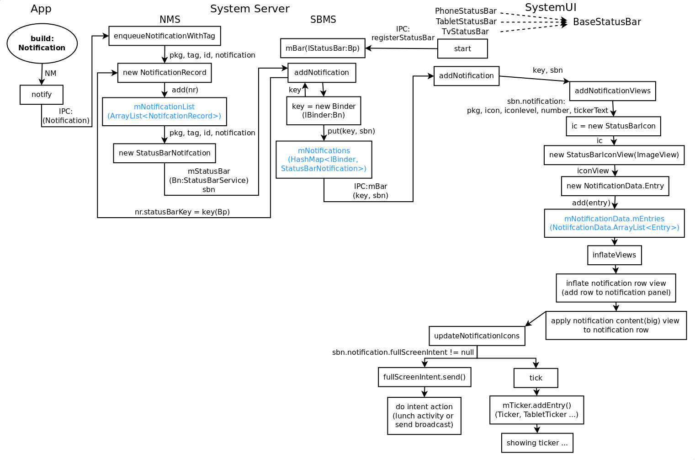
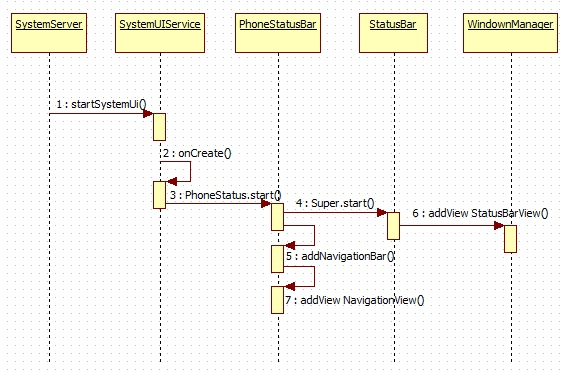

#app call NotificationManager api to send notification

sample code

    mNotificationManager = (NotificationManager)getSystemService(NOTIFICATION_SERVICE);

    Intent intent = new Intent(this, FixVibrateSetting.class);
            PendingIntent pending = PendingIntent.getActivity(this, 0, intent, 0);

            Notification n = new Notification.Builder(this)
                    .setSmallIcon(R.drawable.stat_sys_warning)
                    .setTicker("Test notification")
                    .setWhen(System.currentTimeMillis())
                    .setContentTitle("Test notification")
                    .setContentText("Test notification")
                    .setContentIntent(pending)
                    .setVibrate(new long[] { 0, 700, 500, 1000 })
                    .setAutoCancel(true)
                    .build();

            mNotificationManager.notify(1, n);

从图中可以看到一个通知从 app 自己构造通知然后调用 NotificationManager（NM）的接口发送，经过了 NotificationManagerService（NMS）到 StatusBarManagerService(SBMS) 最后到添加 Notification 的 UI 元素到 SystemUI 中。

然后 NM 会调用 NMS 的 enqueueNotificationInternal（Notification 是 Parcelable 所以可以当作 Binder 的参数传给 NMS）：

      service.enqueueNotificationWithTag(pkg, mContext.getOpPackageName(), tag, id,
                        stripped, idOut, UserHandle.myUserId());

##NMS 内部数据：

    final ArrayList<NotificationRecord> mNotificationList =
                new ArrayList<NotificationRecord>();

细心的会发现在我流程图中 NMS 到 SBMS 那里没有标 IPC 而是标了 Bn（表示本地）。这是因为 NMS 和 SBMS 都是在 SS（SystemServer）进程中的（忘记了的去 Binder 篇复习下），所以它之间可以直接持有对方的对象直接调用相关的接口，无需跨进程。同时 SBMS 提供的 IPC 接口只是占本身接口的一小部分的（aidl 中的），这里调用的接口是没在 aidl 中申明的，所以别的进程只能使用 SMBS 很有限的一部分功能。可以说这里 NMS 转到 SBMS 属于 SS 内部的功能。

##SBMS：

##SystemUI

BaseStatusBar

          public void start() {
              mWindowManager = (WindowManager)mContext.getSystemService(Context.WINDOW_SERVICE);
              mWindowManagerService = WindowManagerGlobal.getWindowManagerService();
              mDisplay = mWindowManager.getDefaultDisplay();

              // 向 SM 获取 SBMS
              mBarService = IStatusBarService.Stub.asInterface(
                      ServiceManager.getService(Context.STATUS_BAR_SERVICE));

              // Connect in to the status bar manager service
              StatusBarIconList iconList = new StatusBarIconList();
              ArrayList<IBinder> notificationKeys = new ArrayList<IBinder>();
              ArrayList<StatusBarNotification> notifications = new ArrayList<StatusBarNotification>();
              mCommandQueue = new CommandQueue(this, iconList);
              int[] switches = new int[7];
              ArrayList<IBinder> binders = new ArrayList<IBinder>();
              try {
                  // 调用 SBMS 的注册接口注册
                  mBarService.registerStatusBar(mCommandQueue, iconList, notificationKeys, notifications,
                          switches, binders);
              } catch (RemoteException ex) {
                  // If the system process isn't there we're doomed anyway.
              }
      ... ...
          }

PhoneStatusBar

      public void start(){

      super.start()

         // Lastly, call to the icon policy to install/update all the icons.
        mIconPolicy = new PhoneStatusBarPolicy(mContext, mCastController, mHotspotController,
                mUserInfoController, mBluetoothController);

      }

PhoneStatusBarPolicy

    mService = (StatusBarManager) context.getSystemService(Context.STATUS_BAR_SERVICE);

System server

            if (!disableSystemUI) {
                try {
                    Slog.i(TAG, "Status Bar");
                    statusBar = new StatusBarManagerService(context, wm);
                    ServiceManager.addService(Context.STATUS_BAR_SERVICE, statusBar);
                } catch (Throwable e) {
                    reportWtf("starting StatusBarManagerService", e);
                }
            }

然后最后总结一下：这里涉及到系统里面的3个模块：NMS，SBMS 和 SystemUI。其中 NMS 直接是管理通知服务的，SBMS 是界面（SystemUI）系统功能（通知等）桥接，应用通过系统功能的接口（例如 NMS）使用系统提供的一系列 UI 接口。然后这些系统接口再通过系统界面的桥接（SBMS）让界面系统（SystemUI）展现相关 UI 元素（视图和控制分工明确，可以学习一下 android 的设计）。最后我们来列下相关模块的对应的数据结构（第一次看还是有点晕的）：

App                        --> Notification
NotificationManagerService --> mNotificationList (ArrayList)
StatusBarManagerService    --> mNotifications (HashMap)
SystemUI                   --> mNotificationData(NotificationData.Entry[ArrayList])
                            |--> StatusBarIconView(StatusBarIcon)
                            |--> notification row
                            |--> Ticker

本文主要是对StatusBar上面的Icons的加载进行了较为细致的分析，后面将继续分析各个部件的加载以及工作流程。其中自己也走了不少弯路，但还是想记录下载，毕竟没有谁从一开始就能做正确吧！将此总结分享出来希望能给各位一些帮助，同时也给自己一些激励，希望自己后面能做的更好。本文主要是枯燥的代码调用与追踪，但对于需要的朋友，我想还是很有帮助的，后面会将相关的时序图以及UML图贴出来，以供参考。

##SystemUI启动流程

SystemUI

什么是SystemUI？你或许会觉得这个问题很幼稚，界面上的布局UI显示？系统的UI？如果你是这么想的，那么就大错特错了。我们知道Android 4.0 ICS同时适用于Phone和Tablet(TV)，因此，对于Phone来说SystemUI指的是：StatusBar(状态栏)、NavigationBar(导航栏)。

根据上面的介绍，我想大家应该知道SystemUI的具体作用了吧！也就是说我们的Phone的信号，蓝牙标志，Wifi标志等等这些状态显示标志都会在StatusBar上显示。当我们的设备开机后，首先需要给用户呈现的就是各种界面同时也包括了我们的SystemUI，因此对于整个Android系统来说，SystemUI都有举足轻重的作用，那接下来就来看看它的启动流程吧！

 首先来看看SystemUI的代码位置，路径：SourceCode/frameworks/base/packages/SystemUI；其次看看它的代码梗概：

在Android 4.0中，Google整合了Phone和Tablet(TV)的SystemUI，也就说可以根据设备的类型自动匹配相应的SystemUI。这一点是在Android 2.3中是没有的。那么接下来怎么分析呢？打开AndroidManifest.xml可以看到：

        <manifest xmlns:android="http://schemas.android.com/apk/res/android"
                package="com.android.systemui"
                coreApp="true"
                android:sharedUserId="android.uid.system"
                android:process="system"
                >

            <uses-permission android:name="android.permission.STATUS_BAR_SERVICE" />
            <uses-permission android:name="android.permission.BLUETOOTH" />
            <uses-permission android:name="android.permission.BLUETOOTH_ADMIN" />
            <uses-permission android:name="android.permission.GET_TASKS" />
            <uses-permission android:name="android.permission.MANAGE_USB" />

            <application
                android:persistent="true"
                android:allowClearUserData="false"
                android:allowBackup="false"
                android:hardwareAccelerated="true"
                android:label="@string/app_label"
                android:icon="@drawable/ic_launcher_settings">

                <!-- Broadcast receiver that gets the broadcast at boot time and starts
                     up everything else.
                     TODO: Should have an android:permission attribute
                     -->
                <service android:name="SystemUIService"
                    android:exported="true"
                    />

                <!-- started from PhoneWindowManager
                     TODO: Should have an android:permission attribute -->
                <service android:name=".screenshot.TakeScreenshotService"
                    android:process=":screenshot"
                    android:exported="false" />

                <service android:name=".LoadAverageService"
                        android:exported="true" />

                <service android:name=".ImageWallpaper"
                        android:permission="android.permission.BIND_WALLPAPER"
                        android:exported="true" />

                <receiver android:name=".BootReceiver" >
                    <intent-filter>
                        <action android:name="android.intent.action.BOOT_COMPLETED" />
                    </intent-filter>
                </receiver>
                ... ...
            </application>
        </manifest>

根据以上代码我们可以发现这其中注册了很多Service，同时也包括了广播。但这里我们只关注SystemUIService，这才是本文的主旨啊。那么首先要找到SystemUIService是如何启动的。对于Service的启动，在我以前的博文中已有提到，这里就不多说了，不外乎startService(intent)和bindService(intent)，它们都是以intent为对象，那intent的声明也需要SystemUIService啊，因此我们可以据此搜索关键词"SystemUIService"。

经过漫长的搜索和比对之后发现，原来，SystemUIService是在SystemServer.Java中被启动的，如下所示：

        static final void startSystemUi(Context context) {
            Intent intent = new Intent();
            intent.setComponent(new ComponentName("com.android.systemui",
                        "com.android.systemui.SystemUIService"));
            Slog.d(TAG, "Starting service: " + intent);
            context.startService(intent);
        }

这里的startSystemUi()方法则在ServerThread的run()方法中被调用。这里提到SystemServer就不得不提及Android的启动流程，这里不会展开详细讨论具体的流程，只是简单的介绍一下大概流程，用以表明SystemServer所处的位置。

Android的启动分为内核启动、Android启动、launcher启动，我们的SystemServer就处于Android启动中，以下是大致流程图：

    init->ServiceManager->Zygote->SystemServer->... ...

在SystemServer中，初始化了Android系统中的Java层服务，如PowerManagerService、WindowManagerService等等，当然也包括了SystemUIService，它们通过ServiceManager的addService()方法，添加到ServiceManager的管理中。实际上，根据后面的分析这里add了一个很重要的StatusBarManagerService。这个Service在后面会用到的。

      public void startServicesIfNeeded() {
              if (mServicesStarted) {
                  return;
              }

              if (!mBootCompleted) {
                  // check to see if maybe it was already completed long before we began
                  // see ActivityManagerService.finishBooting()
                  if ("1".equals(SystemProperties.get("sys.boot_completed"))) {
                      mBootCompleted = true;
                      if (DEBUG) Log.v(TAG, "BOOT_COMPLETED was already sent");
                  }
              }

              Log.v(TAG, "Starting SystemUI services.");
              final int N = SERVICES.length;
              for (int i=0; i<N; i++) {
                  Class<?> cl = SERVICES[i];
                  if (DEBUG) Log.d(TAG, "loading: " + cl);
                  try {
                      mServices[i] = (SystemUI)cl.newInstance();
                  } catch (IllegalAccessException ex) {
                      throw new RuntimeException(ex);
                  } catch (InstantiationException ex) {
                      throw new RuntimeException(ex);
                  }
                  mServices[i].mContext = this;
                  mServices[i].mComponents = mComponents;
                  if (DEBUG) Log.d(TAG, "running: " + mServices[i]);
                  mServices[i].start();

                  if (mBootCompleted) {
                      mServices[i].onBootCompleted();
                  }
              }
              mServicesStarted = true;
          }

这些方法会分别启动两个方法，这两个方法可以从log中知道，分别是PhoneStatusBar.start()和PowerUI.start()。而我们的目的是要弄清SystemUI的启动，因此现关注PhoneStatusBar.start()方法。

log信息：
	
	06-04 13:23:15.379: DEBUG/SystemUIService(396): loading: class com.android.systemui.statusbar.phone.PhoneStatusBar
	
	06-04 13:23:16.739: DEBUG/SystemUIService(396): loading: class com.android.systemui.power.PowerUI
	

来到PhoneStatusBar.start()方法中，位于：SourceCode/frameworks/base/packages/SystemUI/src/com/android/systemui/statusbar/phone/PhoneStatusBar.java，代码如下：

        @Override
        public void start() {
            mDisplay = ((WindowManager)mContext.getSystemService(Context.WINDOW_SERVICE))
                    .getDefaultDisplay();

            mWindowManager = IWindowManager.Stub.asInterface(
                    ServiceManager.getService(Context.WINDOW_SERVICE));

            super.start(); // calls makeStatusBarView()

            addNavigationBar();

            //addIntruderView();

            // Lastly, call to the icon policy to install/update all the icons.
            mIconPolicy = new PhoneStatusBarPolicy(mContext);
        }

来到/SourceCode/frameworks/base/packages/SystemUI/src/com/android/systemui/statusbar/StatusBar.java的start()方法中，代码如下：

在这里，完成了SystemUI的整个初始化以及设置过程，并最终呈现到界面上。在StatusBar中的start()方法主要完成了以下几个工作：首先获取需要在StatusBar上显示的各种icons。然后初始化一些属性。最后通过WindowManager的addView方法将StatusBar显示出来。分析到这里可能有人会问了，明明说分析的是SystemUI的嘛，怎么最后变成StatusBar了呢？如果你硬要说我跑题那我也没有办法，回过头去看看addNavigationBar()，你会发现和StatusBar的加载几乎一致，因此没必要再详述了。如果细心阅读了的朋友肯定会发现这句代码：

    mBarService = IStatusBarService.Stub.asInterface(ServiceManager.getService(Context.STATUS_BAR_SERVICE));

这不正是我们前面add的StatusBarManagerSerivce吗？这里通过AIDL的方式来获取它的对象。

整个代码执行的时序图如图2.2所示：

##总结

Android 4.0的SystemUI加载启动的过程大致就是这样，虽然看似简单，但这仅仅是个开始，master还是后面呢！！各家厂商根据自家的需求，需要定制SystemUI或者美化SystemUI，不同的平台(QCOM、MTK等等)也会有不同的修改，但大体框架是没有变的，无非是在原有基础上的修修改改或者增加一些自己的类等等。通过对Android源码框架性的理解，可以学习到很多设计上的知识（虽然自己还很欠缺）。通过这次分析，开始逐渐用StarUML来画时序图，这也是一个学习的过程。
