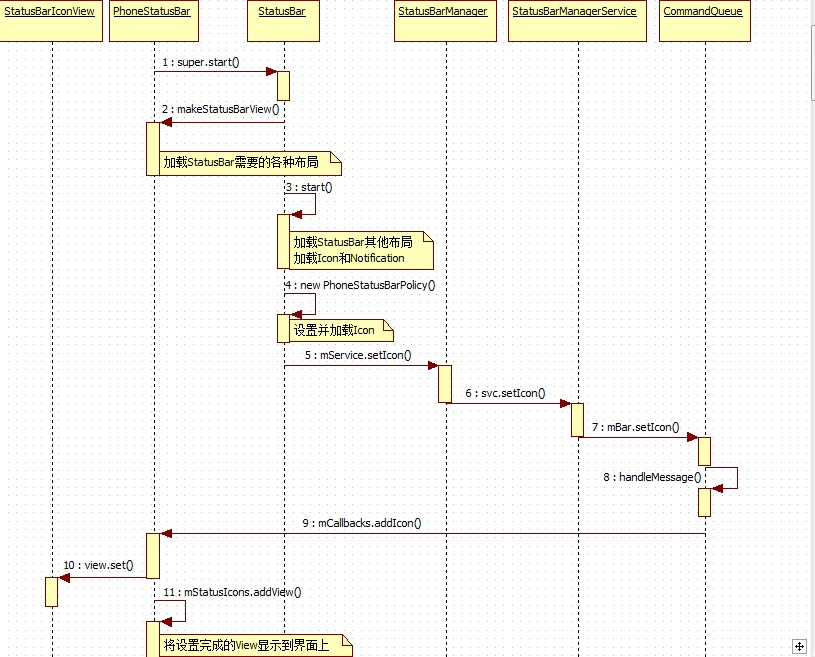
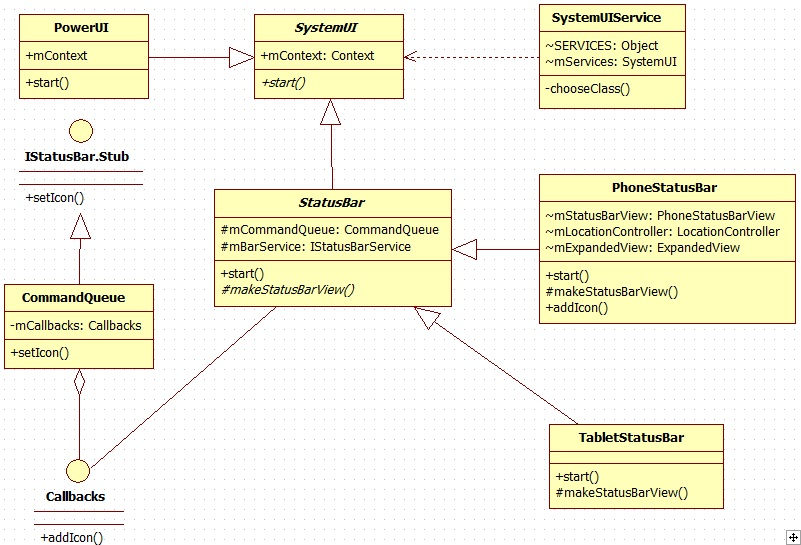

        
#StatusBar加载流程分析 Android 4.0

在《Android 4.0 ICS SystemUI浅析——SystemUI启动流程》中，我们提到了在Phone中，整个StatusBar和NavigationBar都是在/SourceCode/frameworks/base/packages/SystemUI/src/com/Android/systemui/statusbar/phone/PhoneStatusBar.java的start()方法中，完成初始化并显示到界面上的。因此，我们回到这段代码中查看：
	
	@Override  
	public void start() {  
	    mDisplay = ((WindowManager)mContext.getSystemService(Context.WINDOW_SERVICE))  
	            .getDefaultDisplay();  
	  
	    mWindowManager = IWindowManager.Stub.asInterface(  
	            ServiceManager.getService(Context.WINDOW_SERVICE));  
	  
	    super.start(); // calls makeStatusBarView() 这里会调用父类StatusBar.java中的start()方法  
	  
	    addNavigationBar();//加载导航栏，本文因以StatusBar为主，因此暂不分析NavigationBar  
	  
	    //addIntruderView();  
	  
	    // Lastly, call to the icon policy to install/update all the icons.  
	    mIconPolicy = new PhoneStatusBarPolicy(mContext);//用于初始化以及更新StatusBar上的icons  
	}    
               
我们继续跟踪super.start()方法，来到/SourceCode/frameworks/base/packages/SystemUI/src/com/android/systemui/statusbar/StatusBar.java的start()方法中，如代码所示：
	
	 public void start() {  
	 // First set up our views and stuff.首先准备我们需要显示的view以及原材料  
	 //我们先跟踪这里的makeStatusBarView  
	 View sb = makeStatusBarView();  
	 // Connect in to the status bar manager service  
	 StatusBarIconList iconList = new StatusBarIconList();  
	 ArrayList<IBinder> notificationKeys = new ArrayList<IBinder>();  
	 ArrayList<StatusBarNotification> notifications = new ArrayList<StatusBarNotification>();  
	... ...                
               
通过Open Implementation跳转到makeStatusBarView的实现，因为我们是针对Phone来分析的，因此选择PhoneStatusBar，代码如下：
	
	  // ================================================================================  
	    // Constructing the view  
	    // ================================================================================  
	    protected View makeStatusBarView() {  
	  
	        final Context context = mContext;  
	  
	        Resources res = context.getResources();  
	        //获取ExpandedView的尺寸  
	        updateDisplaySize(); // populates mDisplayMetrics  
	        //定义icon的大小，缩放率和彼此间距  
	        loadDimens();  
	        mIconSize = res.getDimensionPixelSize(com.android.internal.R.dimen.status_bar_icon_size);  
	        //设置ExpandedView的布局  
	        ExpandedView expanded = (ExpandedView)View.inflate(context,  
	                R.layout.status_bar_expanded, null);  
	        if (DEBUG) {  
	            expanded.setBackgroundColor(0x6000FF80);  
	        }  
	        expanded.mService = this;  
	        //前面已注释，以下三段代码没有用到  
	        mIntruderAlertView = View.inflate(context, R.layout.intruder_alert, null);  
	        mIntruderAlertView.setVisibility(View.GONE);  
	        mIntruderAlertView.setClickable(true);  
	        PhoneStatusBarView sb;  
	        //这里根据是否是双卡来加载不同的布局文件  
	        if (TelephonyManager.getDefault().isMultiSimEnabled()) {  
	            sb = (PhoneStatusBarView)View.inflate(context,  
	                    R.layout.msim_status_bar, null);  
	        } else {  
	            sb = (PhoneStatusBarView)View.inflate(context,  
	                    R.layout.status_bar, null);  
	        }  
	        sb.mService = this;  
	        mStatusBarView = sb;  
	        //是否显示NavigationBar  
	        try {  
	            boolean showNav = mWindowManager.hasNavigationBar();  
	            if (showNav) {  
	                mNavigationBarView =  
	                    (NavigationBarView) View.inflate(context, R.layout.navigation_bar, null);  
	  
	                mNavigationBarView.setDisabledFlags(mDisabled);  
	            }  
	        } catch (RemoteException ex) {  
	            // no window manager? good luck with that  
	        }  
	  
	        // figure out which pixel-format to use for the status bar.  
	        mPixelFormat = PixelFormat.OPAQUE;  
	        //系统状态图标布局初始化  
	        mStatusIcons = (LinearLayout)sb.findViewById(R.id.statusIcons);  
	        //通知图标布局初始化  
	        mNotificationIcons = (IconMerger)sb.findViewById(R.id.notificationIcons);  
	        mMoreIcon = sb.findViewById(R.id.moreIcon);  
	        mNotificationIcons.setOverflowIndicator(mMoreIcon);  
	        //icons布局初始化，该布局用于装载除开tiker外的所有控件  
	        mIcons = (LinearLayout)sb.findViewById(R.id.icons);  
	        //ticker布局初始化  
	        mTickerView = sb.findViewById(R.id.ticker);  
	        //以上几个重要布局的关系在上一篇文章有详细分析  
	  
	        //以下几段代码是在设置ExpandedView，ExpandedDialog通过加载ExpandedView显示，其中包括了ExpanedView上的清除按钮，  
	        //设置按钮，滚动条，日期显示等等  
	        mExpandedDialog = new ExpandedDialog(context);  
	        mExpandedView = expanded;  
	        mPile = (NotificationRowLayout)expanded.findViewById(R.id.latestItems);  
	        mExpandedContents = mPile; // was: expanded.findViewById(R.id.notificationLinearLayout);  
	        mNoNotificationsTitle = (TextView)expanded.findViewById(R.id.noNotificationsTitle);  
	        mNoNotificationsTitle.setVisibility(View.GONE); // disabling for now  
	  
	        mClearButton = expanded.findViewById(R.id.clear_all_button);  
	        mClearButton.setOnClickListener(mClearButtonListener);  
	        mClearButton.setAlpha(0f);  
	        mClearButton.setEnabled(false);  
	        mDateView = (DateView)expanded.findViewById(R.id.date);  
	        mSettingsButton = expanded.findViewById(R.id.settings_button);  
	        mSettingsButton.setOnClickListener(mSettingsButtonListener);  
	        mScrollView = (ScrollView)expanded.findViewById(R.id.scroll);  
	        //tickerView的初始化  
	        mTicker = new MyTicker(context, sb);  
	        TickerView tickerView = (TickerView)sb.findViewById(R.id.tickerText);  
	        tickerView.mTicker = mTicker;  
	        //TrackingView初始化  
	        mTrackingView = (TrackingView)View.inflate(context, R.layout.status_bar_tracking, null);  
	        mTrackingView.mService = this;  
	        mCloseView = (CloseDragHandle)mTrackingView.findViewById(R.id.close);  
	        mCloseView.mService = this;  
	  
	        mEdgeBorder = res.getDimensionPixelSize(R.dimen.status_bar_edge_ignore);  
	  
	        // set the inital view visibility  
	        setAreThereNotifications();  
	  
	        // Other icons  
	        //以下是对其他icons的加载(信号及电量图标的加载)  
	        mLocationController = new LocationController(mContext); // will post a notification  
	        mBatteryController = new BatteryController(mContext);  
	        mBatteryController.addIconView((ImageView)sb.findViewById(R.id.battery));  
	        SignalClusterView signalCluster;  
	        LinearLayout mSimSignalView;  
	  
	        //根据是否是双卡加载不同的布局文件  
	        if (TelephonyManager.getDefault().isMultiSimEnabled()) {  
	            mMSimNetworkController = new MSimNetworkController(mContext);  
	            mSimSignalView = (LinearLayout) sb.findViewById(R.id.msim_signal_cluster);  
	            if (FeatureQuery.FEATURE_ANNUCIATOR_NEW_STATUSBAR_STYLE) {  
	                CUMSimSignalClusterView cuMSimSignalCluster = (CUMSimSignalClusterView)View.inflate(context, R.layout.msim_signal_cluster_view_cu, null);  
	                mSimSignalView.addView(cuMSimSignalCluster);  
	                for (int i=0; i < TelephonyManager.getDefault().getPhoneCount(); i++) {  
	                    mMSimNetworkController.addSignalCluster(cuMSimSignalCluster, i);  
	                }  
	                cuMSimSignalCluster.setNetworkController(mMSimNetworkController);  
	            } else {  
	                MSimSignalClusterView mSimSignalCluster = (MSimSignalClusterView)View.inflate(context, R.layout.msim_signal_cluster_view, null);  
	                mSimSignalView.addView(mSimSignalCluster);  
	                for (int i=0; i < TelephonyManager.getDefault().getPhoneCount(); i++) {  
	                    mMSimNetworkController.addSignalCluster(mSimSignalCluster, i);  
	                }  
	                mSimSignalCluster.setNetworkController(mMSimNetworkController);  
	            }  
	        } else {  
	            mNetworkController = new NetworkController(mContext);  
	            signalCluster = (SignalClusterView)sb.findViewById(R.id.signal_cluster);  
	            mNetworkController.addSignalCluster(signalCluster);  
	            signalCluster.setNetworkController(mNetworkController);  
	//          final ImageView wimaxRSSI =  
	//                  (ImageView)sb.findViewById(R.id.wimax_signal);  
	//          if (wimaxRSSI != null) {  
	//              mNetworkController.addWimaxIconView(wimaxRSSI);  
	//          }  
	  
	        }  
	  
	        // Recents Panel  
	        //最近使用界面初始化  
	        mRecentTasksLoader = new RecentTasksLoader(context);  
	        updateRecentsPanel();  
	  
	        // receive broadcasts  
	        //注册广播监听器  
	        IntentFilter filter = new IntentFilter();  
	        filter.addAction(Intent.ACTION_CONFIGURATION_CHANGED);  
	        filter.addAction(Intent.ACTION_CLOSE_SYSTEM_DIALOGS);  
	        filter.addAction(Intent.ACTION_SCREEN_ON);  
	        filter.addAction(Intent.ACTION_SCREEN_OFF);  
	        context.registerReceiver(mBroadcastReceiver, filter);  
	  
	        return sb;  
	    }                 
               

通过makeStatusBarView()我们可以看到，在该方法中整个StatusBar根据获取的设备配置信息进行了布局，就好比我们去吃饭，先要安排好座位和桌子，最后才上菜，我们需要加载的icons——就是菜！！:D

我们回到StatusBar.java的start()方法中继续分析，代码如下：
	
	public void start() {  
	    // First set up our views and stuff.首先准备我们需要显示的view以及原材料  
	    //我们先跟踪这里的makeStatusBarView  
	    View sb = makeStatusBarView();  
	  
	    // Connect in to the status bar manager service  
	    //初始化各个存储器，用于存储各类信息，这些信息通过StatusBarManagerService获取  
	    //iconsList用于存放icons  
	    StatusBarIconList iconList = new StatusBarIconList();  
	    //nodificationKeys保存以Binder为Key的notification  
	    ArrayList<IBinder> notificationKeys = new ArrayList<IBinder>();  
	    //保存StatusBarNotification类型的notifications  
	    ArrayList<StatusBarNotification> notifications = new ArrayList<StatusBarNotification>();  
	    //mCommandQueue是和IStatusBarService进行交互的IBinder  
	    mCommandQueue = new CommandQueue(this, iconList);  
	    //这里实际上获取的是StatusBarManagerService  
	    mBarService = IStatusBarService.Stub.asInterface(  
	            ServiceManager.getService(Context.STATUS_BAR_SERVICE));  
	    int[] switches = new int[7];  
	    ArrayList<IBinder> binders = new ArrayList<IBinder>();  
	    try {  
	        //通过StatusBarManagerService中的registerStatusBar来获取初始设置  
	        mBarService.registerStatusBar(mCommandQueue, iconList, notificationKeys, notifications,  
	                switches, binders);  
	    } catch (RemoteException ex) {  
	        // If the system process isn't there we're doomed anyway.  
	    }  
	    //对SystemUI上像Clock、ExpandedView、NavigationBar等进行初始化设置  
	    disable(switches[0]);  
	    setSystemUiVisibility(switches[1]);  
	    topAppWindowChanged(switches[2] != 0);  
	    // StatusBarManagerService has a back up of IME token and it's restored here.  
	    setImeWindowStatus(binders.get(0), switches[3], switches[4]);  
	    setHardKeyboardStatus(switches[5] != 0, switches[6] != 0);  
	  
	    // Set up the initial icon state  
	    //icon加载(注：陷阱!!!一不注意就会迷失！！后文详将细分析)  
	    int N = iconList.size();  
	    int viewIndex = 0;  
	    for (int i=0; i<N; i++) {  
	        StatusBarIcon icon = iconList.getIcon(i);  
	        if (icon != null) {  
	            addIcon(iconList.getSlot(i), i, viewIndex, icon);  
	            viewIndex++;  
	        }  
	    }  
	  
	    // Set up the initial notification state  
	    //加载notifications  
	    N = notificationKeys.size();  
	    if (N == notifications.size()) {  
	        for (int i=0; i<N; i++) {  
	            addNotification(notificationKeys.get(i), notifications.get(i));  
	        }  
	    } else {  
	        Log.wtf(TAG, "Notification list length mismatch: keys=" + N  
	                + " notifications=" + notifications.size());  
	    }  
	  
	    // Put up the view  
	    //获取StatusBar高度  
	    final int height = getStatusBarHeight();  
	    //设置lp各种属性  
	    final WindowManager.LayoutParams lp = new WindowManager.LayoutParams(  
	            ViewGroup.LayoutParams.MATCH_PARENT,  
	            height,  
	            WindowManager.LayoutParams.TYPE_STATUS_BAR,  
	            WindowManager.LayoutParams.FLAG_NOT_FOCUSABLE  
	                | WindowManager.LayoutParams.FLAG_TOUCHABLE_WHEN_WAKING  
	                | WindowManager.LayoutParams.FLAG_SPLIT_TOUCH,  
	            // We use a pixel format of RGB565 for the status bar to save memory bandwidth and  
	            // to ensure that the layer can be handled by HWComposer.  On some devices the  
	            // HWComposer is unable to handle SW-rendered RGBX_8888 layers.  
	            PixelFormat.RGB_565);  
	      
	    // the status bar should be in an overlay if possible  
	    final Display defaultDisplay   
	        = ((WindowManager)mContext.getSystemService(Context.WINDOW_SERVICE))  
	            .getDefaultDisplay();  
	    //enable hardware acceleration based on device  
	    //使能硬件加速，不过只有Tablet上才有用  
	    setHardwareAcceleration(lp);  
	    lp.gravity = getStatusBarGravity();  
	    lp.setTitle("StatusBar");  
	    lp.packageName = mContext.getPackageName();  
	    lp.windowAnimations = R.style.Animation_StatusBar;  
	    //在Window上显示StatusBar界面  
	    WindowManagerImpl.getDefault().addView(sb, lp);  
	    mDoNotDisturb = new DoNotDisturb(mContext);  
	}      
	                   
 可能大多数朋友都还是云里雾里的，先别急，我们只是把大致流程走完了，细节还没有去分析，接下来我们再来看看StatusBar到底是如何加载Icons的。

       需要分析如何加载Icons，首先我们根据StatusBar.java中的start()方法可以看到，addIcon()方法完成了Icons的加载。那么通过Open Implementation跳转到PhoneStatusBar.java中的addIcon()方法中(因为我们之前传递的Context是PhoneStatusBar的)，代码如下：

	
	public void addIcon(String slot, int index, int viewIndex, StatusBarIcon icon) {  
	    if (SPEW) Slog.d(TAG, "addIcon slot=" + slot + " index=" + index + " viewIndex=" + viewIndex  
	            + " icon=" + icon);  
	    //初始化StatusBarIconView  
	    StatusBarIconView view = new StatusBarIconView(mContext, slot, null);  
	    //加载icon  
	    view.set(icon);  
	    //这里的FEATURE_ANNUCIATOR_NEW_STATUSBAR_STYLE是高通自己定义的，默认为true  
	    if (FeatureQuery.FEATURE_ANNUCIATOR_NEW_STATUSBAR_STYLE) {  
	        //将设置好icon的StatusBarIconView加载到mStatusIcons布局中  
	        mStatusIcons.addView(view, viewIndex, new LinearLayout.LayoutParams(LayoutParams.WRAP_CONTENT, mIconSize));  
	    } else {  
	        mStatusIcons.addView(view, viewIndex, new LinearLayout.LayoutParams(mIconSize, mIconSize));  
	    }  
	}                 

整个加载过程从表面上看来只有3步，但从本质上来讲远远不止3步。首先，我们先来看看addIcon(...)方法所传递的值；我将这里Slog中的内容打印出来，结果如下：
	
	addIcon slot=tty index=6 viewIndex=0 icon=StatusBarIcon(pkg=com.android.systemui id=0x7f02012b level=0 visible=false num=0 )  
	addIcon slot=cdma_eri index=11 viewIndex=1 icon=StatusBarIcon(pkg=com.android.systemui id=0x7f0200d8 level=0 visible=false num=0 )  
	addIcon slot=bluetooth index=4 viewIndex=0 icon=StatusBarIcon(pkg=com.android.systemui id=0x7f020073 level=0 visible=false num=0 )  
	addIcon slot=alarm_clock index=18 viewIndex=3 icon=StatusBarIcon(pkg=com.android.systemui id=0x7f020060 level=0 visible=false num=0 )  
	addIcon slot=sync_active index=2 viewIndex=0 icon=StatusBarIcon(pkg=com.android.systemui id=0x7f020129 level=0 visible=false num=0 )  
	addIcon slot=sync_failing index=1 viewIndex=0 icon=StatusBarIcon(pkg=com.android.systemui id=0x7f02012a level=0 visible=false num=0 )  
	addIcon slot=volume index=9 viewIndex=4 icon=StatusBarIcon(pkg=com.android.systemui id=0x7f0200d6 level=0 visible=false num=0 )  
	addIcon slot=headset index=16 viewIndex=6 icon=StatusBarIcon(pkg=com.android.systemui id=0x7f02000a level=0 visible=false num=0 )  
	

通过以上log，其中的tty表示语音图标，cdma_eri表示CDMA漫游时显示的图标，其他的大家应该都认识吧，这里就不多讲了。也就是说addIcon()加载的是系统的状态图标。那么我们继续查看它到底是如何加载的，继续查看StatusBarIconView()方法，代码如下
	
	public StatusBarIconView(Context context, String slot, Notification notification) {  
	    super(context);  
	    //获取资源  
	    final Resources res = context.getResources();  
	    mSlot = slot;  
	    //画笔初始化  
	    mNumberPain = new Paint();  
	    mNumberPain.setTextAlign(Paint.Align.CENTER);  
	    mNumberPain.setColor(res.getColor(R.drawable.notification_number_text_color));  
	    mNumberPain.setAntiAlias(true);  
	    mNotification = notification;  
	    setContentDescription(notification);  
	  
	    // We do not resize and scale system icons (on the right), only notification icons (on the  
	    // left).  
	    if (notification != null) {  
	        final int outerBounds = res.getDimensionPixelSize(R.dimen.status_bar_icon_size);  
	        final int imageBounds = res.getDimensionPixelSize(R.dimen.status_bar_icon_drawing_size);  
	        final float scale = (float)imageBounds / (float)outerBounds;  
	        setScaleX(scale);  
	        setScaleY(scale);  
	        final float alpha = res.getFraction(R.dimen.status_bar_icon_drawing_alpha, 1, 1);  
	        setAlpha(alpha);  
	    }  
	    //按图片原来的size居中显示  
	    setScaleType(ImageView.ScaleType.CENTER);  
	}  
	
通过查看StatusBarIconView的继承关系我们可以发现public class StatusBarIconView extends AnimatedImageView ，继续跟踪可以看到public class AnimatedImageView extends ImageView，也就是说我们的StatusBarIconView其实就是一个封装过的ImageView，这样自然能够盛放我们的Icons了。继续查看StatusBarIconView的set()方法，代码如下：
	
	/** 
	 * Returns whether the set succeeded. 
	 */  
	public boolean set(StatusBarIcon icon) {  
	    final boolean iconEquals = mIcon != null  
	            && streq(mIcon.iconPackage, icon.iconPackage)  
	            && mIcon.iconId == icon.iconId;  
	    final boolean levelEquals = iconEquals  
	            && mIcon.iconLevel == icon.iconLevel;  
	    final boolean visibilityEquals = mIcon != null  
	            && mIcon.visible == icon.visible;  
	    final boolean numberEquals = mIcon != null  
	            && mIcon.number == icon.number;  
	    //将icon的信息copy到mIcon中  
	    mIcon = icon.clone();  
	    setContentDescription(icon.contentDescription);  
	    //获取icon图片并设置到StatusBarIconView中去  
	    if (!iconEquals) {  
	        Drawable drawable = getIcon(icon);  
	        if (drawable == null) {  
	            Slog.w(StatusBar.TAG, "No icon for slot " + mSlot);  
	            return false;  
	        }  
	        setImageDrawable(drawable);  
	    }  
	    //设置需要显示的图片  
	    if (!levelEquals) {  
	        setImageLevel(icon.iconLevel);  
	    }  
	    //这个不太清楚具体是干嘛的  
	    if (!numberEquals) {  
	        if (icon.number > 0 && mContext.getResources().getBoolean(  
	                    R.bool.config_statusBarShowNumber)) {  
	            if (mNumberBackground == null) {  
	                mNumberBackground = getContext().getResources().getDrawable(  
	                        R.drawable.ic_notification_overlay);  
	            }  
	            placeNumber();  
	        } else {  
	            mNumberBackground = null;  
	            mNumberText = null;  
	        }  
	        invalidate();  
	    }  
	    //设置是否可见  
	    if (!visibilityEquals) {  
	        setVisibility(icon.visible ? VISIBLE : GONE);  
	    }  
	    return true;  
	}  

 到这一步时，我们已经将系统的Icons设置到了mStatusIcons这个mStatusIcons的LinearLayout上了。

 但是，事实真的如此吗？这样就完成icons的初始化了吗？还是那句话，实践是检验真理是否正确的唯一标准！那么我们在PhoneStatusBar.java的addIcon()方法中，加入代码，将程序调用栈打印出来，结果一看便知(当然，也可以用Eclipse的远程调试)！加入代码如下：
	        
	 StackTraceElement st[]= Thread.currentThread().getStackTrace();  
	for(int i=0;i<st.length;i++)  
	System.out.println(i+":"+st[i]); 
        
 重新编译SystemUI，push到/system/app目录下，重新启动，打印部分log如下：
	 
	 I/System.out(420): 0:dalvik.system.VMStack.getThreadStackTrace(Native Method)  
	I/System.out(420): 1:java.lang.Thread.getStackTrace(Thread.java:591)  
	I/System.out(420): 2:com.android.systemui.statusbar.phone.PhoneStatusBar.addIcon(PhoneStatusBar.java:562)  
	I/System.out(420): 3:com.android.systemui.statusbar.CommandQueue$H.handleMessage(CommandQueue.java:212)  
	I/System.out(420): 4:android.os.Handler.dispatchMessage(Handler.java:99)  
	I/System.out(420): 5:android.os.Looper.loop(Looper.java:137)  
	I/System.out(420): 6:android.app.ActivityThread.main(ActivityThread.java:4450)  
	I/System.out(420): 7:java.lang.reflect.Method.invokeNative(Native Method)  
	I/System.out(420): 8:java.lang.reflect.Method.invoke(Method.java:511)  
	I/System.out(420): 9:com.android.internal.os.ZygoteInit$MethodAndArgsCaller.run(ZygoteInit.java:787)  
	I/System.out(420): 10:com.android.internal.os.ZygoteInit.main(ZygoteInit.java:554)  
	I/System.out(420): 11:dalvik.system.NativeStart.main(Native Method)  
	... ...  
        
从打印出来的调用栈，我们可以发现，实际条用addIcon()方法的，并不是我们之前分析的StatusBar，而是来自CommandQueue中的handleMessage，这和我们之前的分析大相径庭啊！也就是说实际上addIcon()在CommandQueue中被调用了，那么我们就反过来分析，直接去CommandQueue.java中的handleMessage找到addIcon()。代码如下：
		
		case OP_SET_ICON: {  
		StatusBarIcon icon = (StatusBarIcon)msg.obj;  
		StatusBarIcon old = mList.getIcon(index);  
		if (old == null) {  
		mList.setIcon(index, icon);  
		mCallbacks.addIcon(mList.getSlot(index), index, viewIndex, icon);  
		} else {  
		   mList.setIcon(index, icon);  
		   mCallbacks.updateIcon(mList.getSlot(index), index, viewIndex,  
		                  old, icon);  
		       }  
		break;  
		}          
		
		
通过case OP_SET_ICON我们可以继续追查，我们可以查到是谁发送的这个message，代码如下：
	
	public void setIcon(int index, StatusBarIcon icon) {  
	    synchronized (mList) {  
	        int what = MSG_ICON | index;  
	        mHandler.removeMessages(what);  
	        mHandler.obtainMessage(what, OP_SET_ICON, 0, icon.clone()).sendToTarget();  
	    }  
	}  
	
在CommandQueue中的setIcon发送了这个消息，通过Open Call Hierarchy继续追查，可以看到如图1：

 其中第一个onTransact是一个IBinder，后两者是StatusBarManagerService中的方法。通过方法名称，我们可以大致猜测，setIcon是设置Icon，setIconVisibility是这是Icon是否可见，我们从逻辑上分析，如果是开机第一次调用我们应该先设置Icon然后再考虑设置其可见性(看完后文就会明白了:D)。我们直接跳转到StatusBarManagerService中的setIcon()方法，代码如下：
 
	 
	 public void setIcon(String slot, String iconPackage, int iconId, int iconLevel,  
	        String contentDescription) {  
	    enforceStatusBar();  
	  
	    synchronized (mIcons) {  
	        int index = mIcons.getSlotIndex(slot);//这里会检查是否是未定义的icon，如果是则抛出异常  
	        if (index < 0) {  
	            throw new SecurityException("invalid status bar icon slot: " + slot);  
	        }  
	  
	        StatusBarIcon icon = new StatusBarIcon(iconPackage, iconId, iconLevel, 0,  
	                contentDescription);  
	        //Slog.d(TAG, "setIcon slot=" + slot + " index=" + index + " icon=" + icon);  
	        mIcons.setIcon(index, icon);  
	  
	        if (mBar != null) {  
	            try {  
	                mBar.setIcon(index, icon);//这里调用的  
	            } catch (RemoteException ex) {  
	            }  
	        }  
	    }  
	}  
	
	
继续用Open Call Hierarchy查找哪里调用的setIcon方法，如图2：

  这里一看就知道应该是StatusBarManager中的setIcon嘛，继续跟踪，代码如下：
		
		[java] view plain copy
		public void setIcon(String slot, int iconId, int iconLevel, String contentDescription) {  
		    try {  
		        final IStatusBarService svc = getService();  
		        if (svc != null) {  
		            svc.setIcon(slot, mContext.getPackageName(), iconId, iconLevel,  
		                contentDescription);//这里调用的  
		        }  
		    } catch (RemoteException ex) {  
		        // system process is dead anyway.  
		        throw new RuntimeException(ex);  
		    }  
		}  
        
目前看来还不是很清晰，继续查找，如图3：

看到这里请不要头晕，因为真相就在眼前！那么这里应该是谁在调用呢？在本文的一开始，我们就分析了/SourceCode/frameworks/base/packages/SystemUI/src/com/android/systemui/statusbar/phone/PhoneStatusBar.java的start()方法，在该方法中有如下代码：

	mIconPolicy = new PhoneStatusBarPolicy(mContext);  

 该代码不正是调用了PhoneStatusBarPolicy()构造方法吗？直接跟进去，代码如下：
		 
		 public PhoneStatusBarPolicy(Context context) {  
		       ... ...  
		       // listen for broadcasts  
		       IntentFilter filter = new IntentFilter();  
		       filter.addAction(Intent.ACTION_ALARM_CHANGED);  
		       filter.addAction(Intent.ACTION_SYNC_STATE_CHANGED);  
		       filter.addAction(AudioManager.RINGER_MODE_CHANGED_ACTION);  
		       filter.addAction(AudioManager.VIBRATE_SETTING_CHANGED_ACTION);  
		       filter.addAction(BluetoothAdapter.ACTION_STATE_CHANGED);  
		    filter.addAction(Intent.ACTION_HEADSET_PLUG); // ted add 2021-4-24  
		       filter.addAction(BluetoothAdapter.ACTION_CONNECTION_STATE_CHANGED);  
		       filter.addAction(TelephonyIntents.ACTION_SIM_STATE_CHANGED);  
		       filter.addAction(TtyIntent.TTY_ENABLED_CHANGE_ACTION);  
		       mContext.registerReceiver(mIntentReceiver, filter, null, mHandler);  
		       ... ...  
		  
		       // TTY status  
		       mService.setIcon("tty",  R.drawable.stat_sys_tty_mode, 0, null);//这里调用  
		       mService.setIconVisibility("tty", false);  
		  
		       // Cdma Roaming Indicator, ERI  
		       mService.setIcon("cdma_eri", R.drawable.stat_sys_roaming_cdma_0, 0, null);//这里调用  
		       mService.setIconVisibility("cdma_eri", false);  
		  
		       ... ...  
		       mService.setIcon("bluetooth", bluetoothIcon, 0, null);//这里调用  
		       mService.setIconVisibility("bluetooth", mBluetoothEnabled);  
		  
		       // Alarm clock  
		       mService.setIcon("alarm_clock", R.drawable.stat_sys_alarm, 0, null);//这里调用  
		       mService.setIconVisibility("alarm_clock", false);  
		  
		       // Sync state  
		       mService.setIcon("sync_active", R.drawable.stat_sys_sync, 0, null);//这里调用  
		       mService.setIcon("sync_failing", R.drawable.stat_sys_sync_error, 0, null);//这里调用  
		       mService.setIconVisibility("sync_active", false);  
		       mService.setIconVisibility("sync_failing", false);  
		  
		       // volume  
		       mService.setIcon("volume", R.drawable.stat_sys_ringer_silent, 0, null);//这里调用  
		       mService.setIconVisibility("volume", false);  
		       updateVolume();  
		      
		// headset  
		mService.setIcon("headset", R.drawable.ckt_headset_with_mic, 0, null);//这里调用  
		mService.setIconVisibility("headset", false);  
		   }  

这里也同时验证了我们前面的猜想，即先设置Icon再设置其可见性。也许你会认为本文到这里已经完结了(太长了，一次看不完...o(╯□╰)o)，但有个别地方我还得再提一下，Android 启动之后，在SystemServer.java的run方法中，调用了StatusBarManagerService的构造方法，代码如下：

	... ...  
	try {  
	    Slog.i(TAG, "Status Bar");  
	    statusBar = new StatusBarManagerService(context, wm);  
	    ServiceManager.addService(Context.STATUS_BAR_SERVICE, statusBar);  
	} catch (Throwable e) {  
	    reportWtf("starting StatusBarManagerService", e);  
	}  
	... ...  

在StatusBarManagerService的构造方法中，代码如下：

	public StatusBarManagerService(Context context, WindowManagerService windowManager) {  
	    mContext = context;  
	    mWindowManager = windowManager;  
	    mWindowManager.setOnHardKeyboardStatusChangeListener(this);  
	  
	    final Resources res = context.getResources();  
	    //这里加载了系统预置的所有icon，路径在：Sourcecode/framework/base/core/res/res/values/config.xml中  
	    mIcons.defineSlots(res.getStringArray(com.android.internal.R.array.config_statusBarIcons));  
	}  

其中Sourcecode/framework/base/core/res/res/values/config.xml中的预置图标定义如下：

	<string-array name="config_statusBarIcons">  
	        <item><xliff:g id="id">ime</xliff:g></item>  
	        <item><xliff:g id="id">sync_failing</xliff:g></item>  
	        <item><xliff:g id="id">sync_active</xliff:g></item>  
	        <item><xliff:g id="id">gps</xliff:g></item>  
	        <item><xliff:g id="id">bluetooth</xliff:g></item>  
	        <item><xliff:g id="id">nfc</xliff:g></item>  
	        <item><xliff:g id="id">tty</xliff:g></item>  
	        <item><xliff:g id="id">speakerphone</xliff:g></item>  
	        <item><xliff:g id="id">mute</xliff:g></item>  
	        <item><xliff:g id="id">volume</xliff:g></item>  
	        <item><xliff:g id="id">wifi</xliff:g></item>  
	        <item><xliff:g id="id">cdma_eri</xliff:g></item>  
	        <item><xliff:g id="id">phone_signal_second_sub</xliff:g></item>  
	        <item><xliff:g id="id">data_connection</xliff:g></item>  
	        <item><xliff:g id="id">phone_evdo_signal</xliff:g></item>  
	        <item><xliff:g id="id">phone_signal</xliff:g></item>  
	        <item><xliff:g id="id">headset</xliff:g></item>  
	        <item><xliff:g id="id">battery</xliff:g></item>  
	        <item><xliff:g id="id">alarm_clock</xliff:g></item>  
	        <item><xliff:g id="id">secure</xliff:g></item>  
	        <item><xliff:g id="id">clock</xliff:g></item>  
	</string-array>  

这些东西在后文判断时都会用到，在此记录用以备忘。
        

        
小结

       本文主要是对StatusBar上面的Icons的加载进行了较为细致的分析，后面将继续分析各个部件的加载以及工作流程。其中自己也走了不少弯路，但还是想记录下载，毕竟没有谁从一开始就能做正确吧！将此总结分享出来希望能给各位一些帮助，同时也给自己一些激励，希望自己后面能做的更好。本文主要是枯燥的代码调用与追踪，但对于需要的朋友，我想还是很有帮助的，后面会将相关的时序图以及UML图贴出来，以供参考。

