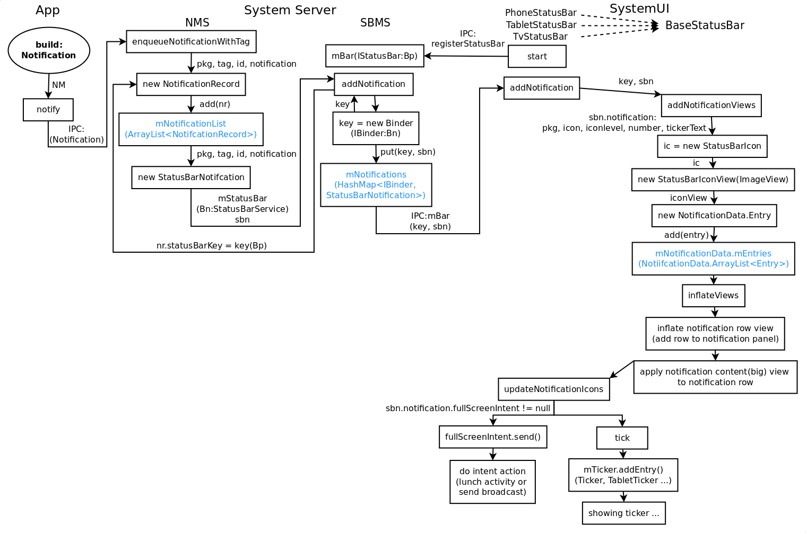
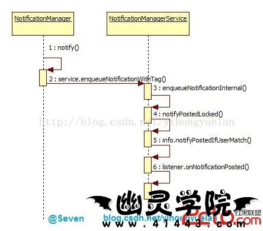

#app call NotificationManager api to send notification

sample code

    mNotificationManager = (NotificationManager)getSystemService(NOTIFICATION_SERVICE);

    Intent intent = new Intent(this, FixVibrateSetting.class);
            PendingIntent pending = PendingIntent.getActivity(this, 0, intent, 0);

            Notification n = new Notification.Builder(this)
                    .setSmallIcon(R.drawable.stat_sys_warning)
                    .setTicker("Test notification")
                    .setWhen(System.currentTimeMillis())
                    .setContentTitle("Test notification")
                    .setContentText("Test notification")
                    .setContentIntent(pending)
                    .setVibrate(new long[] { 0, 700, 500, 1000 })
                    .setAutoCancel(true)
                    .build();

            mNotificationManager.notify(1, n);

NotificationManager 创建过程：
		
		  registerService(Context.NOTIFICATION_SERVICE, NotificationManager.class,
		342                new CachedServiceFetcher<NotificationManager>() {
		343            @Override
		344            public NotificationManager createService(ContextImpl ctx) {
		345                final Context outerContext = ctx.getOuterContext();
		346                return new NotificationManager(
		347                    new ContextThemeWrapper(outerContext,
		348                            Resources.selectSystemTheme(0,
		349                                    outerContext.getApplicationInfo().targetSdkVersion,
		350                                    com.android.internal.R.style.Theme_Dialog,
		351                                    com.android.internal.R.style.Theme_Holo_Dialog,
		352                                    com.android.internal.R.style.Theme_DeviceDefault_Dialog,
		353                                    com.android.internal.R.style.Theme_DeviceDefault_Light_Dialog)),
		354                    ctx.mMainThread.getHandler());
		355            }});
		356

从图中可以看到一个通知从 app 自己构造通知然后调用 NotificationManager（NM）的接口发送，经过了 NotificationManagerService（NMS）到 StatusBarManagerService(SBMS) 最后到添加 Notification 的 UI 元素到 SystemUI 中。

	
		167        IBinder b = ServiceManager.getService("notification");
		168        sService = INotificationManager.Stub.asInterface(b);

然后 NM 会调用 NMS 的 enqueueNotificationInternal（Notification 是 Parcelable 所以可以当作 Binder 的参数传给 NMS）：

      service.enqueueNotificationWithTag(pkg, mContext.getOpPackageName(), tag, id,
                        stripped, idOut, UserHandle.myUserId());

##NMS 内部数据：

    final ArrayList<NotificationRecord> mNotificationList =
                new ArrayList<NotificationRecord>();

细心的会发现在我流程图中 NMS 到 SBMS 那里没有标 IPC 而是标了 Bn（表示本地）。这是因为 NMS 和 SBMS 都是在 SS（SystemServer）进程中的（忘记了的去 Binder 篇复习下），所以它之间可以直接持有对方的对象直接调用相关的接口，无需跨进程。同时 SBMS 提供的 IPC 接口只是占本身接口的一小部分的（aidl 中的），这里调用的接口是没在 aidl 中申明的，所以别的进程只能使用 SMBS 很有限的一部分功能。可以说这里 NMS 转到 SBMS 属于 SS 内部的功能。

Android 6.0代码，StatusBar直接向NMS注册监听，获得Notification通知。

##SBMS：

##SystemUI

BaseStatusBar

          public void start() {
              mWindowManager = (WindowManager)mContext.getSystemService(Context.WINDOW_SERVICE);
              mWindowManagerService = WindowManagerGlobal.getWindowManagerService();
              mDisplay = mWindowManager.getDefaultDisplay();

              // 向 SM 获取 SBMS
              mBarService = IStatusBarService.Stub.asInterface(
                      ServiceManager.getService(Context.STATUS_BAR_SERVICE));

              // Connect in to the status bar manager service
              StatusBarIconList iconList = new StatusBarIconList();
              ArrayList<IBinder> notificationKeys = new ArrayList<IBinder>();
              ArrayList<StatusBarNotification> notifications = new ArrayList<StatusBarNotification>();
              mCommandQueue = new CommandQueue(this, iconList);
              int[] switches = new int[7];
              ArrayList<IBinder> binders = new ArrayList<IBinder>();
              try {
                  // 调用 SBMS 的注册接口注册
                  mBarService.registerStatusBar(mCommandQueue, iconList, notificationKeys, notifications,
                          switches, binders);
              } catch (RemoteException ex) {
                  // If the system process isn't there we're doomed anyway.
              }
      ... ...
          }

Set up the initial notification state.

		622        try {
		623            mNotificationListener.registerAsSystemService(mContext,
		624                    new ComponentName(mContext.getPackageName(), getClass().getCanonicalName()),
		625                    UserHandle.USER_ALL);
		626        } catch (RemoteException e) {
		627            Log.e(TAG, "Unable to register notification listener", e);
		628        }
		
Directly register this service with the Notification Manager.

		/**
		623     * Directly register this service with the Notification Manager.
		624     *
		625     * 
Only system services may use this call. It will fail for non-system callers.
		626     * Apps should ask the user to add their listener in Settings.
		627     *
		628     * @param context Context required for accessing resources. Since this service isn't
		629     *    launched as a real Service when using this method, a context has to be passed in.
		630     * @param componentName the component that will consume the notification information
		631     * @param currentUser the user to use as the stream filter
		632     * @hide
		633     */
		634    @SystemApi
		635    public void registerAsSystemService(Context context, ComponentName componentName,
		636            int currentUser) throws RemoteException {
		637        mSystemContext = context;
		638        if (mWrapper == null) {
		639            mWrapper = new INotificationListenerWrapper();
		640        }
		641        INotificationManager noMan = getNotificationInterface();
		642        noMan.registerListener(mWrapper, componentName, currentUser);
		643        mCurrentUser = currentUser;
		644    }

NotificationManager service

		 private final INotificationManager getNotificationInterface() {
		268        if (mNoMan == null) {
		269            mNoMan = INotificationManager.Stub.asInterface(
		270                    ServiceManager.getService(Context.NOTIFICATION_SERVICE));
		271        }
		272        return mNoMan;
		273    }

PhoneStatusBar

      public void start(){

      super.start()

         // Lastly, call to the icon policy to install/update all the icons.
        mIconPolicy = new PhoneStatusBarPolicy(mContext, mCastController, mHotspotController,
                mUserInfoController, mBluetoothController);

      }

PhoneStatusBarPolicy, 从Registry 中拿service的包装对象

    mService = (StatusBarManager) context.getSystemService(Context.STATUS_BAR_SERVICE);

System server

            if (!disableSystemUI) {
                try {
                    Slog.i(TAG, "Status Bar");
                    statusBar = new StatusBarManagerService(context, wm);
                    ServiceManager.addService(Context.STATUS_BAR_SERVICE, statusBar);
                } catch (Throwable e) {
                    reportWtf("starting StatusBarManagerService", e);
                }
            }

然后最后总结一下：这里涉及到系统里面的3个模块：NMS，SBMS 和 SystemUI。其中 NMS 直接是管理通知服务的，SBMS 是界面（SystemUI）系统功能（通知等）桥接，应用通过系统功能的接口（例如 NMS）使用系统提供的一系列 UI 接口。然后这些系统接口再通过系统界面的桥接（SBMS）让界面系统（SystemUI）展现相关 UI 元素（视图和控制分工明确，可以学习一下 android 的设计）。最后我们来列下相关模块的对应的数据结构（第一次看还是有点晕的）：
		
		App                        --> Notification
		NotificationManagerService --> mNotificationList (ArrayList)
		StatusBarManagerService    --> mNotifications (HashMap)
		SystemUI                   --> mNotificationData(NotificationData.Entry[ArrayList])
		                            |--> StatusBarIconView(StatusBarIcon)
		                            |--> notification row
		                            |--> Ticker
	
	
PhoneStatusBar.java
	
	public void addNotification(StatusBarNotification notification, RankingMap ranking,
	1198            Entry oldEntry) {
	1199        if (DEBUG) Log.d(TAG, "addNotification key=" + notification.getKey());
	1200
	1201        Entry shadeEntry = createNotificationViews(notification);
	1202        if (shadeEntry == null) {
	1203            return;
	1204        }
	1205        boolean isHeadsUped = mUseHeadsUp && shouldInterrupt(shadeEntry);
	1206        if (isHeadsUped) {
	1207            mHeadsUpManager.showNotification(shadeEntry);
	1208            // Mark as seen immediately
	1209            setNotificationShown(notification);
	1210        }
	1211
	1212        if (!isHeadsUped && notification.getNotification().fullScreenIntent != null) {
	1213            // Stop screensaver if the notification has a full-screen intent.
	1214            // (like an incoming phone call)
	1215            awakenDreams();
	1216
	1217            // not immersive & a full-screen alert should be shown
	1218            if (DEBUG) Log.d(TAG, "Notification has fullScreenIntent; sending fullScreenIntent");
	1219            try {
	1220                EventLog.writeEvent(EventLogTags.SYSUI_FULLSCREEN_NOTIFICATION,
	1221                        notification.getKey());
	1222                notification.getNotification().fullScreenIntent.send();
	1223                shadeEntry.notifyFullScreenIntentLaunched();
	1224                MetricsLogger.count(mContext, "note_fullscreen", 1);
	1225            } catch (PendingIntent.CanceledException e) {
	1226            }
	1227        }
	1228        addNotificationViews(shadeEntry, ranking);
	1229        // Recalculate the position of the sliding windows and the titles.
	1230        setAreThereNotifications();
	1231    }
	
	
	
BaseStatusBar.java
		
		 protected void addNotificationViews(Entry entry, RankingMap ranking) {
		1797        if (entry == null) {
		1798            return;
		1799        }
		1800        // Add the expanded view and icon.
		1801        mNotificationData.add(entry, ranking);
		1802        updateNotifications();
		1803    }
		1804
	

updateNotifications
	
	
	1900    public void updateNotification(StatusBarNotification notification, RankingMap ranking) {
	1901        if (DEBUG) Log.d(TAG, "updateNotification(" + notification + ")");
	1902
	1903        final String key = notification.getKey();
	1904        Entry entry = mNotificationData.get(key);
	1905        if (entry == null) {
	1906            return;
	1907        }
	1908
	1909        Notification n = notification.getNotification();
	1910        if (DEBUG) {
	1911            logUpdate(entry, n);
	1912        }
	1913        boolean applyInPlace = shouldApplyInPlace(entry, n);
	1914        boolean shouldInterrupt = shouldInterrupt(entry, notification);
	1915        boolean alertAgain = alertAgain(entry, n);
	1916
	1917        entry.notification = notification;
	1918        mGroupManager.onEntryUpdated(entry, entry.notification);
	1919
	1920        boolean updateSuccessful = false;
	1921        if (applyInPlace) {
	1922            if (DEBUG) Log.d(TAG, "reusing notification for key: " + key);
	1923            try {
	1924                if (entry.icon != null) {
	1925                    // Update the icon
	1926                    final StatusBarIcon ic = new StatusBarIcon(
	1927                            notification.getUser(),
	1928                            notification.getPackageName(),
	1929                            n.getSmallIcon(),
	1930                            n.iconLevel,
	1931                            n.number,
	1932                            n.tickerText);
	1933                    entry.icon.setNotification(n);
	1934                    if (!entry.icon.set(ic)) {
	1935                        handleNotificationError(notification, "Couldn't update icon: " + ic);
	1936                        return;
	1937                    }
	1938                }
	1939                updateNotificationViews(entry, notification);
	1940                updateSuccessful = true;
	1941            }
	1942            catch (RuntimeException e) {
	1943                // It failed to apply cleanly.
	1944                Log.w(TAG, "Couldn't reapply views for package " + n.contentView.getPackage(), e);
	1945            }
	1946        }
	1947        if (!updateSuccessful) {
	1948            if (DEBUG) Log.d(TAG, "not reusing notification for key: " + key);
	1949            final StatusBarIcon ic = new StatusBarIcon(
	1950                    notification.getUser(),
	1951                    notification.getPackageName(),
	1952                    n.getSmallIcon(),
	1953                    n.iconLevel,
	1954                    n.number,
	1955                    n.tickerText);
	1956            entry.icon.setNotification(n);
	1957            entry.icon.set(ic);
	1958            inflateViews(entry, mStackScroller);
	1959        }
	1960        updateHeadsUp(key, entry, shouldInterrupt, alertAgain);
	1961        mNotificationData.updateRanking(ranking);
	1962        updateNotifications();
	1963
	1964        // Update the veto button accordingly (and as a result, whether this row is
	1965        // swipe-dismissable)
	1966        updateNotificationVetoButton(entry.row, notification);
	1967
	1968        if (DEBUG) {
	1969            // Is this for you?
	1970            boolean isForCurrentUser = isNotificationForCurrentProfiles(notification);
	1971            Log.d(TAG, "notification is " + (isForCurrentUser ? "" : "not ") + "for you");
	1972        }
	1973
	1974        setAreThereNotifications();
	1975    }
	1976
	
updateNotifications
		
		
		
				
		1488    @Override
		1489    protected void updateNotifications() {
		1490        mNotificationData.filterAndSort();
		1491
		1492        updateNotificationShade();
		1493        mIconController.updateNotificationIcons(mNotificationData);
		1494    }
		
			
updateNotificationIcons
		
		191    public void updateNotificationIcons(NotificationData notificationData) {
		192        final LinearLayout.LayoutParams params = new LinearLayout.LayoutParams(
		193                mIconSize + 2*mIconHPadding, mPhoneStatusBar.getStatusBarHeight());
		194
		195        ArrayList<NotificationData.Entry> activeNotifications =
		196                notificationData.getActiveNotifications();
		197        final int N = activeNotifications.size();
		198        ArrayList<StatusBarIconView> toShow = new ArrayList<>(N);
		199
		200        // Filter out ambient notifications and notification children.
		201        for (int i = 0; i < N; i++) {
		202            NotificationData.Entry ent = activeNotifications.get(i);
		203            if (notificationData.isAmbient(ent.key)
		204                    && !NotificationData.showNotificationEvenIfUnprovisioned(ent.notification)) {
		205                continue;
		206            }
		207            if (!PhoneStatusBar.isTopLevelChild(ent)) {
		208                continue;
		209            }
		210            toShow.add(ent.icon);
		211        }
		212
		213        ArrayList<View> toRemove = new ArrayList<>();
		214        for (int i=0; i<mNotificationIcons.getChildCount(); i++) {
		215            View child = mNotificationIcons.getChildAt(i);
		216            if (!toShow.contains(child)) {
		217                toRemove.add(child);
		218            }
		219        }
		220
		221        final int toRemoveCount = toRemove.size();
		222        for (int i = 0; i < toRemoveCount; i++) {
		223            mNotificationIcons.removeView(toRemove.get(i));
		224        }
		225
		226        for (int i=0; i<toShow.size(); i++) {
		227            View v = toShow.get(i);
		228            if (v.getParent() == null) {
		229                mNotificationIcons.addView(v, i, params);
		230            }
		231        }
		232
		233        // Resort notification icons
		234        final int childCount = mNotificationIcons.getChildCount();
		235        for (int i = 0; i < childCount; i++) {
		236            View actual = mNotificationIcons.getChildAt(i);
		237            StatusBarIconView expected = toShow.get(i);
		238            if (actual == expected) {
		239                continue;
		240            }
		241            mNotificationIcons.removeView(expected);
		242            mNotificationIcons.addView(expected, i);
		243        }
		244
		245        applyNotificationIconsTint();
		246    }
		247

mNotificationIcons

		73    private IconMerger mNotificationIcons;

IconMerger
		
		public class IconMerger extends LinearLayout {

		
##总结

Android 4.0的SystemUI加载启动的过程大致就是这样，虽然看似简单，但这仅仅是个开始，master还是后面呢！！各家厂商根据自家的需求，需要定制SystemUI或者美化SystemUI，不同的平台(QCOM、MTK等等)也会有不同的修改，但大体框架是没有变的，无非是在原有基础上的修修改改或者增加一些自己的类等等。通过对Android源码框架性的理解，可以学习到很多设计上的知识（虽然自己还很欠缺）。通过这次分析，开始逐渐用StarUML来画时序图，这也是一个学习的过程。
