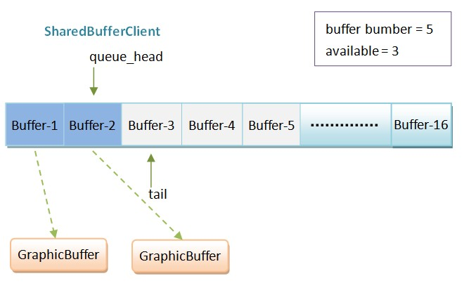

#Android应用程序与SurfaceFlinger服务的关系概述和学习计划

SurfaceFlinger服务负责绘制Android应用程序的UI，它的实现相当复杂，要从正面分析它的实现不是一件容易的事。既然不能从正面分析，我们就想办法从侧面分析。说到底，无论SurfaceFlinger服务有多复杂，它都是为Android应用程序服务的，因此，我们就从Android应用程序与SurfaceFlinger服务的关系入手，来概述和制定SurfaceFlinger服务的学习计划。

SurfaceFlinger服务运行在Android系统的System进程中，它负责管理Android系统的帧缓冲区（Frame Buffer）。

Android应用程序为了能够将自己的UI绘制在系统的帧缓冲区上，它们就必须要与SurfaceFlinger服务进行通信，如图1所示：

Android应用程序与SurfaceFlinger服务是运行在不同的进程中的，因此，它们采用Binder进程间通信机制来进行通信。

 在图1中，每一个Android应用程序与SurfaceFlinger服务都有一个连接，这个连接都是通过一个类型为Client的Binder对象来描述的。这些Client对象是Android应用程序连接到SurfaceFlinger服务的时候由SurfaceFlinger服务创建的，而当Android应用程序成功连接到SurfaceFlinger服务之后，就可以获得一个对应的Client对象的Binder代理接口了。有了这些Binder代理接口之后，Android应用程序就可以通知SurfaceFlinger服务来绘制自己的UI了。

Android应用程序在通知SurfaceFlinger服务来绘制自己的UI的时候，需要将UI元数据传递给SurfaceFlinger服务，例如，要绘制UI的区域、位置等信息。一个Android应用程序可能会有很多个窗口，而每一个窗口都有自己的UI元数据，因此，Android应用程序需要传递给SurfaceFlinger服务的UI元数据是相当可观的。在这种情况下，通过Binder进程间通信机制来在Android应用程序与SurfaceFlinger服务之间传递UI元数据是不合适的，这时候Android系统的匿名共享内存机制（Anonymous Shared Memory）就派上用场了。

在每一个Android应用程序与SurfaceFlinger服务之间的连接上加上一块用来传递UI元数据的匿名共享内存，我们就得到了图2，如下所示：

图2 用来在Android应用程序与SurfaceFlinger服务之间传递UI元数据的匿名共享内存

在Application和Client这两个高富帅看来，它们之间的原生匿名共享内存块就一个活脱脱的土肥圆。因此，Application和Client是看不上这块原生的匿名共享内存的。于是，这块原生的匿名共享内存当时就怒了，立志要逆袭变成白富美，如图3所示：

图3 结构化后的用来传递UI元数据的匿名共享内存块

土肥圆逆袭后，就变成了一个名字为SharedClient的白富美，从此，它就和Application、Client过上幸福的啪啪啪生活了。

图4 用来描述Android应用程序的UI元数据的SharedClient

 在每一个SharedClient里面，有至多31个SharedBufferStack。字面上来看，SharedBufferStack就是共享缓冲区堆栈。怎么理解呢？首先，Shared表明这个堆栈共享的。那么由谁来共享呢？当然就是Android应用程序和SurfaceFlinger服务了。其次，Buffer表明这个堆栈的内容是缓冲区。什么样的缓冲区呢？当然就是用来描述UI元数据的缓冲区了。再者，Stack表明用来描述UI元数据的缓冲区是需要按照一定的规则来访问的。综合起来，我们就可以认为每一个SharedBufferStack就是用来描述一系列需要按照一定规则来访问的缓冲区。

好像还是不能理解SharedBufferStack？好吧，回忆一下，一般我们就绘制UI的时候，都会采用一种称为“双缓冲”的技术。双缓冲意味着要使用两个缓冲区，其中一个称为Front Buffer，另外一个称为Back Buffer。UI总是先在Back Buffer中绘制，然后再和Front Buffer交换，渲染到显示设备中。这下就可以理解SharedBufferStack的含义了吧？SurfaceFlinger服务只不过是将传统的“双缓冲”技术升华和抽象为了一个SharedBufferStack。可别小看了这个升华和抽象，有了SharedBufferStack之后，SurfaceFlinger服务就可以使用N个缓冲区技术来绘制UI了。N值的取值范围为2到16。例如，在Android 2.3中，N的值等于2，而在Android 4.1中，据说就等于3了。

 我们还可以再进一步地理解SharedBufferStack。在SurfaceFlinger服务中，每一个SharedBufferStack都对应一个Surface，即一个窗口。这样，我们就可以知道为什么每一个SharedClient里面包含的是一系列SharedBufferStack而不是单个SharedBufferStack：一个SharedClient对应一个Android应用程序，而一个Android应用程序可能包含有多个窗口，即Surface。从这里也可以看出，一个Android应用程序至多可以包含31个Surface。

图 5 SharedBufferStack的结构示意图

在图5中，为了方便描述，我们假设图中的SharedBufferStack有5个Buffer，其中，Buffer-1和Buffer-2是已经使用了的，而Buffer-3、Buffer-4和Buffer-5是空闲的。指针head和tail分别指向空闲缓冲区列表的头部和尾部，而指针queue_head指向已经使用了的缓冲区列表的头部。从这里就可以看出，从指针tail到head之间的Buffer即为空闲缓冲区表，而从指针head到queue_head之间的Buffer即为已经使用了的缓冲区列表。注意，图中的5个Buffer是循环使用的。

空闲缓冲区比较好理解，接下来我们重点解释一下那些已经被使用了的缓冲区，即图5中的Buffer-1和Buffer-2。

前面我们说过，SharedBufferStack中的缓冲区只是用来描述UI元数据的，这意味着它们不包含真正的UI数据。真正的UI数据保存在GraphicBuffer中，后面我们再描述GaphicBuffer。因此，为了完整地描述一个UI，SharedBufferStack中的每一个已经使用了的缓冲区都对应有一个GraphicBuffer，用来描述真正的UI数据。当SurfaceFlinger服务缓制Buffer-1和Buffer-2的时候，就会找到与它们所对应的GraphicBuffer，这样就可以将对应的UI绘制出来了。

当Android应用程序需要更新一个Surface的时候，它就会找到与它所对应的SharedBufferStack，并且从它的空闲缓冲区列表的尾部取出一个空闲的Buffer。我们假设这个取出来的空闲Buffer的编号为index。接下来Android应用程序就请求SurfaceFlinger服务为这个编号为index的Buffer分配一个图形缓冲区GraphicBuffer。SurfaceFlinger服务分配好图形缓冲区GraphicBuffer之后，会将它的编号设置为index，然后再将这个图形缓冲区GraphicBuffer返回给Android应用程序访问。Android应用程序得到了SurfaceFlinger服务返回的图形缓冲区GraphicBuffer之后，就在里面写入UI数据。写完之后，就将与它所对应的缓冲区，即编号为index的Buffer，插入到对应的SharedBufferStack的已经使用了的缓冲区列表的头部去。这一步完成了之后，Android应用程序就通知SurfaceFlinger服务去绘制那些保存在已经使用了的缓冲区所描述的图形缓冲区GraphicBuffer了。用图5的例子来说，SurfaceFlinger服务需要绘制的是编号为1和2的Buffer所对应的图形缓冲区GraphicBuffer。由于SurfaceFlinger服务知道编号为1和2的Buffer所对应的图形缓冲区GraphicBuffer在哪里，因此，Android应用程序只需要告诉SurfaceFlinger服务要绘制的Buffer的编号就OK了。当一个已经被使用了的Buffer被绘制了之后，它就重新变成一个空闲的Buffer了。

上面描述的过程比较复杂，后面我们再用几篇文章来详细描述。

SharedBufferStack是在Android应用程序和SurfaceFlinger服务之间共享的，但是，Android应用程序和SurfaceFlinger服务使用SharedBufferStack的方式是不一样的，具体来说，就是Android应用程序关心的是它里面的空闲缓冲区列表，而SurfaceFlinger服务关心的是它里面的已经使用了的缓冲区列表。从SurfaceFlinger服务的角度来看，保存在SharedBufferStack中的已经使用了的缓冲区其实就是在排队等待渲染。

为了方便SharedBufferStack在Android应用程序和SurfaceFlinger服务中的访问，Android系统分别使用SharedBufferClient和SharedBufferServer来描述SharedBufferStack，其中，SharedBufferClient用来在Android应用程序这一侧访问SharedBufferStack的空闲缓冲区列表，而SharedBufferServer用来在SurfaceFlinger服务这一侧访问SharedBufferStack的排队缓冲区列表。

在SharedBufferClient看来，SharedBufferStack的样子如图6所示：

只要SharedBufferStack中的available的buffer的数量大于0，SharedBufferClient就会将指针tail往前移一步，并且减少available的值，以便可以获得一个空闲的Buffer。当Android应用程序往这个空闲的Buffer写入好数据之后，它就会通过SharedBufferClient来将它添加到SharedBufferStack中的排队缓冲区列表的尾部去，即指针queue_head的下一个位置上。

        在SharedBufferServer看来，SharedBufferStack的样子如图7所示：

当Android应用程序通知SurfaceFlinger服务更新UI的时候，只要对应的SharedBufferStack中的queued的缓冲区的数量大于0，SharedBufferServer就会将指针head的下一个Buffer绘制出来，并且将指针head向前移一步，以及将queued的值减1。

        上面我们多次提到了图形缓冲区GraphicBuffer，它是什么东东呢？我们看图8：

图8 图形缓冲区Graphic的结构示意图

每一个GraphicBuffer内部都包含有一块用来保存UI数据的缓冲区，这块缓冲区使用一个buffer_handle_t对象来描述。看到buffer_handle_t，是不是有点眼熟？在前面Android帧缓冲区（Frame Buffer）硬件抽象层（HAL）模块Gralloc的实现原理分析一文中，我们说过，由HAL层的Gralloc模块分配的图形缓冲区的是使用一个buffer_handle_t对象来描述的，而由buffer_handle_t对象所描述的图形缓冲区要么是在系统帧缓冲区（Frame Buffer）或者匿名共享内存（Anonymous Shared Memory）中分配的。这样，我们就可以将SurfaceFlinger服务与HAL层中的Gralloc模块关联起来了。

至此，Android应用程序与SurfaceFlinger服务的关系就概述完毕了，但是我们的任务还没有完成，我们还要进一步去具体地学习它，例如：

        1. Android应用程序是如何与SurfaceFlinger服务建立连接的？

        2. 用来描述Android应用程序的UI元数据的SharedClient是如何创建的？

        3. Android应用程序是如何请求SurfaceFlinger服务创建一个Surface的？

        4. Android应用程序是如何请求SurfaceFlinger服务渲染一个Surface的？

回答了这4个问题之后，相信我们就可以对SurfaceFlinger服务有一个深刻的认识，进而可以帮助我们从正面去分析SurfaceFlinger服务的实现。后面我们将以Android系统的开机动画为例子，用4篇文章来回答这4个问题，敬请关注！
