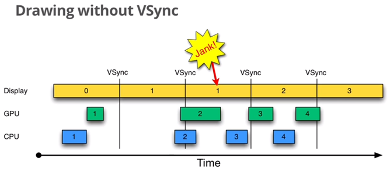
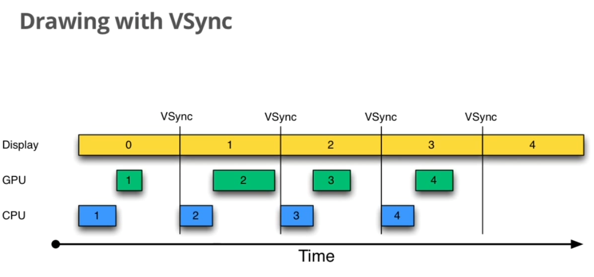

#VSYNC

[ Android 4.4 Graphic系统详解（2） VSYNC的生成 ](http://blog.csdn.net/michaelcao1980/article/details/43233765)

Project Butter对Android Display系统进行了重构，引入了三个核心元素，即VSYNC、Triple Buffer和Choreographer。关于后面两个概念我们会在后面开专题讲解，这里我们重点讲解VSYNC的作用。

##without vsync

##with vsync

##VSYNC信号的生成

那么VSYNC信号是如何生成的呢？
Android系统中VSYNC信号分为两种，一种是硬件生成的信号，一种是软件模拟的信号。
硬件信号是由HardwareComposer提供的，HWC封装了相关的HAL层，如果硬件厂商提供的HAL层实现能定时产生VSYNC中断，则直接使用硬件的VSYNC中断，否则HardwareComposer内部会通过VSyncThread来模拟产生VSYNC中断（其实现很简单，就是sleep固定时间，然后唤醒）。

    HWComposer::HWComposer(  
            const sp<SurfaceFlinger>& flinger,  
            EventHandler& handler)  
        : mFlinger(flinger),  
          mFbDev(0), mHwc(0), mNumDisplays(1),  
          mCBContext(new cb_context),  
          mEventHandler(handler),  
          mDebugForceFakeVSync(false)  
    {  
    ...  
        //首先是一些和VSYNC有关的信息的初始化  
        //因为在硬件支持的情况下，VSYNC的功能就是由HWC提供的  
        for (size_t i=0 ; i<HWC_NUM_PHYSICAL_DISPLAY_TYPES ; i++) {  
            mLastHwVSync[i] = 0;  
            mVSyncCounts[i] = 0;  
        }  
        //根据配置来看是否需要模拟VSYNC消息  
        char value[PROPERTY_VALUE_MAX];  
        property_get("debug.sf.no_hw_vsync", value, "0");  
        mDebugForceFakeVSync = atoi(value);  
        ...  
        // don't need a vsync thread if we have a hardware composer  
        needVSyncThread = false;  
        // always turn vsync off when we start,只是暂时关闭信号，后面会再开启  
        eventControl(HWC_DISPLAY_PRIMARY, HWC_EVENT_VSYNC, 0);      

        //显然，如果需要模拟VSync信号的话，我们需要线程来做这个工作  
        if (needVSyncThread) {  
            // we don't have VSYNC support, we need to fake it  
            //VSyncThread类的实现很简单，无非就是一个计时器而已，定时发送消息而已  
            //TODO VSYNC专题  
            mVSyncThread = new VSyncThread(*this);  
        }  
    ...  
    }  

##软件模拟

    bool HWComposer::VSyncThread::threadLoop() {  
        const nsecs_t period = mRefreshPeriod;  
        //当前的时间  
        const nsecs_t now = systemTime(CLOCK_MONOTONIC);  
        //下一次VSYNC到来的时间  
        nsecs_t next_vsync = mNextFakeVSync;  
        //为了等待下个时间到来应该休眠的时间  
        nsecs_t sleep = next_vsync - now;  
        //错过了VSYNC的时间  
        if (sleep < 0) {  
            // we missed, find where the next vsync should be  
            //重新计算下应该休息的时间  
            sleep = (period - ((now - next_vsync) % period));  
            //更新下次VSYNC的时间  
            next_vsync = now + sleep;  
        }  
        //更新下下次VSYNC的时间  
        mNextFakeVSync = next_vsync + period;  

        struct timespec spec;  
        spec.tv_sec  = next_vsync / 1000000000;  
        spec.tv_nsec = next_vsync % 1000000000;  

        int err;  
        do {  
            //纳秒精度级的休眠  
            err = clock_nanosleep(CLOCK_MONOTONIC, TIMER_ABSTIME, &spec, NULL);  
        } while (err<0 && errno == EINTR);  

        if (err == 0) {  
            //休眠之后，到了该发生VSYNC的时间了  
            mHwc.mEventHandler.onVSyncReceived(0, next_vsync);  
        }  
        return true;  
    }  

##硬件实现

硬件又是如何实现这一点的呢？
我们再一次回到HWC的创建过程中来：

    if (mHwc) {  
           ALOGE("Lee Using %s version %u.%u", HWC_HARDWARE_COMPOSER,  
                 (hwcApiVersion(mHwc) >> 24) & 0xff,  
                 (hwcApiVersion(mHwc) >> 16) & 0xff);  
           if (mHwc->registerProcs) {  
               mCBContext->hwc = this;  
               mCBContext->procs.invalidate = &hook_invalidate;  
               mCBContext->procs.vsync = &hook_vsync;  
               if (hwcHasApiVersion(mHwc, HWC_DEVICE_API_VERSION_1_1))  
                   mCBContext->procs.hotplug = &hook_hotplug;  
               else  
                   mCBContext->procs.hotplug = NULL;  
               memset(mCBContext->procs.zero, 0, sizeof(mCBContext->procs.zero));  
               mHwc->registerProcs(mHwc, &mCBContext->procs);  
           }  

当HWC有vsync信号生成时，硬件模块会通过procs.vsync来通知软件部分，因此也就是调用了hook_vsync函数。

    void HWComposer::hook_vsync(const struct hwc_procs* procs, int disp,  
            int64_t timestamp) {  
        cb_context* ctx = reinterpret_cast<cb_context*>(  
                const_cast<hwc_procs_t*>(procs));  
        ctx->hwc->vsync(disp, timestamp);  
    }  

    void HWComposer::vsync(int disp, int64_t timestamp) {  
        //只有真实的硬件设备才会产生VSYNC  
        if (uint32_t(disp) < HWC_NUM_PHYSICAL_DISPLAY_TYPES) {  
            {  
                mLastHwVSync[disp] = timestamp;  
            }  
            mEventHandler.onVSyncReceived(disp, timestamp);  
    }  

我们发现最后殊途同归，硬件信号最终也通过onVSyncReceived函数通知到了SurfaceFlinger了。下面我们来分析下SurfaceFlinger的处理过程。

##Vsync native

### use one thread for vsync notifiication

1. init

     mVsyncReceiver = new DisplayEventReceiver();
     status_t result = mVsyncReceiver->initCheck();
      if (result) {
          ALOGW("Failed to initialize display event receiver, status=%d", result);
          return result;
      }

      int rc = mLooper->addFd(mVsyncReceiver->getFd(), 0, Looper::EVENT_INPUT, this, NULL);
      if (rc < 0) {
          return UNKNOWN_ERROR;
      }

      scheduleVsync();
      return OK;

2. dispose

  void PunchVsyncThread::disposeVsync() {
      ALOGV("receiver %p ~ Disposing display event receiver.", this);

      if (!mVsyncReceiver->initCheck()) {
          mLooper->removeFd(mVsyncReceiver->getFd());
      }
  }

3. schedule

  status_t PunchVsyncThread::scheduleVsync() {
      status_t status = mVsyncReceiver->requestNextVsync();
      if (status) {
          ALOGW("Failed to request next vsync, status=%d", status);
          return status;
      }
      return OK;
  }

4. handle vsync event

  int PunchVsyncThread::handleEvent(int receiveFd, int events, void* data) {
      ATRACE_CALL();
      if (events & (Looper::EVENT_ERROR | Looper::EVENT_HANGUP)) {
          ALOGE("Display event receiver pipe was closed or an error occurred.  "
                  "events=0x%x", events);
          return 0; // remove the callback
      }

      if (!(events & Looper::EVENT_INPUT)) {
          ALOGW("Received spurious callback for unhandled poll event.  "
                  "events=0x%x", events);
          return 1; // keep the callback
      }

      DisplayEventReceiver::Event buf[EVENT_BUFFER_SIZE];
      ssize_t n; bool goVsync = false;
      while ((n = mVsyncReceiver->getEvents(buf, EVENT_BUFFER_SIZE)) > 0) {
          ALOGV("receiver %p ~ Read %d events.", this, int(n));
          for (ssize_t i = 0; i < n; i++) {
              const DisplayEventReceiver::Event& ev = buf[i];
              switch (ev.header.type) {
              case DisplayEventReceiver::DISPLAY_EVENT_VSYNC:
                  goVsync = true;
                  break;
              default:
                  ALOGW("receiver %p ~ ignoring unknown event type %#x", this, ev.header.type);
                  break;
              }
     }
      }

      if (n < 0) {
          ALOGW("Failed to get events from display event receiver, status=%d", status_t(n));
      }

      scheduleVsync(); // important

      if(goVsync){
          // do something
      }

      return 1; // keep the callback
  }
