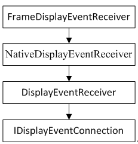

#Choreographer

[Android系统Choreographer机制实现过程](http://blog.csdn.net/yangwen123/article/details/39518923)

在Android4.1之后增加了Choreographer机制，用于同Vsync机制配合，实现统一调度界面绘图.

ViewRootImpl.java (mermaid\frameworks\base\core\java\android\view)	297908	7/4/2016

    Choreographer mChoreographer;
    mChoreographer = Choreographer.getInstance();

    void scheduleTraversals() {
        if (!mTraversalScheduled) {
            mTraversalScheduled = true;
            mTraversalBarrier = mHandler.getLooper().getQueue().postSyncBarrier();
            mChoreographer.postCallback(
                    Choreographer.CALLBACK_TRAVERSAL, mTraversalRunnable, null);
            if (!mUnbufferedInputDispatch) {
                scheduleConsumeBatchedInput();
            }
            notifyRendererOfFramePending();
            pokeDrawLockIfNeeded();
        }
    }

对于View不论是Invalidate还是requestlayout，这些重绘开始的地方都是ViewRootImpl的scheduleTraversals，在scheduleTraversals中，

    mChoreographer.postCallback(
    Choreographer.CALLBACK_TRAVERSAL, mTraversalRunnable, null);

有这样一行代码，这个mTraversalRunnable就是调用了View measure，layout，draw的非常经典的performTraversals方法。

而postCallback中做的事情主要就是根据时间看这个啥时候执行，如果要立即执行了就添加到一个callback队列中然后去请求VSYNC(这里只考虑有VSYNC的场景）。如果不需要立即执行就sendmessage做一个队列排队去。

Choreographer是对VSYNC做了监听的，当有VSYNC消息的时候会执行onVsync,最终走到Choreographer的doFrame，在这里会将从callback队列中取出runnable进行绘制。

所以对于当用户手动去invalidate,或者requestlayout的情况，还是会通过Choreographer对这些请求做排队处理，所有绘制的地方都会等待VSYNC的消息回调再去做相应的绘制。所以就不会出现，用户要求去绘制，但是这个时机和VSYNC不同步的问题了。

##Vsync请求过程

Choreographer.java (mermaid\frameworks\base\core\java\android\view)	37925	7/4/2016

    private void scheduleVsyncLocked() {
        mDisplayEventReceiver.scheduleVsync();
    }

DisplayEventReceiver.java (mermaid\frameworks\base\core\java\android\view)	4823	7/4/2016

    /**
     * Schedules a single vertical sync pulse to be delivered when the next
     * display frame begins.
     */
    public void scheduleVsync() {
        if (mReceiverPtr == 0) {
            Log.w(TAG, "Attempted to schedule a vertical sync pulse but the display event "
                    + "receiver has already been disposed.");
        } else {
            nativeScheduleVsync(mReceiverPtr);
        }
    }

frameworks\base\core\jni\ android_view_DisplayEventReceiver.cpp

    static void nativeScheduleVsync(JNIEnv* env, jclass clazz, jint receiverPtr) {  
        //得到NativeDisplayEventReceiver对象指针  
        sp<NativeDisplayEventReceiver> receiver =  
                reinterpret_cast<NativeDisplayEventReceiver*>(receiverPtr);  
        //通过NativeDisplayEventReceiver请求VSync  
        status_t status = receiver->scheduleVsync();  
        if (status) {  
            String8 message;  
            message.appendFormat("Failed to schedule next vertical sync pulse.  status=%d", status);  
            jniThrowRuntimeException(env, message.string());  
        }  
    }  

    status_t NativeDisplayEventReceiver::scheduleVsync() {  
        if (!mWaitingForVsync) {  
            ALOGV("receiver %p ~ Scheduling vsync.", this);  
            // Drain all pending events.  
            nsecs_t vsyncTimestamp;  
            uint32_t vsyncCount;  
            readLastVsyncMessage(&vsyncTimestamp, &vsyncCount);  
            status_t status = mReceiver.requestNextVsync();  
            if (status) {  
                ALOGW("Failed to request next vsync, status=%d", status);  
                return status;  
            }  
            mWaitingForVsync = true;  
        }  
        return OK;  
    }  

VSync请求过程又转交给了DisplayEventReceiver

frameworks\native\libs\gui\ DisplayEventReceiver.cpp

    status_t DisplayEventReceiver::requestNextVsync() {  
        if (mEventConnection != NULL) {  
            mEventConnection->requestNextVsync();  
            return NO_ERROR;  
        }  
        return NO_INIT;  
    }  

这里又通过IDisplayEventConnection接口来请求Vsync信号，IDisplayEventConnection实现了Binder通信框架，可以跨进程调用，因为Vsync信号请求进程和Vsync产生进程有可能不在同一个进程空间，因此这里就借助IDisplayEventConnection接口来实现。下面通过图来梳理Vsync请求的调用流程：

##Choreographer 使用例子

        Choreographer mChoreographer = null;

        // 初始化Choreographer的实例，此实例为线程唯一。这个类的用法与Handler

        // 类似，不过它总是在VSYC同步时回调，所以比Handler更适合做动画的循环器[1]

        mChoreographer= Choreographer.getInstance();

      public void scheduleNextFrame() {

        // 要求在显示系统刷新下一帧时回调mFrameRender，注意，只回调一次

        mChoreographer.postCallback(Choreographer.CALLBACK_ANIMATION

               , mFrameRender, null);

    }

    // 这个Runnable对象用以在窗口上描绘一帧
    publicRunnable mFrameRender = new Runnable() {
       @Override
        publicvoid run() {
            try{
               // 获取当期时间戳
               long time = mChoreographer.getFrameTime() % 1000;

               // 绘图
               if (mSurface.isValid()) {
                   Canvas canvas = mSurface.lockCanvas(null);
                   canvas.drawColor(Color.DKGRAY);
                   canvas.drawRect(2 * mLp.width * time / 1000
                            - mLp.width, 0, 2 *mLp.width * time
                            / 1000, mLp.height,mPaint);
                   mSurface.unlockCanvasAndPost(canvas);
                   mSession.finishDrawing(mWindow);
               }

              if(mContinueAnime)
                scheduleNextFrame();
           } catch (Exception e) {
               e.printStackTrace();
           }
        }
    };
