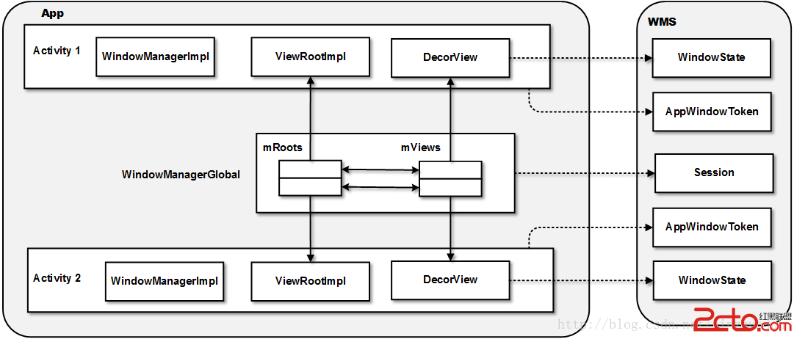

#ViewRootImpl

ViewRootImpl怎来的，大家可以看看ActivityThread里面的handleResumeActivity,抛开anr这些系统的窗口等，理论上一个APP应该是一个ViewRootImpl

在WindowManagerGlobal的addView会

    root = new ViewRootImpl(view.getContext(), display);

    root.setView(view, wparams, panelParentView);

也就是说, ViewRootImpl的mView其实是DecorView.而DecorView是一个activity中最外层的view了，其实是继承的FrameLayout。

ViewRoot从名称上来理解似乎是“View树的根”，这很容易让人产生误解。因为ViewRoot并不属于View树的一份子。从源码实现上来看，ViewRoot和View对象并没有任何“血缘”关系，它既非View的子类，也非View的父类。ViewRoot可以被理解为“View树的管理者”——它有一个mView成员变量，指向的是它所管理的View树的根。

ViewRoot的核心任务就是与WindowManagerService进行通信。

##获得touch坐标

    View root = getRootView();
                if (root == null)
                    return;

                final ViewRootImpl viewRoot = (ViewRootImpl)root.getParent();

                Point lastPoint = new Point();
                viewRoot.getLastTouchPoint(lastPoint);

首先分析下App端的结构。移动平台一般显示区域有限，要完成一个工作往往不是一屏内容中能搞定的，所以Android中有了Activity的概念，让用户可以把相关的子内容放到单独的Activity中，然后通过Intent在Activity间跳转。类似于浏览网页，点击链接跳转到另一个网页。这些同一交互过程中的一系列Activity成为一个Task。这些Activity运行在主线程ActivityThread中。Activity要展现出来的主视图是DecorView，它是一棵视图树。ViewRootImpl负责管理这个视图树和与WMS交互，与WMS交互通过WindowManagerImpl和WindowManagerGlobal。DecorView被包含在系统的通用窗口抽象类Window当中。视图对应的图形缓冲区由Surface管理。其中涉及到的主要的类包括下面几个：

Activity：描述一个Activity，它是与用户交互的基本单元。

ActivityThread：每一个App进程有一个主线程，它由ActivityThread描述。它负责这个App进程中各个Activity的调度和执行，以及响应AMS的操作请求等。

ApplicationThread：AMS和Activity通过它进行通信。对于AMS而言，ApplicationThread代表了App的主线程。简而言之，它是AMS与ActivityThread进行交互的接口。注意ActivityThread和ApplicationThread之间的关系并不像Activity与Application。后者的关系是Application中包含了多个Activity，而前者ActivityThread和ApplicationThread是同一个东西的两种"View"，ApplicationThread是在AMS眼中的ActivityThread。

ViewRootImpl：主要责任包括创建Surface，和WMS的交互和App端的UI布局和渲染。同时负责把一些事件发往Activity以便Activity可以截获事件。每一个添加到WMS中的窗口对应一个ViewRootImpl，通过WindowManagerGlobal向WMS添加窗口时创建。大多数情况下，它管理Activity顶层视图DecorView。总得来说，它相当于MVC模型中的Controller。

ViewRootImpl::W：用于向WMS提供接口，让WMS控制App端的窗口。它可看作是个代理，很多时候会调用ViewRootImpl中的功能。这种内嵌类的用法很多，特别是这种提供接口的代理类，如PhoneWindow::DecorView等。

Instrumentation:官方提供的Hook，主要用于测试。如果只关注窗口管理流程的话可以先无视。

WindowManagerImpl：Activity中与窗口管理系统通信的代理类，实现类是WindowManagerGlobal。WindowManagerGlobal是App中全局的窗口管理模块，因此是个Singleton。其中管理着该App中的ViewRootImpl，DecorView等结构，以有两个Activity的App为例：

indow：每个App虽然都可以做得各不相同，但是作为有大量用户交互的系统，窗口之间必须要有统一的交互模式，这样才能减小用户的学习成本。这些共性比如title, action bar的显示和通用按键的处理等等。Window类就抽象了这些共性。另外，它定义了一组Callback，Activity通过实现这些Callback被调用来处理事件。注意要和在WMS中的窗口区分开来，WMS中的窗口更像是App端的View。

PhoneWindow：PhoneWindow是Window类的唯一实现，至少目前是。这样的设计下如果要加其它平台的Window类型更加方便。每个Activity会有一个PhoneWindow，在attach到ActivityThread时创建，保存在mWindow成员中。

Context：运行上下文，Activity和Service本质上都是一个Context，Context包含了它们作为运行实体的共性，如启动Activity，绑定Service，处理Broadcast和Receiver等等。注意Application也会有Context。Activity的Context是对应Activity的，Activity被杀掉（比如转屏后）后就变了。所以要注意如果有生命周期很长的对象有对Activity的Context的引用的话，转屏、返回这种会引起Activity销毁的操作都会引起内存泄露。
