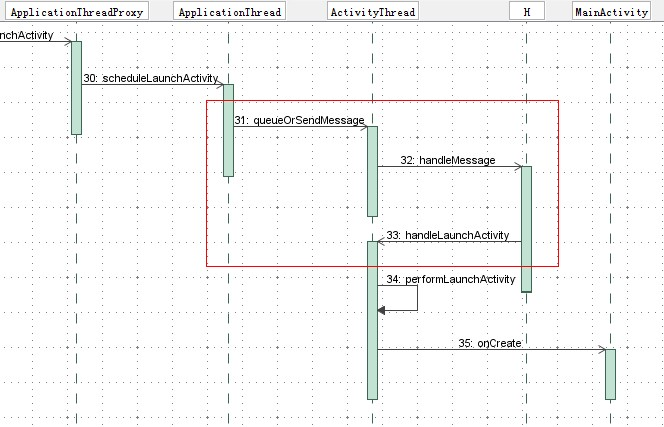

Android应用程序是通过消息来驱动的，系统为每一个应用程序维护一个消息队例，应用程序的主线程不断地从这个消息队例中获取消息（Looper），然后对这些消息进行处理（Handler），这样就实现了通过消息来驱动应用程序的执行，本文将详细分析Android应用程序的消息处理机制。

Activity启动,Service启动,以及广播发送时，它们都有一个共同的特点，当ActivityManagerService需要与应用程序进行并互时，如加载Activity和Service、处理广播待，会通过Binder进程间通信机制来知会应用程序，应用程序接收到这个请求时，它不是马上就处理这个请求，而是将这个请求封装成一个消息，然后把这个消息放在应用程序的消息队列中去，然后再通过消息循环来处理这个消息。这样做的好处就是消息的发送方只要把消息发送到应用程序的消息队列中去就行了，它可以马上返回去处理别的事情，而不需要等待消息的接收方去处理完这个消息才返回，这样就可以提高系统的并发性。实质上，这就是一种异步处理机制。

这样说可能还是比较笼统，我们以Android应用程序启动过程源代码分析一文中所介绍的应用程序启动过程的一个片断来具体看看是如何这种消息处理机制的。在这篇文章中，要启动的应用程序称为Activity，它的默认Activity是MainActivity，它是由Launcher来负责启动的，而Launcher又是通过ActivityManagerService来启动的，当ActivityManagerService为这个即将要启的应用程序准备好新的进程后，便通过一个Binder进程间通信过程来通知这个新的进程来加载MainActivity，如下图所示：

了解Android应用程序的消息处理过程之后，我们就开始分样它的实现原理了。与Windows应用程序的消息处理过程一样，Android应用程序的消息处理机制也是由消息循环、消息发送和消息处理这三个部分组成的，接下来，我们就详细描述这三个过程。

##1. 消息循环

在消息处理机制中，消息都是存放在一个消息队列中去，而应用程序的主线程就是围绕这个消息队列进入一个无限循环的，直到应用程序退出。如果队列中有消息，应用程序的主线程就会把它取出来，并分发给相应的Handler进行处理；如果队列中没有消息，应用程序的主线程就会进入空闲等待状态，等待下一个消息的到来。在Android应用程序中，这个消息循环过程是由Looper类来实现的，它定义在frameworks/base/core/java/android/os/Looper.java文件中，在分析这个类之前，我们先看一下Android应用程序主线程是如何进入到这个消息循环中去的。

在Android应用程序进程启动过程的源代码分析一文中，我们分析了Android应用程序进程的启动过程，Android应用程序进程在启动的时候，会在进程中加载ActivityThread类，并且执行这个类的main函数，应用程序的消息循环过程就是在这个main函数里面实现的，我们来看看这个函数的实现，它定义在frameworks/base/core/java/android/app/ActivityThread.java文件中：

    public final class ActivityThread {  
        ......  

        public static final void main(String[] args) {  
            ......  

            Looper.prepareMainLooper();  

            ......  

            ActivityThread thread = new ActivityThread();  
            thread.attach(false);  

            ......  

            Looper.loop();  

            ......  

            thread.detach();  

            ......  
        }  
    }  

这个函数做了两件事情，一是在主线程中创建了一个ActivityThread实例，二是通过Looper类使主线程进入消息循环中，这里我们只关注后者。

首先看Looper.prepareMainLooper函数的实现，这是一个静态成员函数，定义在frameworks/base/core/java/android/os/Looper.java文件中：

    public class Looper {  
        ......  

        private static final ThreadLocal sThreadLocal = new ThreadLocal();  

        final MessageQueue mQueue;  

        ......  

        /** Initialize the current thread as a looper.
        * This gives you a chance to create handlers that then reference
        * this looper, before actually starting the loop. Be sure to call
        * {@link #loop()} after calling this method, and end it by calling
        * {@link #quit()}.
        */  
        public static final void prepare() {  
            if (sThreadLocal.get() != null) {  
                throw new RuntimeException("Only one Looper may be created per thread");  
            }  
            sThreadLocal.set(new Looper());  
        }  

        /** Initialize the current thread as a looper, marking it as an application's main  
        *  looper. The main looper for your application is created by the Android environment,
        *  so you should never need to call this function yourself.
        * {@link #prepare()}
        */  

        public static final void prepareMainLooper() {  
            prepare();  
            setMainLooper(myLooper());  
            if (Process.supportsProcesses()) {  
                myLooper().mQueue.mQuitAllowed = false;  
            }  
        }  

        private synchronized static void setMainLooper(Looper looper) {  
            mMainLooper = looper;  
        }  

        /**
        * Return the Looper object associated with the current thread.  Returns
        * null if the calling thread is not associated with a Looper.
        */  
        public static final Looper myLooper() {  
            return (Looper)sThreadLocal.get();  
        }  

        private Looper() {  
            mQueue = new MessageQueue();  
            mRun = true;  
            mThread = Thread.currentThread();  
        }  

        ......  
    }  

函数prepareMainLooper做的事情其实就是在线程中创建一个Looper对象，这个Looper对象是存放在sThreadLocal成员变量里面的，成员变量sThreadLocal的类型为ThreadLocal，表示这是一个线程局部变量，即保证每一个调用了prepareMainLooper函数的线程里面都有一个独立的Looper对象。在线程是创建Looper对象的工作是由prepare函数来完成的，而在创建Looper对象的时候，会同时创建一个消息队列MessageQueue，保存在Looper的成员变量mQueue中，后续消息就是存放在这个队列中去。消息队列在Android应用程序消息处理机制中最重要的组件，因此，我们看看它的创建过程，即它的构造函数的实现，实现frameworks/base/core/java/android/os/MessageQueue.java文件中：

    public class MessageQueue {  
        ......  

        private int mPtr; // used by native code  

        private native void nativeInit();  

        MessageQueue() {  
            nativeInit();  
        }  

        ......  
    }  

它的初始化工作都交给JNI方法nativeInit来实现了，这个JNI方法定义在frameworks/base/core/jni/android_os_MessageQueue.cpp文件中：

    static void android_os_MessageQueue_nativeInit(JNIEnv* env, jobject obj) {  
        NativeMessageQueue* nativeMessageQueue = new NativeMessageQueue();  
        if (! nativeMessageQueue) {  
            jniThrowRuntimeException(env, "Unable to allocate native queue");  
            return;  
        }  

        android_os_MessageQueue_setNativeMessageQueue(env, obj, nativeMessageQueue);  
    }  

在JNI中，也相应地创建了一个消息队列NativeMessageQueue，NativeMessageQueue类也是定义在frameworks/base/core/jni/android_os_MessageQueue.cpp文件中，它的创建过程如下所示：

    NativeMessageQueue::NativeMessageQueue() {  
        mLooper = Looper::getForThread();  
        if (mLooper == NULL) {  
            mLooper = new Looper(false);  
            Looper::setForThread(mLooper);  
        }  
    }  

它主要就是在内部创建了一个Looper对象，注意，这个Looper对象是实现在JNI层的，它与上面Java层中的Looper是不一样的，不过它们是对应的，下面我们进一步分析消息循环的过程的时候，读者就会清楚地了解到它们之间的关系。

这个Looper的创建过程也很重要，不过我们暂时放一放，先分析完android_os_MessageQueue_nativeInit函数的执行，它创建了本地消息队列NativeMessageQueue对象之后，接着调用android_os_MessageQueue_setNativeMessageQueue函数来把这个消息队列对象保存在前面我们在Java层中创建的MessageQueue对象的mPtr成员变量里面：

    static void android_os_MessageQueue_setNativeMessageQueue(JNIEnv* env, jobject messageQueueObj,  
            NativeMessageQueue* nativeMessageQueue) {  
        env->SetIntField(messageQueueObj, gMessageQueueClassInfo.mPtr,  
                 reinterpret_cast<jint>(nativeMessageQueue));  
    }  

这里传进来的参数messageQueueObj即为我们前面在Java层创建的消息队列对象，而gMessageQueueClassInfo.mPtr即表示在Java类MessageQueue中，其成员变量mPtr的偏移量，通过这个偏移量，就可以把这个本地消息队列对象natvieMessageQueue保存在Java层创建的消息队列对象的mPtr成员变量中，这是为了后续我们调用Java层的消息队列对象的其它成员函数进入到JNI层时，能够方便地找回它在JNI层所对应的消息队列对象。

我们再回到NativeMessageQueue的构造函数中，看看JNI层的Looper对象的创建过程，即看看它的构造函数是如何实现的，这个Looper类实现在frameworks/base/libs/utils/Looper.cpp文件中：

    Looper::Looper(bool allowNonCallbacks) :  
        mAllowNonCallbacks(allowNonCallbacks),  
        mResponseIndex(0) {  
        int wakeFds[2];  
        int result = pipe(wakeFds);  
        ......  

        mWakeReadPipeFd = wakeFds[0];  
        mWakeWritePipeFd = wakeFds[1];  

        ......  

    #ifdef LOOPER_USES_EPOLL  
        // Allocate the epoll instance and register the wake pipe.  
        mEpollFd = epoll_create(EPOLL_SIZE_HINT);  
        ......  

        struct epoll_event eventItem;  
        memset(& eventItem, 0, sizeof(epoll_event)); // zero out unused members of data field union  
        eventItem.events = EPOLLIN;  
        eventItem.data.fd = mWakeReadPipeFd;  
        result = epoll_ctl(mEpollFd, EPOLL_CTL_ADD, mWakeReadPipeFd, & eventItem);  
        ......  
    #else  
        ......  
    #endif  

        ......  
    }  

这个构造函数做的事情非常重要，它跟我们后面要介绍的应用程序主线程在消息队列中没有消息时要进入等待状态以及当消息队列有消息时要把应用程序主线程唤醒的这两个知识点息息相关。它主要就是通过pipe系统调用来创建了一个管道了：

    int wakeFds[2];  
    int result = pipe(wakeFds);  
    ......  

    mWakeReadPipeFd = wakeFds[0];  
    mWakeWritePipeFd = wakeFds[1];  

管道是Linux系统中的一种进程间通信机制，具体可以参考前面一篇文章Android学习启动篇推荐的一本书《Linux内核源代码情景分析》中的第6章--传统的Uinx进程间通信。简单来说，管道就是一个文件，在管道的两端，分别是两个打开文件文件描述符，这两个打开文件描述符都是对应同一个文件，其中一个是用来读的，别一个是用来写的，一般的使用方式就是，一个线程通过读文件描述符中来读管道的内容，当管道没有内容时，这个线程就会进入等待状态，而另外一个线程通过写文件描述符来向管道中写入内容，写入内容的时候，如果另一端正有线程正在等待管道中的内容，那么这个线程就会被唤醒。这个等待和唤醒的操作是如何进行的呢，这就要借助Linux系统中的epoll机制了。 Linux系统中的epoll机制为处理大批量句柄而作了改进的poll，是Linux下多路复用IO接口select/poll的增强版本，它能显著减少程序在大量并发连接中只有少量活跃的情况下的系统CPU利用率。但是这里我们其实只需要监控的IO接口只有mWakeReadPipeFd一个，即前面我们所创建的管道的读端，为什么还需要用到epoll呢？有点用牛刀来杀鸡的味道。其实不然，这个Looper类是非常强大的，它除了监控内部所创建的管道接口之外，还提供了addFd接口供外界面调用，外界可以通过这个接口把自己想要监控的IO事件一并加入到这个Looper对象中去，当所有这些被监控的IO接口上面有事件发生时，就会唤醒相应的线程来处理，不过这里我们只关心刚才所创建的管道的IO事件的发生。

要使用Linux系统的epoll机制，首先要通过epoll_create来创建一个epoll专用的文件描述符：

    mEpollFd = epoll_create(EPOLL_SIZE_HINT);  

传入的参数EPOLL_SIZE_HINT是在这个mEpollFd上能监控的最大文件描述符数。

接着还要通过epoll_ctl函数来告诉epoll要监控相应的文件描述符的什么事件：

  struct epoll_event eventItem;  
  memset(& eventItem, 0, sizeof(epoll_event)); // zero out unused members of data field union  
  eventItem.events = EPOLLIN;  
  eventItem.data.fd = mWakeReadPipeFd;  
  result = epoll_ctl(mEpollFd, EPOLL_CTL_ADD, mWakeReadPipeFd, & eventItem);

这里就是告诉mEpollFd，它要监控mWakeReadPipeFd文件描述符的EPOLLIN事件，即当管道中有内容可读时，就唤醒当前正在等待管道中的内容的线程。

C++层的这个Looper对象创建好了之后，就返回到JNI层的NativeMessageQueue的构造函数，最后就返回到Java层的消息队列MessageQueue的创建过程，这样，Java层的Looper对象就准备好了。有点复杂，我们先小结一下这一步都做了些什么事情：

A. 在Java层，创建了一个Looper对象，这个Looper对象是用来进入消息循环的，它的内部有一个消息队列MessageQueue对象mQueue；

B. 在JNI层，创建了一个NativeMessageQueue对象，这个NativeMessageQueue对象保存在Java层的消息队列对象mQueue的成员变量mPtr中；

C. 在C++层，创建了一个Looper对象，保存在JNI层的NativeMessageQueue对象的成员变量mLooper中，这个对象的作用是，当Java层的消息队列中没有消息时，就使Android应用程序主线程进入等待状态，而当Java层的消息队列中来了新的消息后，就唤醒Android应用程序的主线程来处理这个消息。

回到ActivityThread类的main函数中，在上面这些工作都准备好之后，就调用Looper类的loop函数进入到消息循环中去了：

    public class Looper {  
        ......  

        public static final void loop() {  
            Looper me = myLooper();  
            MessageQueue queue = me.mQueue;  

            ......  

            while (true) {  
                Message msg = queue.next(); // might block  
                ......  

                if (msg != null) {  
                    if (msg.target == null) {  
                        // No target is a magic identifier for the quit message.  
                        return;  
                    }  

                    ......  

                    msg.target.dispatchMessage(msg);  

                    ......  

                    msg.recycle();  
                }  
            }  
        }  

        ......  
    }  

这里就是进入到消息循环中去了，它不断地从消息队列mQueue中去获取下一个要处理的消息msg，如果消息的target成员变量为null，就表示要退出消息循环了，否则的话就要调用这个target对象的dispatchMessage成员函数来处理这个消息，这个target对象的类型为Handler，下面我们分析消息的发送时会看到这个消息对象msg是如设置的。

这个函数最关键的地方便是从消息队列中获取下一个要处理的消息了，即MessageQueue.next函数，它实现frameworks/base/core/java/android/os/MessageQueue.java文件中：

    public class MessageQueue {  
        ......  

        final Message next() {  
            int pendingIdleHandlerCount = -1; // -1 only during first iteration  
            int nextPollTimeoutMillis = 0;  

            for (;;) {  
                if (nextPollTimeoutMillis != 0) {  
                    Binder.flushPendingCommands();  
                }  
                nativePollOnce(mPtr, nextPollTimeoutMillis);  

                synchronized (this) {  
                    // Try to retrieve the next message.  Return if found.  
                    final long now = SystemClock.uptimeMillis();  
                    final Message msg = mMessages;  
                    if (msg != null) {  
                        final long when = msg.when;  
                        if (now >= when) {  
                            mBlocked = false;  
                            mMessages = msg.next;  
                            msg.next = null;  
                            if (Config.LOGV) Log.v("MessageQueue", "Returning message: " + msg);  
                            return msg;  
                        } else {  
                            nextPollTimeoutMillis = (int) Math.min(when - now, Integer.MAX_VALUE);  
                        }  
                    } else {  
                        nextPollTimeoutMillis = -1;  
                    }  

                    // If first time, then get the number of idlers to run.  
                    if (pendingIdleHandlerCount < 0) {  
                        pendingIdleHandlerCount = mIdleHandlers.size();  
                    }  
                    if (pendingIdleHandlerCount == 0) {  
                        // No idle handlers to run.  Loop and wait some more.  
                        mBlocked = true;  
                        continue;  
                    }  

                    if (mPendingIdleHandlers == null) {  
                        mPendingIdleHandlers = new IdleHandler[Math.max(pendingIdleHandlerCount, 4)];  
                    }  
                    mPendingIdleHandlers = mIdleHandlers.toArray(mPendingIdleHandlers);  
                }  

                // Run the idle handlers.  
                // We only ever reach this code block during the first iteration.  
                for (int i = 0; i < pendingIdleHandlerCount; i++) {  
                    final IdleHandler idler = mPendingIdleHandlers[i];  
                    mPendingIdleHandlers[i] = null; // release the reference to the handler  

                    boolean keep = false;  
                    try {  
                        keep = idler.queueIdle();  
                    } catch (Throwable t) {  
                        Log.wtf("MessageQueue", "IdleHandler threw exception", t);  
                    }  

                    if (!keep) {  
                        synchronized (this) {  
                            mIdleHandlers.remove(idler);  
                        }  
                    }  
                }  

                // Reset the idle handler count to 0 so we do not run them again.  
                pendingIdleHandlerCount = 0;  

                // While calling an idle handler, a new message could have been delivered  
                // so go back and look again for a pending message without waiting.  
                nextPollTimeoutMillis = 0;  
            }  
        }  

        ......  
    }  

 调用这个函数的时候，有可能会让线程进入等待状态。什么情况下，线程会进入等待状态呢？两种情况，一是当消息队列中没有消息时，它会使线程进入等待状态；二是消息队列中有消息，但是消息指定了执行的时间，而现在还没有到这个时间，线程也会进入等待状态。消息队列中的消息是按时间先后来排序的，后面我们在分析消息的发送时会看到。

执行下面语句是看看当前消息队列中有没有消息：

    nativePollOnce(mPtr, nextPollTimeoutMillis);  

 这是一个JNI方法，我们等一下再分析，这里传入的参数mPtr就是指向前面我们在JNI层创建的NativeMessageQueue对象了，而参数nextPollTimeoutMillis则表示如果当前消息队列中没有消息，它要等待的时候，for循环开始时，传入的值为0，表示不等待。

当前nativePollOnce返回后，就去看看消息队列中有没有消息：

    final Message msg = mMessages;  
    if (msg != null) {  
        final long when = msg.when;  
        if (now >= when) {  
            mBlocked = false;  
            mMessages = msg.next;  
            msg.next = null;  
            if (Config.LOGV) Log.v("MessageQueue", "Returning message: " + msg);  
            return msg;  
        } else {  
            nextPollTimeoutMillis = (int) Math.min(when - now, Integer.MAX_VALUE);  
        }  
    } else {  
        nextPollTimeoutMillis = -1;  
    }  

##2. 消息的发送

应用程序的主线程准备就好消息队列并且进入到消息循环后，其它地方就可以往这个消息队列中发送消息了。我们继续以文章开始介绍的Android应用程序启动过程源代码分析一文中的应用程序启动过为例，说明应用程序是如何把消息加入到应用程序的消息队列中去的。

 在Android应用程序启动过程源代码分析这篇文章的Step 30中，ActivityManagerService通过调用ApplicationThread类的scheduleLaunchActivity函数通知应用程序，它可以加载应用程序的默认Activity了，这个函数定义在frameworks/base/core/java/android/app/ActivityThread.java文件中：

    public final class ActivityThread {    

        ......    

        private final class ApplicationThread extends ApplicationThreadNative {    

            ......    

            // we use token to identify this activity without having to send the    
            // activity itself back to the activity manager. (matters more with ipc)    
            public final void scheduleLaunchActivity(Intent intent, IBinder token, int ident,    
                    ActivityInfo info, Bundle state, List<ResultInfo> pendingResults,    
                    List<Intent> pendingNewIntents, boolean notResumed, boolean isForward) {    
                ActivityClientRecord r = new ActivityClientRecord();    

                r.token = token;    
                r.ident = ident;    
                r.intent = intent;    
                r.activityInfo = info;    
                r.state = state;    

                r.pendingResults = pendingResults;    
                r.pendingIntents = pendingNewIntents;    

                r.startsNotResumed = notResumed;    
                r.isForward = isForward;    

                queueOrSendMessage(H.LAUNCH_ACTIVITY, r);    
            }    

            ......    

        }    

        ......    
    }    

这里把相关的参数都封装成一个ActivityClientRecord对象r，然后调用queueOrSendMessage函数来往应用程序的消息队列中加入一个新的消息（H.LAUNCH_ACTIVITY），这个函数定义在frameworks/base/core/java/android/app/ActivityThread.java文件中：

    public final class ActivityThread {    

        ......    

        private final class ApplicationThread extends ApplicationThreadNative {    

            ......    

            // if the thread hasn't started yet, we don't have the handler, so just    
            // save the messages until we're ready.    
            private final void queueOrSendMessage(int what, Object obj) {    
                queueOrSendMessage(what, obj, 0, 0);    
            }    

            ......    

            private final void queueOrSendMessage(int what, Object obj, int arg1, int arg2) {    
                synchronized (this) {    
                    ......    
                    Message msg = Message.obtain();    
                    msg.what = what;    
                    msg.obj = obj;    
                    msg.arg1 = arg1;    
                    msg.arg2 = arg2;    
                    mH.sendMessage(msg);    
                }    
            }    

            ......    

        }    

        ......    
    }    

在queueOrSendMessage函数中，又进一步把上面传进来的参数封装成一个Message对象msg，然后通过mH.sendMessage函数把这个消息对象msg加入到应用程序的消息队列中去。这里的mH是ActivityThread类的成员变量，它的类型为H，继承于Handler类，它定义在frameworks/base/core/java/android/app/ActivityThread.java文件中：

    public final class ActivityThread {    

        ......    

        private final class H extends Handler {    

            ......    

            public void handleMessage(Message msg) {    
                ......    
                switch (msg.what) {      
                ......    
                }    

            ......    

        }    

        ......    
    }   

这个H类就是通过其成员函数handleMessage函数来处理消息的了，后面我们分析消息的处理过程时会看到。

ActivityThread类的这个mH成员变量是什么时候创建的呢？我们前面在分析应用程序的消息循环时，说到当应用程序进程启动之后，就会加载ActivityThread类的main函数里面，在这个main函数里面，在通过Looper类进入消息循环之前，会在当前进程中创建一个ActivityThread实例：

    public final class ActivityThread {  
        ......  

        public static final void main(String[] args) {  
            ......  

            ActivityThread thread = new ActivityThread();  
            thread.attach(false);  

            ......  
        }  
    }

在创建这个实例的时候，就会同时创建其成员变量mH了：

    public final class ActivityThread {  
        ......  

        final H mH = new H();  

        ......  
    }   

前面说过，H类继承于Handler类，因此，当创建这个H对象时，会调用Handler类的构造函数，这个函数定义在frameworks/base/core/java/android/os/Handler.java文件中：

    public class Handler {  
        ......  

        public Handler() {  
            ......  

            mLooper = Looper.myLooper();  
            ......  

            mQueue = mLooper.mQueue;  
            ......  
        }  

        final MessageQueue mQueue;  
        final Looper mLooper;  
        ......  
    }  

在Hanlder类的构造函数中，主要就是初始成员变量mLooper和mQueue了。这里的myLooper是Looper类的静态成员函数，通过它来获得一个Looper对象，这个Looper对象就是前面我们在分析消息循环时，在ActivityThread类的main函数中通过Looper.prepareMainLooper函数创建的。Looper.myLooper函数实现在frameworks/base/core/java/android/os/Looper.java文件中

    public class Looper {  
        ......  

        public static final Looper myLooper() {  
            return (Looper)sThreadLocal.get();  
        }  

        ......  
    }  

有了这个Looper对象后，就可以通过Looper.mQueue来访问应用程序的消息队列了。

有了这个Handler对象mH后，就可以通过它来往应用程序的消息队列中加入新的消息了。回到前面的queueOrSendMessage函数中，当它准备好了一个Message对象msg后，就开始调用mH.sendMessage函数来发送消息了，这个函数定义在frameworks/base/core/java/android/os/Handler.java文件中：

    public class Handler {  
        ......  

        public final boolean sendMessage(Message msg)  
        {  
            return sendMessageDelayed(msg, 0);  
        }  

        public final boolean sendMessageDelayed(Message msg, long delayMillis)  
        {  
            if (delayMillis < 0) {  
                delayMillis = 0;  
            }  
            return sendMessageAtTime(msg, SystemClock.uptimeMillis() + delayMillis);  
        }  

        public boolean sendMessageAtTime(Message msg, long uptimeMillis)  
        {  
            boolean sent = false;  
            MessageQueue queue = mQueue;  
            if (queue != null) {  
                msg.target = this;  
                sent = queue.enqueueMessage(msg, uptimeMillis);  
            }  
            else {  
                ......  
            }  
            return sent;  
        }  

        ......  
    }  

在发送消息时，是可以指定消息的处理时间的，但是通过sendMessage函数发送的消息的处理时间默认就为当前时间，即表示要马上处理，因此，从sendMessage函数中调用sendMessageDelayed函数，传入的时间参数为0，表示这个消息不要延时处理，而在sendMessageDelayed函数中，则会先获得当前时间，然后加上消息要延时处理的时间，即得到这个处理这个消息的绝对时间，然后调用sendMessageAtTime函数来把消息加入到应用程序的消息队列中去。

##总结

至此，我们就从消息循环、消息发送和消息处理三个部分分析完Android应用程序的消息处理机制了，为了更深理解，这里我们对其中的一些要点作一个总结：

A. Android应用程序的消息处理机制由消息循环、消息发送和消息处理三个部分组成的。

B. Android应用程序的主线程在进入消息循环过程前，会在内部创建一个Linux管道（Pipe），这个管道的作用是使得Android应用程序主线程在消息队列为空时可以进入空闲等待状态，并且使得当应用程序的消息队列有消息需要处理时唤醒应用程序的主线程。

C. Android应用程序的主线程进入空闲等待状态的方式实际上就是在管道的读端等待管道中有新的内容可读，具体来说就是是通过Linux系统的Epoll机制中的epoll_wait函数进行的。

D. 当往Android应用程序的消息队列中加入新的消息时，会同时往管道中的写端写入内容，通过这种方式就可以唤醒正在等待消息到来的应用程序主线程。

E. 当应用程序主线程在进入空闲等待前，会认为当前线程处理空闲状态，于是就会调用那些已经注册了的IdleHandler接口，使得应用程序有机会在空闲的时候处理一些事情。
