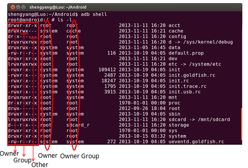
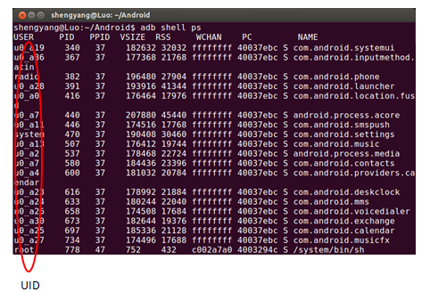
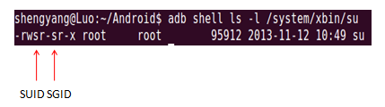
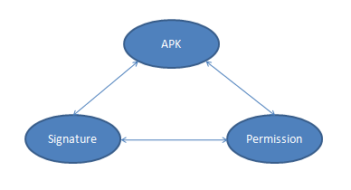
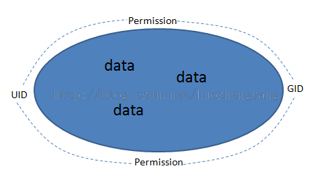

#Android的安全机制

Android是一个基于Linux内核的移动操作系统。Linux是一个支持多用户的系统，系统中的文件的访问权限是通过用户ID（UID）和用户组ID（GID）来控制的。换句话说，就是Linux的安全机制是基于UID和GID来实现的。Android在Linux内核提供的基于UID和GID的安全机制的基础上，又实现了一套称为Permission的安全机制

Linux中的每一个用户都分配有一个UID，然后所有的用户又按组来进划分，每一个用户组都分配有一个GID。注意，一个用户可以属于多个用户组，也就是说，一个UID可以对应多个GID。在一个用户所对应的用户组中，其中有一个称为主用户组，其它的称为补充用户组。

Linux中的每一个文件都具有三种权限：Read、Write和Execute。这三种权限又按照用户属性划分为三组：Owner、Group和Other。

 Linux中的每一个进程都关联有一个用户，也就是对应有一个UID，如图4所示：

由于每一个用户都对应有一个主用户组，以及若干个补充用户组，因此，每一个进程除了有一个对应的UID之外，还对应有一个主GID，以及若干个Supplementary GIDs。这些UID和GID就决定了一个进程所能访问的文件或者所能调用的系统API。例如，在图4中，PID为340的进程一般来说，就只能访问所有者为u0_a19的文件。

一个进程的UID是怎么来的呢？在默认情况下，就等于创建它的进程的UID，也就是它的父进程的UID。Linux的第一个进程是init进程，它是由内核在启动完成后创建的，它的UID是root。然后系统中的所有其它进程都是直接由init进程或者间接由init进程的子进程来创建。所以默认情况下，系统的所有进程的UID都应该是root。但是实际情况并非如此，因为父进程在创建子进程之后，也就是在fork之后，可以调用setuid来改变它的UID。例如，在PC中，init进程启动之后，会先让用户登录。用户登录成功后，就对应有一个shell进程。该shell进程的UID就会被setuid修改为所登录的用户。之后系统中创建的其余进程的UID为所登录的用户。

进程的UID除了来自于父进程之外，还有另外一种途径。上面我们说到，Linux的文件有三种权限，分别是Read、Wirte和Execute。其实还有另外一个种权限，叫做SUID。例如，我们对Android手机进行root的过程中，会在里面放置一个su文件。这个su文件就具有SUID权限，如图5所示：

一个可执行文件一旦被设置了SUID位，那么当它被一个进程通过exec加载之后，该进程的UID就会变成该可执行文件的所有者的UID。也就是说，当上述的su被执行的时候，它所运行在的进程的UID是root，于是它就具有最高级别的权限，想干什么就干什么。

与SUI类似，文件还有另外一个称为SGID的权限，不过它描述的是用户组。也就是说，一个可执行文件一旦被设置了GUID位，么当它被一个进程通过exec加载之后，该进程的主UID就会变成该可执行文件的所有者的主UID。

以上就是Linux基于UID/GID的安全机制的核心内容。接下来我们再看Android基于Permission的安全机制，它也有三个角色：apk、signature和permission，如图6所示：

**Android的APK经过PackageManagerService安装之后，就相当于Linux里面的User，它们都会被分配到一个UID和一个主GID，而APK所申请的Permission就相当于是Linux里面的Supplementary GID。**

我们知道，Android的APK都是运行在独立的应用程序进程里面的，并且这些应用程序进程都是Zygote进程fork出来的。Zygote进程又是由init进程fork出来的，并且它被init进程fork出来后，没有被setuid降权，也就是它的uid仍然是root。按照我们前面所说的，应用程序进程被Zygote进程fork出来的时候，它的UID也应当是root。但是，它们的UID会被setuid修改为所加载的APK被分配的UID。

参照Android应用程序进程启动过程的源代码分析一文的分析，ActivityManagerService在请求Zygote创建应用程序进程的时候，会将这个应用程序所加载的APK所分配得到的UID和GID（包括主GID和Supplementary GID）都收集起来，并且将它们作为参数传递给Zygote进程。Zygote进程通过执行函数来fork应用程序进程：

        /*
         * Utility routine to fork zygote and specialize the child process.
         */  
        static pid_t forkAndSpecializeCommon(const u4* args, bool isSystemServer)  
        {     
            pid_t pid;  

            uid_t uid = (uid_t) args[0];  
            gid_t gid = (gid_t) args[1];  
            ArrayObject* gids = (ArrayObject *)args[2];  
            ......  

            pid = fork();  

            if (pid == 0) {  
                ......  

                err = setgroupsIntarray(gids);  
                ......  

                err = setgid(gid);  
                ......  

                err = setuid(uid);  
                ......  
            }     

            .....  

            return pid;  
        }  

参数args[0]、args[1]和args[]保存的就是APK分配到的UID、主GID和Supplementary GID，它们分别通过setuid、setgid和setgroupsIntarray设置给当前fork出来的应用程序进程，于是应用程序进程就不再具有root权限了。

那么，Signature又充当什么作用呢？两个作用：1. 控制哪些APK可以共享同一个UID；2. 控制哪些APK可以申请哪些Permission。

我们知道，如果要让两个APK共享同一个UID，那么就需要在AndroidManifest中配置android:sharedUserId属性。PackageManagerService在安装APK的时候，如果发现两个APK具有相同的android:sharedUserId属性，那么它们就会被分配到相同的UID。当然这有一个前提，就是这两个APK必须具有相同的Signature。这很重要，否则的话，如果我知道别人的APK设置了android:sharedUserId属性，那么我也在自己的APK中设置相同的android:sharedUserId属性，就可以去访问别人APK的数据了。

除了可以通过android:sharedUserId属性申请让两个APK共享同一个UID之外，我们还可以将android:sharedUserId属性的值设置为“android.uid.system”，从而让一个APK的UID设置为1000。UID是1000的用户是system，系统的关键服务都是运行在的进程的UID就是它。它的权限虽然不等同于root，不过也足够大了。我们可以通过Master Key漏洞来看一下有多大。   

Master Key漏洞发布时，曾轰动了整个Android界，它的具体情况老罗就不分析了，网上很多，这里是一篇官方的文章：http://bluebox.com/corporate-blog/bluebox-uncovers-android-master-key/。现在就简单说说它是怎么利用的：

        1. 找到一个具有系统签名的APP，并且这个APP通过android:sharedUserId属性申请了android.uid.system这个UID。

        2. 通过Master Key向这个APP注入恶意代码。

        3. 注入到这个APP的恶意代码在运行时就获得了system用户身份。

        4. 修改/data/local.prop文件，将属性ro.kernel.qemu的值设置为1。

        5. 重启手机，由于ro.kernel.qemu的值等于1，这时候手机里面的adb进程不会被setuid剥夺掉root权限。

        6. 通过具有root权限的adb进程就可以向系统注入我们熟悉的su和superuser.apk，于是整个root过程完成。

        注意，第1步之所以要找一个具有系统签名的APP，是因为通过android:sharedUserId属性申请android.uid.system这个UID需要有系统签名，也就是说不是谁可以申请system这个UID的。另外，/data/local.prop文件的Owner是system，因此，只有获得了system这个UID的进程，才可以对它进行修改。

再说说Signature与Permission的关系。有些Permission，例如INSTALL_PACKAGE，不是谁都可以申请的，必须要具有系统签名才可以，这样就可以控制Suppementary GID的分配，从而控制应用程序进程的权限。具有哪些Permission是具有系统签名才可以申请的，可以参考官方文档：http://developer.android.com/reference/android/Manifest.html，就是哪些标记为“Not for use by third-party applications”的Permission。

了解了Android的Permission机制之后，我们就可以知道：

         1. Android的APK就相当于是Linux的UID。

         2. Android的Permission就相当于是Linux的GID。

         3. Android的Signature就是用来控制APK的UID和GID分配的。

这就是Android基于Permission的安全机制与Linux基于UID/GID的安全机制的关系，概括来说，我们常说的应用程序沙箱就是这样的：

