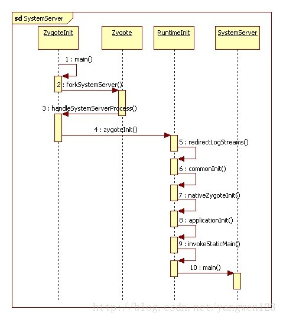

#启动

在Zygote进程进入循环监听Socket模式前，会根据Zygote启动参数来选择是否启动SystemServer进程，而Zygote进程的启动是在Android的启动脚本init.rc文件中配置的：

  service zygote /system/bin/app_process -Xzygote /system/bin --zygote --start-system-server

由于配置了参数--start-system-server，因此SystemServer进程会伴随Zygote进程的启动而启动：

frameworks\base\core\java\com\android\internal\os\ZygoteInit.java

      if (argv[1].equals("start-system-server")) {
      	startSystemServer();
      } else if (!argv[1].equals("")) {
      	throw new RuntimeException(argv[0] + USAGE_STRING);
      }

SystemServer虽然也是又Zygote进程孵化出来，但和普通的应用程序进程的启动方式有所不同，这里是通过调用startSystemServer()函数来启动SystemServer进程的。

frameworks\base\core\java\com\android\internal\os\ZygoteInit.java

    private static boolean startSystemServer()
    		throws MethodAndArgsCaller, RuntimeException {
    	/* Hardcoded command line to start the system server */
    	String args[] = {
    		"--setuid=1000",
    		"--setgid=1000",
    		"--setgroups=1001,1002,1003,1004,1005,1006,1007,1008,1009,1010,1018,3001,3002,3003,3006,3007",
    		"--capabilities=130104352,130104352",
    		"--runtime-init",
    		"--nice-name=system_server",
    		"com.android.server.SystemServer",
    	};
    	ZygoteConnection.Arguments parsedArgs = null;
    	int pid;
    	try {
    		//参数解析
    		parsedArgs = new ZygoteConnection.Arguments(args);
    		//打开系统调试属性
    		ZygoteConnection.applyDebuggerSystemProperty(parsedArgs);
    		ZygoteConnection.applyInvokeWithSystemProperty(parsedArgs);

    		/* 请求fork SystemServer进程*/
    		pid = Zygote.forkSystemServer(
    				parsedArgs.uid, parsedArgs.gid,
    				parsedArgs.gids,
    				parsedArgs.debugFlags,
    				null,
    				parsedArgs.permittedCapabilities,
    				parsedArgs.effectiveCapabilities);
    	} catch (IllegalArgumentException ex) {
    		throw new RuntimeException(ex);
    	}

    	/* pid为0表示子进程，即SystemServer进程，从此SystemServer进程与Zygote进程分道扬镳*/
    	if (pid == 0) {
    		handleSystemServerProcess(parsedArgs);
    	}
    	return true;
    }

##流程图

